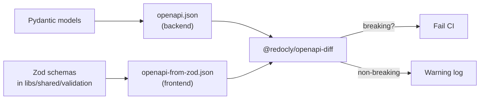

# Appendix B: End-to-End Contract-Driven Angular Workflow

This appendix is the hands-on companion to [Chapter 31](ch31-advanced-typescript-openapi.md)'s "Closing the Loop with a FastAPI Backend" section. The chapter explains *why* a contract-driven workflow matters; this appendix shows *how* to build one, with working scripts, Nx library layout, and a CI pipeline you can copy.

Everything uses the FinancialApp domain from the rest of the book: `Account`, `Transaction`, `TransactionDraft`, `Portfolio`, `Client`. The running backend is **FastAPI + Pydantic**, picked because Pydantic is Python's canonical schema library and FastAPI's `/openapi.json` endpoint is free. The Angular side demonstrates four alternative topologies; each one is a different answer to the question "who owns the contract, and how do the frontend artifacts stay in lock-step with it?"

Three small sibling appendices cover non-Python backends using the same shared template:

- [Appendix B1: Backend Adapter -- Node + Express](appendix-b1-backend-express.md)
- [Appendix B2: Backend Adapter -- Spring Boot](appendix-b2-backend-spring.md)
- [Appendix B3: Backend Adapter -- Go](appendix-b3-backend-go.md)

---

## 1. Prerequisites

This appendix assumes the rest of the book's FinancialApp is already set up: an Nx monorepo at `financial-app/` with `apps/financial-app` and `libs/shared/{models,ui,data-access,validation,api-client}`. If you're picking this up fresh, run `npm install` in `financial-app/`, which gives you Angular v21, Vitest, and the existing libraries.

Two additions are needed for the FastAPI backend:

- **Python 3.12 or later.** The backend uses structural pattern matching and `datetime.UTC`. Any recent macOS/Linux install with `python3 --version` reporting 3.12+ works.
- **`uv` for dependency management.** Install via `brew install uv` (macOS) or `curl -LsSf https://astral.sh/uv/install.sh | sh` (Linux). `uv` is faster than pip and produces reproducible lockfiles. If you prefer pip, every `uv` command below has a `pip` equivalent.

Bootstrap the backend dependencies:

```bash
cd financial-app/backend
uv sync
# or: pip install -e .
```

Verify the backend boots and the spec is served:

```bash
uv run uvicorn backend.main:app --reload --port 8000
curl http://localhost:8000/openapi.json | jq '.info'
```

For Node generators (Strategies A, C, D), you need the existing `financial-app/` dev dependencies plus a few additions covered per-strategy below.

---

## 2. Shared FastAPI Backend

The backend is deliberately tiny. It exists to produce a realistic OpenAPI spec against the FinancialApp domain, not to be a production service. Business logic is in-memory dictionaries; there is no database, no auth, no observability.

**File layout:**

```
financial-app/backend/
|-- pyproject.toml        # uv-managed dependencies
|-- README.md             # how to run it
|-- backend/              # Python package
|   |-- __init__.py
|   |-- main.py           # FastAPI app + route definitions
|   |-- models.py         # Pydantic models
|   |-- dump_openapi.py   # CLI: write openapi.json to stdout
|-- tests/
|   |-- test_contract.py  # pytest: in-process TestClient smoke
```

### The Pydantic Models

The Pydantic models are the single source of truth. Every constraint -- required fields, value ranges, enum values, string formats -- lives here, and FastAPI translates them into the OpenAPI spec automatically. They mirror the existing [`libs/shared/validation/`](financial-app/libs/shared/validation/) Zod schemas exactly:

```python
# financial-app/backend/backend/models.py
from datetime import date
from decimal import Decimal
from typing import Literal
from pydantic import BaseModel, Field

class Account(BaseModel):
    id: int
    name: str = Field(min_length=1, max_length=100)
    type: Literal["checking", "savings", "investment"]
    balance: Decimal = Field(ge=0)
    currency: Literal["USD", "EUR", "GBP", "JPY"]
    owner_id: int = Field(alias="ownerId")

    model_config = {"populate_by_name": True}

class TransactionDraft(BaseModel):
    account_id: int = Field(alias="accountId")
    amount: Decimal = Field(gt=Decimal("0.01"))
    type: Literal["credit", "debit"]
    category: str = Field(min_length=1, max_length=50)
    date: date
    description: str | None = Field(default=None, max_length=500)
    pending: bool = False

    model_config = {"populate_by_name": True}

class Transaction(TransactionDraft):
    id: int

class ApiError(BaseModel):
    code: str
    message: str
    details: dict[str, list[str]] | None = None
```

A few things worth calling out:

- **`Field(...)` constraints become JSON Schema.** `ge=0`, `min_length=1`, `max_length=50`, `gt=Decimal("0.01")` all end up in the emitted OpenAPI schema as `minimum`, `minLength`, `maxLength`, `exclusiveMinimum`. The Angular generators pick them up and translate back into Zod `.min()`, `.max()`, `.positive()` calls automatically.
- **`Literal[...]` becomes an enum.** `Literal["checking", "savings", "investment"]` produces `{"enum": ["checking", "savings", "investment"]}` in the spec. The `typescript-angular` generator converts those to `type AccountType = 'checking' | 'savings' | 'investment'` (with `stringEnums=true`).
- **`alias` maps snake_case -> camelCase.** Python idiom is `owner_id`; the JSON wire format is `ownerId`; the generated TypeScript keeps `ownerId`. No manual translation layer.
- **Inheritance produces `allOf`.** `Transaction(TransactionDraft)` emits `allOf: [TransactionDraft, {id}]`. Strategy C's `datamodel-code-generator` handles this cleanly; the simpler generators may inline the fields depending on options.

### The FastAPI App

```python
# financial-app/backend/backend/main.py
from fastapi import FastAPI, HTTPException, status
from .models import Account, Transaction, TransactionDraft, ApiError

app = FastAPI(
    title="FinancialApp API",
    version="1.0.0",
    description="Contract source of truth for the FinancialApp running example.",
)

# Seed data (in-memory; no database). Realistic enough for contract demos.
_accounts: dict[int, Account] = {
    1: Account(id=1, name="Primary Checking", type="checking",
               balance=5_432.10, currency="USD", ownerId=10),
    2: Account(id=2, name="Emergency Fund", type="savings",
               balance=15_000.00, currency="USD", ownerId=10),
}
_transactions: dict[int, Transaction] = {}

@app.get("/api/accounts", response_model=list[Account], tags=["accounts"])
def list_accounts() -> list[Account]:
    return list(_accounts.values())

@app.get(
    "/api/accounts/{account_id}",
    response_model=Account,
    responses={404: {"model": ApiError}},
    tags=["accounts"],
)
def get_account(account_id: int) -> Account:
    account = _accounts.get(account_id)
    if account is None:
        raise HTTPException(status.HTTP_404_NOT_FOUND, "Account not found")
    return account

@app.post(
    "/api/transactions",
    response_model=Transaction,
    status_code=status.HTTP_201_CREATED,
    tags=["transactions"],
)
def create_transaction(draft: TransactionDraft) -> Transaction:
    new_id = max(_transactions.keys(), default=0) + 1
    transaction = Transaction(id=new_id, **draft.model_dump())
    _transactions[new_id] = transaction
    return transaction
```

FastAPI does the rest: request-body parsing, path-parameter binding, 422 validation errors for malformed inputs, and the `/openapi.json` endpoint exposing the OpenAPI 3.1 spec.

### Dumping the Spec

Two ways to get the spec:

```bash
# Runtime: hit the live server
uvicorn backend.main:app --port 8000 &
curl http://localhost:8000/openapi.json > openapi.json

# Offline: dump from the in-process app (CI-friendly, no port)
python -m backend.dump_openapi > openapi.json
```

The CLI is three lines:

```python
# financial-app/backend/backend/dump_openapi.py
import json, sys
from .main import app
json.dump(app.openapi(), sys.stdout, indent=2, sort_keys=True)
```

Committing `openapi.json` to the repo root gives the four frontend strategies a stable input and makes it a first-class artifact in code review.

---

## 3. Strategy A -- FastAPI/Pydantic as Single Source of Truth

[openapi-zod-client](https://github.com/astahmer/openapi-zod-client) reads an OpenAPI spec and emits both Zod schemas and a fully-typed `Zodios` fetch client in a single file. One generator, one output, runtime validation baked in.

### Installing

```bash
npm install -D openapi-zod-client
npm install @zodios/core zod
```

### The Generator Script

```javascript
// financial-app/tools/generate-from-backend.mjs
// See appendix-b-e2e-workflow.md -- "Strategy A"
import { execSync } from 'node:child_process';
import { existsSync } from 'node:fs';

const specPath = 'openapi.json';

if (!existsSync(specPath)) {
  console.error(`Missing ${specPath}. Run "npm run backend:spec" first.`);
  process.exit(1);
}

execSync(
  `npx openapi-zod-client ${specPath} ` +
  `-o libs/shared/api-client/src/generated/generated-zodios.ts ` +
  `--export-schemas --with-docs`,
  { stdio: 'inherit' },
);
console.log('Strategy A: generated Zod + Zodios client.');
```

Corresponding `package.json` scripts:

```json
{
  "scripts": {
    "backend:dev": "uv run --project backend uvicorn backend.main:app --reload --port 8000",
    "backend:spec": "uv run --project backend python -m backend.dump_openapi > openapi.json",
    "generate:zod-client": "node tools/generate-from-backend.mjs"
  }
}
```

### Sample Output

Given the `Account` Pydantic model above, the generator emits:

```typescript
// libs/shared/api-client/src/generated/generated-zodios.ts (excerpt)
import { z } from 'zod';
import { makeApi, Zodios } from '@zodios/core';

export const AccountSchema = z.object({
  id: z.number().int(),
  name: z.string().min(1).max(100),
  type: z.enum(['checking', 'savings', 'investment']),
  balance: z.number().gte(0),
  currency: z.enum(['USD', 'EUR', 'GBP', 'JPY']),
  ownerId: z.number().int(),
});
export type Account = z.infer<typeof AccountSchema>;

export const TransactionDraftSchema = z.object({
  accountId: z.number().int(),
  amount: z.number().gt(0.01),
  type: z.enum(['credit', 'debit']),
  category: z.string().min(1).max(50),
  date: z.string(),
  description: z.string().max(500).optional(),
  pending: z.boolean().default(false),
});

export const api = makeApi([
  {
    method: 'get',
    path: '/api/accounts/:account_id',
    alias: 'getAccount',
    parameters: [{ name: 'account_id', type: 'Path', schema: z.number() }],
    response: AccountSchema,
  },
  {
    method: 'post',
    path: '/api/transactions',
    alias: 'createTransaction',
    parameters: [{ name: 'body', type: 'Body', schema: TransactionDraftSchema }],
    response: z.object({ /* Transaction */ }),
  },
]);

export const createApiClient = (baseUrl: string) => new Zodios(baseUrl, api);
```

### Wiring into Angular

Wrap the generated client in an Angular-visible service:

```typescript
// apps/financial-app/src/app/features/admin/admin-account-api.service.ts
// See appendix-b-e2e-workflow.md -- "Strategy A"
import { Injectable, inject } from '@angular/core';
import { fromPromise } from 'rxjs/internal/observable/innerFrom';
import { createApiClient, AccountSchema } from '@financial-app/shared/api-client/generated';
import { ENVIRONMENT } from '../../environments/environment.token';

@Injectable({ providedIn: 'root' })
export class AdminAccountApiService {
  private client = createApiClient(inject(ENVIRONMENT).apiUrl);

  getAccount(id: number) {
    return fromPromise(this.client.getAccount({ params: { account_id: id } }));
  }
}
```

Every call through `this.client` validates the response against `AccountSchema` at runtime. A malformed response -- extra field, wrong type, missing required property -- throws immediately. The UI receives either a known-good `Account` or an error, never a malformed object masquerading as one.

The same `AccountSchema` plugs into Signal Forms as a validator; see §7 for the full wiring.

### Trade-offs

- **Pro:** one generator, one output, runtime validation for free.
- **Pro:** minimal boilerplate -- the whole pipeline is ~30 lines of glue.
- **Con:** the `Zodios` client is not Angular's `HttpClient`. Interceptors, `HttpContext`, XSRF integration, and `httpResource` patterns from [Chapter 2](ch02-signal-components.md) do not apply -- you'd rebuild those concerns against the Zodios API surface.

That's why the FinancialApp reserves Strategy A for the admin-screen area (see §6 "Runtime strategy"); Strategy D drives the main app where the full Angular HTTP toolkit matters.

---

## 4. Strategy B -- Zod + Pydantic Co-Equal with CI Diff

Some teams don't want generated code. The frontend has form-level constraints that don't belong in the backend (UX-specific error messages, multi-field validators that depend on ViewModel state), and the backend has database-coupled constraints that shouldn't leak to the client. Both sides author schemas independently, and CI just verifies they haven't drifted apart.

### The Pipeline



### Frontend Zod -> OpenAPI

`@asteasolutions/zod-to-openapi` walks a registry of Zod schemas and emits OpenAPI 3.x JSON:

```javascript
// financial-app/tools/zod-to-openapi.mjs
// See appendix-b-e2e-workflow.md -- "Strategy B"
import { OpenAPIRegistry, OpenApiGeneratorV31 } from '@asteasolutions/zod-to-openapi';
import { writeFileSync, mkdirSync } from 'node:fs';
import { AccountSchema, TransactionDraftSchema } from '../libs/shared/validation/src/index.js';

const registry = new OpenAPIRegistry();
registry.register('Account', AccountSchema);
registry.register('TransactionDraft', TransactionDraftSchema);

const generator = new OpenApiGeneratorV31(registry.definitions);
const spec = generator.generateDocument({
  openapi: '3.1.0',
  info: { title: 'FinancialApp (frontend view)', version: '1.0.0' },
});

mkdirSync('libs/shared/validation/src/generated', { recursive: true });
writeFileSync(
  'libs/shared/validation/src/generated/openapi-from-zod.json',
  JSON.stringify(spec, null, 2) + '\n',
);
console.log('Strategy B: emitted openapi-from-zod.json');
```

### The Diff

```javascript
// financial-app/tools/diff-openapi.mjs
// See appendix-b-e2e-workflow.md -- "Strategy B"
import { diff } from '@redocly/openapi-diff';
import { readFileSync } from 'node:fs';

const backend = JSON.parse(readFileSync('openapi.json', 'utf8'));
const frontend = JSON.parse(readFileSync(
  'libs/shared/validation/src/generated/openapi-from-zod.json',
  'utf8',
));

const changes = await diff(backend, frontend);
const breaking = changes.filter((c) => c.type === 'breaking');

if (breaking.length > 0) {
  console.error(`${breaking.length} breaking difference(s) between backend and frontend contract:`);
  for (const change of breaking) console.error(`  - ${change.path}: ${change.description}`);
  process.exit(1);
}

const nonBreaking = changes.filter((c) => c.type !== 'breaking');
if (nonBreaking.length > 0) {
  console.warn(`${nonBreaking.length} non-breaking difference(s):`);
  for (const change of nonBreaking) console.warn(`  - ${change.path}: ${change.description}`);
}
console.log('Strategy B: contracts are compatible.');
```

### When to Pick This

- Frontend and backend teams are independent and want schema authorship autonomy.
- The form layer has significant UX-only validation (conditional requirements, multi-field rules) that shouldn't travel to the server.
- You already have a mature hand-written Zod layer and don't want to refactor to consume generated schemas.

### Trade-offs

- **Pro:** no generated code to audit; both teams write what they want.
- **Pro:** drift is caught early, with a precise diff in the PR rather than a runtime bug.
- **Con:** no type sharing. The frontend's `Account` type comes from `z.infer<typeof AccountSchema>`; the backend's comes from Pydantic. They agree structurally but are separate declarations.
- **Con:** adding a field requires two edits. Neither side generates from the other.

---

## 5. Strategy C -- Pydantic-Primary via datamodel-code-generator + ts-to-zod

Strategy A's `openapi-zod-client` works well for flat schemas but can struggle with deep inheritance, discriminated unions driven by `allOf`/`oneOf`, or custom Pydantic `Annotated[]` transformations. Strategy C splits the job across two mature tools:

1. [`datamodel-code-generator`](https://github.com/koxudaxi/datamodel-code-generator) reads OpenAPI and emits TypeScript types. It has deep OpenAPI knowledge: `discriminator`, `allOf`, `oneOf`, nested refs, anonymous schemas.
2. [`ts-to-zod`](https://github.com/fabien0102/ts-to-zod) reads TypeScript and emits Zod schemas that match. Constraints declared via `@minimum`, `@maximum`, `@pattern` JSDoc tags flow into the Zod output.

### Installing

```bash
# datamodel-code-generator is Python; add to backend pyproject.toml
uv add --dev datamodel-code-generator

# ts-to-zod is Node
npm install -D ts-to-zod
```

### The Pipeline

```javascript
// financial-app/tools/generate-datamodel.mjs
// See appendix-b-e2e-workflow.md -- "Strategy C"
import { execSync } from 'node:child_process';
import { mkdirSync } from 'node:fs';

mkdirSync('libs/shared/api-client/src/generated', { recursive: true });

// Step 1: OpenAPI -> TypeScript
execSync(
  'uv run --project backend datamodel-codegen ' +
  '--input openapi.json ' +
  '--input-file-type openapi ' +
  '--output libs/shared/api-client/src/generated/generated-types.ts ' +
  '--output-model-type typescript ' +
  '--use-double-quotes ' +
  '--disable-timestamp',
  { stdio: 'inherit' },
);

// Step 2: TypeScript -> Zod
execSync(
  'npx ts-to-zod ' +
  'libs/shared/api-client/src/generated/generated-types.ts ' +
  'libs/shared/api-client/src/generated/generated.zod.ts',
  { stdio: 'inherit' },
);

console.log('Strategy C: emitted generated-types.ts + generated.zod.ts');
```

Pair with `openapi-fetch` for the typed client layer:

```bash
npm install openapi-fetch
npx openapi-typescript openapi.json -o libs/shared/api-client/src/generated/schema.ts
```

Usage is standard `openapi-fetch` (covered earlier in ch31):

```typescript
// apps/financial-app/src/app/features/something/some.service.ts
import createClient from 'openapi-fetch';
import type { paths } from '@financial-app/shared/api-client/generated/schema';
import { accountSchema } from '@financial-app/shared/api-client/generated/generated.zod';

@Injectable({ providedIn: 'root' })
export class SomeService {
  private client = createClient<paths>({ baseUrl: environment.apiUrl });

  async getAccount(id: number) {
    const { data, error } = await this.client.GET('/api/accounts/{account_id}', {
      params: { path: { account_id: id } },
    });
    if (error) throw error;
    return accountSchema.parse(data);
  }
}
```

### When to Pick This

- Your Pydantic models use `Annotated[]` with custom validators or `model_serializer` hooks that simpler generators don't understand.
- You have inheritance chains more than two levels deep, or discriminated unions via `oneOf`.
- You want full control over the TypeScript output (naming, imports, export style).

### Trade-offs

- **Pro:** `datamodel-code-generator` is the most capable OpenAPI->TS tool available.
- **Pro:** two files mean you can use just the types (without runtime validation) in perf-sensitive paths, and just the Zod schemas in boundary paths.
- **Con:** two-stage pipeline means two dependency chains and two places for things to go wrong.
- **Con:** constraints may need JSDoc annotations (`/** @minimum 0.01 */`) to flow into Zod -- the default translation is structural only.

---

## 6. Strategy D -- OpenAPI Generator's `typescript-angular` for an Angular-Native Client Library

Strategies A and C give you Zod schemas and plain TypeScript types, but the HTTP layer is a `fetch`-based client. Strategy D is categorically different: it generates a full **Angular library** -- injectable services using `HttpClient`, `Observable` returns, a `Configuration` class, and a publishable package.

Source: [OpenAPI Generator `typescript-angular` reference](https://openapi-generator.tech/docs/generators/typescript-angular/).

### Installing

```bash
npm install -D @openapitools/openapi-generator-cli
```

The Java runtime the generator needs is auto-downloaded on first use via the Node wrapper. No separate JDK install required for contributors.

Pin the generator version in `openapitools.json` at the repo root so every run (local, CI, across machines) produces byte-identical output:

```json
{
  "$schema": "./node_modules/@openapitools/openapi-generator-cli/config.schema.json",
  "spaces": 2,
  "generator-cli": {
    "version": "7.10.0"
  }
}
```

### The Generator Invocation

```javascript
// financial-app/tools/generate-ng-client.mjs
// See appendix-b-e2e-workflow.md -- "Strategy D"
import { execSync } from 'node:child_process';

const additionalProperties = [
  'ngVersion=21.0.0',
  'providedIn=root',
  'fileNaming=kebab-case',
  'stringEnums=true',
  'taggedUnions=true',
  'useSingleRequestParameter=true',
  'withInterfaces=true',
  'supportsES6=true',
  'enumPropertyNaming=PascalCase',
  'enumUnknownDefaultCase=true',
].join(',');

execSync(
  `npx openapi-generator-cli generate ` +
  `-i openapi.json ` +
  `-g typescript-angular ` +
  `-o libs/shared/api-client-ng/src/lib/generated ` +
  `--additional-properties=${additionalProperties}`,
  { stdio: 'inherit' },
);

// Prettify the generated output so diffs are minimal
execSync('npx nx format:write --files=libs/shared/api-client-ng/src/lib/generated', {
  stdio: 'inherit',
});

console.log('Strategy D: regenerated typescript-angular client.');
```

Each flag earns its place:

- `ngVersion=21.0.0` -- aligns with the book's target. The generator scopes peer dependencies accordingly.
- `providedIn=root` -- services use `@Injectable({ providedIn: 'root' })` so the legacy `ApiModule` wrapper isn't needed in standalone apps.
- `stringEnums=true` -- emits `type AccountType = 'checking' | 'savings' | 'investment'` instead of runtime enum objects. Smaller bundle, simpler DX.
- `taggedUnions=true` -- respects `discriminator` fields from the spec, matching the discriminated-union pattern from ch31's top.
- `useSingleRequestParameter=true` -- methods with multiple params take one object rather than positional arguments. Easier to read at call sites.
- `withInterfaces=true` -- emits an interface for each service alongside the class, so Vitest tests can mock against the interface.
- `enumUnknownDefaultCase=true` -- adds `UnknownDefaultOpenApi` as a fallback enum case. If the backend adds a new `currency` value before the client regenerates, the client parses it as the fallback rather than throwing. This makes enum additions non-breaking at the client layer.
- `fileNaming=kebab-case` -- matches Angular style guide conventions.

### Generated Artifacts

Running the generator against the `openapi.json` from §2 produces:

```
libs/shared/api-client-ng/src/lib/generated/
|-- api/
|   |-- accounts.service.ts         # @Injectable accounts operations
|   |-- transactions.service.ts     # @Injectable transactions operations
|   |-- api.ts                       # barrel
|-- model/
|   |-- account.ts                   # Account interface + enums
|   |-- transaction.ts
|   |-- transaction-draft.ts
|   |-- api-error.ts
|   |-- models.ts                    # barrel
|-- configuration.ts                 # basePath, auth hooks
|-- api.module.ts                    # legacy NgModule (ignorable in v21)
|-- encoder.ts, variables.ts         # HTTP helpers
|-- index.ts                         # public barrel
```

A sample service:

```typescript
// api/accounts.service.ts (excerpt, auto-generated)
@Injectable({ providedIn: 'root' })
export class AccountsService implements AccountsServiceInterface {
  protected basePath = 'http://localhost:8000';
  protected defaultHeaders = new HttpHeaders();
  public configuration = new Configuration();
  public encoder: HttpParameterCodec;

  constructor(
    protected httpClient: HttpClient,
    @Optional() @Inject(BASE_PATH) basePath: string | string[],
    @Optional() configuration: Configuration,
  ) { /* ... */ }

  public getAccount(
    accountId: number,
    observe: 'body' = 'body',
    reportProgress: boolean = false,
    options?: { httpHeaderAccept?: 'application/json' },
  ): Observable<Account> { /* ... */ }
}
```

### Nx Library Layout

The generator emits into a **new buildable Nx library** so the output is clearly scoped:

```bash
nx g @nx/angular:library api-client-ng --buildable --directory=shared
```

The library's `project.json` gains a `generate` target:

```json
{
  "targets": {
    "generate": {
      "executor": "nx:run-commands",
      "options": {
        "command": "node tools/generate-ng-client.mjs",
        "cwd": "{workspaceRoot}"
      }
    }
  }
}
```

Now `nx run api-client-ng:generate` regenerates just this library. The dev-time `tsconfig.base.json` path maps to source:

```json
"paths": {
  "@financial-app/shared/api-client-ng": ["libs/shared/api-client-ng/src/index.ts"]
}
```

For consumers using the published npm flavor, the same import resolves to `dist/libs/shared/api-client-ng` after `nx build api-client-ng`.

### Consuming in Angular v21 (Standalone)

No `ApiModule` imports needed -- the generated services use `providedIn: 'root'` and participate in DI automatically.

```typescript
// apps/financial-app/src/app/features/accounts/account.service.ts
// See appendix-b-e2e-workflow.md -- "Strategy D"
import { inject, Injectable } from '@angular/core';
import {
  AccountsService as GeneratedAccountsService,
  Configuration,
} from '@financial-app/shared/api-client-ng';

@Injectable({ providedIn: 'root' })
export class AccountService {
  private api = inject(GeneratedAccountsService);

  listAccounts() { return this.api.listAccounts(); }
  getAccount(id: number) { return this.api.getAccount(id); }
}
```

Provide `Configuration` once in `app.config.ts`:

```typescript
import { Configuration } from '@financial-app/shared/api-client-ng';

export const appConfig: ApplicationConfig = {
  providers: [
    // ...existing providers...
    provideHttpClient(withInterceptors([retryInterceptor, xsrfInterceptor])),
    { provide: Configuration, useValue: new Configuration({ basePath: environment.apiUrl }) },
  ],
};
```

Every generated service now routes through Angular's `HttpClient`. Every interceptor, the SSR `withHttpTransferCache()` feature, XSRF, retry policies, and the `httpResource` patterns from the rest of the book apply unchanged because nothing about the generated code is aware of them -- it's just `HttpClient` underneath.

### Pairing with Validation

`typescript-angular` doesn't emit Zod schemas. Three options for adding runtime validation:

- **Hybrid D + ts-to-zod** (recommended for the main FinancialApp). Run `ts-to-zod` against the generated `model/` folder to produce Zod schemas matching the models. Wire those into Signal Forms (§7).
- **Hand-authored Zod in `libs/shared/validation/`** plus Strategy B's diff job to verify structural alignment.
- **Narrow-boundary Zod** only where data enters the application -- on the first response parse, at form submit. Internal calls skip validation for perf.

The FinancialApp uses the first option. A small `tools/zod-from-generated-models.mjs` script runs `ts-to-zod` after `generate-ng-client.mjs` and writes output to `libs/shared/api-client-ng/src/lib/generated/model/generated.zod.ts`.

### Publishing as an npm Package

Set `npmName`, `npmVersion`, and optionally `npmRepository` on the generator call:

```bash
npx openapi-generator-cli generate \
  -i openapi.json -g typescript-angular \
  -o libs/shared/api-client-ng/src/lib/generated \
  --additional-properties=npmName=@acme/financial-api-client,npmVersion=2.1.0
```

`nx build api-client-ng` produces a publishable `dist/`, and `npm publish dist/libs/shared/api-client-ng` ships it. Multiple Angular apps (web portal, admin, mobile webview) now consume one typed package.

### When to Pick This Strategy

- You run multiple Angular apps against the same API and want one library shipped as an npm package.
- Your team's Angular conventions mandate `HttpClient` + `Observable` + DI. Losing those to a `fetch` client is a non-starter.
- Your backend is not Python. Strategy D is backend-agnostic; the generator cares only about OpenAPI.

### Trade-offs

- **Pro:** most Angular-idiomatic output. Every existing pattern in the book (interceptors, XSRF, `httpResource`, SSR, error handling) works.
- **Pro:** the generator is mature, stable, and widely used in enterprise codebases.
- **Con:** no Zod schemas emitted -- you pair with `ts-to-zod` or another tool for runtime validation.
- **Con:** larger generated footprint than Strategies A and C. One file per service, one per model.
- **Con:** tracking Angular major versions requires waiting briefly for a generator release targeting the new peer-dependency range.

---

## 7. Wiring Generated Schemas into Signal Forms

The point of the whole apparatus is to make the form layer consume the same contract the backend publishes. When `TransactionDraft.amount` gains a new constraint on the backend, the frontend form should pick it up automatically.

### Main App: Strategy D + ts-to-zod Hybrid

```typescript
// apps/financial-app/src/app/features/transactions/transaction-entry.component.ts
// See appendix-b-e2e-workflow.md -- "Wiring generated schemas into Signal Forms"
import { Component, inject } from '@angular/core';
import { form, validateAgainst } from '@angular/forms/signals';
import { transactionDraftSchema } from '@financial-app/shared/api-client-ng/generated/model/generated.zod';
import { TransactionsService } from '@financial-app/shared/api-client-ng';

@Component({ /* ... */ })
export class TransactionEntryComponent {
  private transactionsApi = inject(TransactionsService);

  readonly draft = form({
    accountId: 0,
    amount: 0,
    type: 'debit' as 'credit' | 'debit',
    category: '',
    date: new Date().toISOString().slice(0, 10),
  }, {
    validators: [validateAgainst(transactionDraftSchema)],
  });

  submit() {
    if (!this.draft.valid()) return;
    this.transactionsApi.createTransaction(this.draft.value()).subscribe(/* ... */);
  }
}
```

The form's validators come entirely from the generated Zod schema. If the backend adds `memo: z.string().max(200).optional()` to the Pydantic model, the regenerated `transactionDraftSchema` includes it, and the form accepts the new field without any frontend code change beyond rendering.

### Extending a Generated Schema with UX Rules

Sometimes the form needs a validator that shouldn't exist on the backend -- a "confirm email" field that compares to another form field, for example. Extend the generated schema via `.refine()` in a hand-authored wrapper that re-exports from the generated one:

```typescript
// libs/shared/validation/src/transaction-entry.schema.ts
// See appendix-b-e2e-workflow.md -- "Wiring generated schemas into Signal Forms"
import { transactionDraftSchema } from '@financial-app/shared/api-client-ng/generated/model/generated.zod';

export const transactionEntrySchema = transactionDraftSchema
  .extend({
    confirmAmount: z.number().gt(0),
  })
  .refine(
    (draft) => draft.amount === draft.confirmAmount,
    { message: 'Confirmation amount must match', path: ['confirmAmount'] },
  );
```

`transactionDraftSchema` regenerates without touching this file. The hand-authored `refine()` keeps working as long as the underlying fields still exist. When a field *is* removed, TypeScript flags the reference here and you update deliberately rather than discovering the drift in production.

### Admin Screens: Strategy A Zodios Schema

The admin area uses Strategy A, where the Zod schema and client ship in the same file:

```typescript
// apps/financial-app/src/app/features/admin/admin-account-form.component.ts
// See appendix-b-e2e-workflow.md -- "Wiring generated schemas into Signal Forms"
import { form, validateAgainst } from '@angular/forms/signals';
import { AccountSchema } from '@financial-app/shared/api-client/generated';

@Component({ /* ... */ })
export class AdminAccountFormComponent {
  readonly account = form({
    name: '',
    type: 'checking' as const,
    balance: 0,
    currency: 'USD' as const,
  }, {
    validators: [validateAgainst(AccountSchema.omit({ id: true, ownerId: true }))],
  });
}
```

Two subtly different approaches, one codebase, same contract source.

---

## 8. Wiring Generated Schemas into `DynamicFormComponent`

The `DynamicFormComponent` from the main body of ch31 takes an OpenAPI JSON Schema fragment and renders form fields from it. With the closed-loop in place, the "schema" input now comes directly from the backend's published spec -- no manual declaration.

```typescript
// apps/financial-app/src/app/features/admin/admin-entity.component.ts
// See appendix-b-e2e-workflow.md -- "Wiring generated schemas into DynamicFormComponent"
import { Component, computed, input } from '@angular/core';
import openApiSpec from '../../../../../../openapi.json';

@Component({
  selector: 'app-admin-entity',
  imports: [DynamicFormComponent],
  template: `
    <h2>Edit {{ entityName() }}</h2>
    <fin-dynamic-form
      [schema]="schema().properties"
      [requiredFields]="schema().required"
      (saved)="handleSave($event)" />
  `,
})
export class AdminEntityComponent {
  entityName = input.required<string>();

  protected schema = computed(() => {
    const entity = this.entityName();
    const s = openApiSpec.components.schemas[entity];
    if (!s) throw new Error(`No schema for ${entity}`);
    return { properties: s.properties ?? {}, required: s.required ?? [] };
  });

  handleSave(payload: Record<string, unknown>) { /* POST through Strategy A client */ }
}
```

Add a new Pydantic model on the backend, regenerate the spec, and the admin screen for that entity renders instantly. The workflow is:

1. Developer adds `ClientBackend(BaseModel)` to `backend/models.py`.
2. `npm run backend:spec && npm run generate:all` refreshes every generated artifact.
3. Navigate to `/admin/ClientBackend` -- `AdminEntityComponent` extracts the schema from `openapi.json` and renders fields.

Use this for internal tooling only. User-facing forms should remain hand-crafted (Signal Forms composition, specific error copy, layout choices) as noted in ch31.

---

## 9. Testing Against the Single Source of Truth: Vitest + Playwright

Generating the artifacts is half the story. The other half is using them as the anchor for every test layer. Tests that hand-author fixtures silently lie about the contract; tests that import from the generated modules cannot.

### 9.1 Why the Generated Schemas Change How We Test

In the traditional split, unit tests mock inputs, E2E tests hit the real backend, and each layer owns its fixtures. The problem is that fixtures drift -- someone renames a field, updates one test, and the other fixtures stay stale for months. Nothing fails until a careful reader notices that the fixture in `account.service.spec.ts` uses `balance` while the real backend has started returning `currentBalance`.

The closed-loop split removes that class of bug entirely:

- **Unit tests import generated Zod schemas** and run each service response through `safeParse`. A contract mismatch produces a readable failure in the test output.
- **Component tests use `zod-mock`-generated fixtures** from the same schemas. The fixtures can't misrepresent the contract because they're derived from it.
- **E2E tests hit the real backend** and pipe responses through the generated schemas as the final gate.
- **CI regeneration gate** runs before any of this, so a contract change is already a visible PR diff by the time tests run.

See [Chapter 7](ch07-testing-vitest.md) for Vitest setup and [Chapter 25](ch25-e2e-playwright.md) for the Playwright baseline.

### 9.2 Vitest Patterns

**Schema-backed response assertions.** Register a custom Vitest matcher that wraps `schema.safeParse()`:

```typescript
// libs/shared/testing/src/to-match-schema.ts
import { expect } from 'vitest';
import { z, ZodType } from 'zod';

expect.extend({
  toMatchSchema(received: unknown, schema: ZodType) {
    const result = schema.safeParse(received);
    return {
      pass: result.success,
      message: () => result.success
        ? 'expected value NOT to match schema'
        : `schema mismatch:\n${result.error.issues.map((i) => `  - ${i.path.join('.')}: ${i.message}`).join('\n')}`,
    };
  },
});

declare module 'vitest' {
  interface Assertion<T = any> { toMatchSchema(schema: ZodType): T; }
}
```

Use at any test call site:

```typescript
const account = await accountService.getAccount(1);
expect(account).toMatchSchema(AccountSchema);
```

**Generated fixtures with `zod-mock`.** Pair the schema with `zod-mock` to produce realistic data on demand:

```typescript
import { generateMock } from '@anatine/zod-mock';
import { AccountSchema } from '@financial-app/shared/api-client-ng/generated/model/generated.zod';

const account = generateMock(AccountSchema);
// account is a random-but-valid Account that passes AccountSchema.parse()
```

Factories in `libs/shared/testing/` wrap these calls with sensible defaults for tests that care about specific fields:

```typescript
export const makeAccount = (overrides: Partial<Account> = {}): Account =>
  ({ ...generateMock(AccountSchema), ...overrides });
```

**MSW handlers derived from the spec (scoped).** A `mswHandlersFromSpec()` generator produces handlers for 200-response GETs:

```typescript
// libs/shared/testing/src/msw-handlers.ts
import { http, HttpResponse } from 'msw';
import { generateMock } from '@anatine/zod-mock';
import openApiSpec from '../../../../openapi.json';
import * as schemas from '@financial-app/shared/api-client-ng/generated/model/generated.zod';

export function mswHandlersFromSpec() {
  const handlers = [];
  for (const [path, methods] of Object.entries(openApiSpec.paths)) {
    if (methods.get && methods.get.responses?.['200']) {
      const schemaName = /* ... resolve from $ref ... */;
      const schema = (schemas as Record<string, z.ZodType>)[schemaName];
      handlers.push(http.get(path, () => HttpResponse.json(generateMock(schema))));
    }
  }
  return handlers;
}
```

This covers simple GET-by-id and list endpoints automatically. Stateful handlers (POST-then-GET), error variants, and path-parameter specifics remain hand-authored on top. For teams needing full coverage without hand-writing anything, [`msw-auto-mock`](https://github.com/zoubingwu/msw-auto-mock) generates complete handler sets from an OpenAPI spec including error cases and delays.

**Parameterized contract smoke tests.** One test iterates every operation in the spec:

```typescript
import { describe, it, expect } from 'vitest';
import { TestBed } from '@angular/core/testing';
import openApiSpec from '../../../../openapi.json';
import * as services from '@financial-app/shared/api-client-ng';

describe.each(Object.entries(openApiSpec.paths))('contract: %s', (path, methods) => {
  it('every declared operation is callable on the generated service', () => {
    for (const [method, op] of Object.entries(methods)) {
      const serviceName = capitalize(op.tags[0]) + 'Service';
      const service = TestBed.inject((services as Record<string, any>)[serviceName]);
      expect(service[op.operationId]).toBeTypeOf('function');
    }
  });
});
```

Add a real call that asserts schema conformance per operation, and this single file covers "every endpoint returns what the spec says" in ~30 lines.

**Strategy D: generated service unit tests.** `HttpTestingController` verifies each generated service hits the expected URL with the expected body:

```typescript
import { provideHttpClient } from '@angular/common/http';
import { HttpTestingController, provideHttpClientTesting } from '@angular/common/http/testing';
import { AccountsService } from '@financial-app/shared/api-client-ng';
import { AccountSchema } from '@financial-app/shared/api-client-ng/generated/model/generated.zod';

beforeEach(() => {
  TestBed.configureTestingModule({
    providers: [provideHttpClient(), provideHttpClientTesting(), AccountsService],
  });
});

it('getAccount calls /api/accounts/:id and validates the response', () => {
  const svc = TestBed.inject(AccountsService);
  const ctrl = TestBed.inject(HttpTestingController);
  const payload = generateMock(AccountSchema);

  let result: Account | undefined;
  svc.getAccount(1).subscribe((r) => (result = r));

  const req = ctrl.expectOne(/\/api\/accounts\/1$/);
  expect(req.request.method).toBe('GET');
  req.flush(payload);

  expect(result).toMatchSchema(AccountSchema);
});
```

**Generated Zod plus fake timers for debounced typeahead.** Ties back to [Chapter 3](ch03-reactive-signals.md)'s "Working with RxJS" section. The typeahead debounce + response shape are both validated:

```typescript
it('typeahead returns a list of Accounts after debounce', fakeAsync(() => {
  const fixture = TestBed.createComponent(AccountTypeaheadComponent);
  fixture.componentInstance.query.set('Pri');
  tick(300); // debounce
  const req = TestBed.inject(HttpTestingController).expectOne(/\/accounts\?q=/);
  req.flush([generateMock(AccountSchema)]);
  tick();
  fixture.detectChanges();
  expect(fixture.componentInstance.results()).toSatisfy(
    (list: Account[]) => list.every((a) => AccountSchema.safeParse(a).success),
  );
}));
```

**Coverage convention.** Any service method that makes an HTTP call must validate its response against the generated schema in at least one unit test. A tiny "enumerate all services" meta-test enforces this:

```typescript
it('every generated service has at least one schema-assertion test', () => {
  // Walks the generated barrel, asserts each method is covered.
});
```

### 9.3 Playwright Patterns

**Typed page objects.** POM classes import generated types so helpers are compiler-checked:

```typescript
// apps/financial-app-e2e/pages/account-list.page.ts
import { Page } from '@playwright/test';
import type { Account } from '@financial-app/shared/api-client-ng';

export class AccountListPage {
  constructor(private page: Page) {}

  async getDisplayedAccounts(): Promise<Pick<Account, 'id' | 'name' | 'balance'>[]> {
    return this.page.$$eval('.account-row', (rows) =>
      rows.map((r) => ({
        id: Number(r.dataset.id),
        name: r.querySelector('.name')!.textContent!,
        balance: Number(r.dataset.balance),
      })),
    );
  }
}
```

**API-level round-trip suite.** `playwright.config.ts` spawns FastAPI and the Angular dev server:

```typescript
// apps/financial-app-e2e/playwright.config.ts
export default defineConfig({
  webServer: [
    { command: 'uvicorn backend.main:app --port 8000', url: 'http://localhost:8000/openapi.json', cwd: '../backend' },
    { command: 'nx serve financial-app', url: 'http://localhost:4200' },
  ],
  use: { baseURL: 'http://localhost:4200' },
});
```

Then iterate every GET endpoint and validate against the generated Zod schema:

```typescript
// apps/financial-app-e2e/tests/contract.spec.ts
import { test, expect } from '@playwright/test';
import openApiSpec from '../../../openapi.json';
import * as schemas from '@financial-app/shared/api-client-ng/generated/model/generated.zod';

for (const [path, methods] of Object.entries(openApiSpec.paths)) {
  if (!methods.get) continue;
  test(`GET ${path} conforms to schema`, async ({ request }) => {
    const response = await request.get(`http://localhost:8000${path}`);
    expect(response.ok()).toBe(true);
    const body = await response.json();
    const schemaName = /* resolve from spec */;
    const schema = (schemas as any)[schemaName];
    expect(schema.safeParse(body).success).toBe(true);
  });
}
```

**State seeding with generated factories.** Before UI navigation, prime the backend:

```typescript
test('account detail page shows newly created account', async ({ page, request }) => {
  const account = makeAccount({ name: 'New Primary' });
  const created = await request.post('http://localhost:8000/api/accounts', { data: account });
  const { id } = await created.json();
  await page.goto(`/accounts/${id}`);
  await expect(page.getByRole('heading', { name: 'New Primary' })).toBeVisible();
});
```

**Visual regression anchored on a schema version.** The `dump_openapi.py` helper injects `x-spec-hash` into the top of the spec:

```python
spec = app.openapi()
spec["x-spec-hash"] = sha256(json.dumps(app.openapi()).encode()).hexdigest()[:12]
```

Playwright screenshots include the hash in the filename:

```typescript
await expect(page).toHaveScreenshot(`account-list-${specHash}.png`);
```

When the spec changes, every baseline invalidates, forcing deliberate re-approval rather than silent drift.

**Contract-first E2E flows.** One flow per operation tag: create via typed API, edit via UI, assert resulting state via typed API. No raw JSON touches test code; every interaction uses the generated client or its typed helpers.

**Accessibility + schema in one spec.** Combines the [Chapter 22](ch22-accessibility-aria.md) axe-core integration with schema validation:

```typescript
test('account list is accessible and data is contract-valid', async ({ page, request }) => {
  await page.goto('/accounts');
  expect(await new AxeBuilder({ page }).analyze()).toHaveNoViolations();
  const apiResponse = await request.get('http://localhost:8000/api/accounts').then((r) => r.json());
  expect(apiResponse).toSatisfy((list: unknown[]) =>
    list.every((a) => AccountSchema.safeParse(a).success),
  );
});
```

### 9.4 Shared Testing Library

Everything above lives in **`libs/shared/testing/`** so it's reusable and regenerable:

```
libs/shared/testing/src/
|-- index.ts
|-- to-match-schema.ts         # custom Vitest matcher
|-- factories.ts               # makeAccount/makeTransaction/makeClient
|-- msw-handlers.ts            # mswHandlersFromSpec generator
|-- playwright-fixture.ts      # typed api-request fixture
```

Critically, every helper imports *only* from `@financial-app/shared/api-client-ng/...` or `@financial-app/shared/api-client/generated/...`. When the generators run, the helpers follow automatically. No manual fixture updates, ever.

Nx tags: `scope:shared` + `type:testing`. Sheriff enforces that production code (`type:feature`, `type:data-access`) cannot import from `type:testing`, keeping Vitest-only dependencies out of production bundles.

### 9.5 What Breaks When Tests Drift

Walk through a concrete drift scenario. Suppose the backend team renames `Transaction.amount` to `Transaction.value`:

1. Developer edits `backend/models.py`.
2. In CI, the `backend-spec` job re-dumps `openapi.json` with the new field name.
3. `regenerate-frontend` runs the four generators and diffs the output. The diff shows `amount` removed, `value` added in four places. `git diff --exit-code` fails. The build stops with "generated artifacts out of date" before any test runs.
4. Developer commits the regenerated artifacts. The build advances to `vitest-contract` and `playwright-contract`.
5. TypeScript fails to compile: every `transaction.amount` reference in the app is now an error, every `Transaction` fixture in `libs/shared/testing/factories.ts` (which imports the generated type) signals a type mismatch.
6. Developer updates those references, commits, and the full pipeline turns green.

No silent field-rename. The "test gets out of date" scenario that kills traditional contract testing cannot happen here, because every test is grounded on the generated types and schemas.

---

## 10. CI Lock-Step Pipeline

The point of the whole apparatus is the CI gate. Without it, contributors forget to regenerate and drift creeps back in.

```yaml
# .github/workflows/contract.yml
name: contract
on: [pull_request, push]

jobs:
  backend-spec:
    runs-on: ubuntu-latest
    steps:
      - uses: actions/checkout@v4
      - uses: actions/setup-python@v5
        with: { python-version: '3.12' }
      - run: curl -LsSf https://astral.sh/uv/install.sh | sh
      - working-directory: financial-app/backend
        run: uv sync
      - working-directory: financial-app/backend
        run: uv run python -m backend.dump_openapi > ../openapi.json
      - uses: actions/upload-artifact@v4
        with: { name: openapi-spec, path: financial-app/openapi.json }

  regenerate-frontend:
    runs-on: ubuntu-latest
    needs: backend-spec
    steps:
      - uses: actions/checkout@v4
      - uses: actions/setup-node@v4
        with: { node-version: '22' }
      - uses: actions/setup-python@v5
        with: { python-version: '3.12' }
      - run: curl -LsSf https://astral.sh/uv/install.sh | sh
      - uses: actions/download-artifact@v4
        with: { name: openapi-spec, path: financial-app/ }
      - working-directory: financial-app
        run: |
          npm ci
          npm run generate:zod-client   # Strategy A
          npm run check:spec-drift      # Strategy B
          npm run generate:datamodel    # Strategy C
          npm run generate:ng-client    # Strategy D
          git diff --exit-code -- libs/shared/api-client libs/shared/api-client-ng libs/shared/validation \
            || { echo 'Generated artifacts out of date. Run "npm run generate:all" locally and commit.' >&2; exit 1; }

  build-ng-client:
    runs-on: ubuntu-latest
    needs: regenerate-frontend
    steps:
      - uses: actions/checkout@v4
      - uses: actions/setup-node@v4
        with: { node-version: '22' }
      - working-directory: financial-app
        run: |
          npm ci
          npx nx build api-client-ng

  vitest-contract:
    runs-on: ubuntu-latest
    needs: regenerate-frontend
    steps:
      - uses: actions/checkout@v4
      - uses: actions/setup-node@v4
        with: { node-version: '22' }
      - working-directory: financial-app
        run: |
          npm ci
          npx nx run-many --target=test --projects='tag:type:testing,api-client-ng'

  playwright-contract:
    runs-on: ubuntu-latest
    needs: regenerate-frontend
    steps:
      - uses: actions/checkout@v4
      - uses: actions/setup-node@v4
        with: { node-version: '22' }
      - uses: actions/setup-python@v5
        with: { python-version: '3.12' }
      - run: curl -LsSf https://astral.sh/uv/install.sh | sh
      - working-directory: financial-app
        run: |
          npm ci
          npx playwright install --with-deps
      - working-directory: financial-app/backend
        run: uv sync
      - working-directory: financial-app
        run: npx nx e2e financial-app-e2e
```

**Version pinning.** Every generator version is pinned exactly: Node dev dependencies in `package.json`, Python dev dependencies in `pyproject.toml`, and the OpenAPI Generator JAR in `openapitools.json`. CI's `git diff --exit-code` step is only reproducible when the same versions run everywhere.

**Branch protection.** Require `contract.yml` and the existing `ci.yml` to pass before merging to `main`. The `regenerate-frontend` job is the single most valuable gate -- it prevents the entire class of drift bugs from reaching production.

---

## 11. Handling Breaking Changes

Generation is strict by design. When the backend deliberately makes a breaking change (removing a required field, narrowing an enum), the regeneration diff lights up and the PR carries visible consequences into every downstream artifact.

**Semver rules for OpenAPI:**

- **Additive** (new optional field, new endpoint, new enum case with `enumUnknownDefaultCase=true`) -- minor version bump.
- **Breaking** (renamed field, removed endpoint, narrowed type, tightened constraint) -- major version bump.
- **Deprecation** (mark field with `deprecated: true`) -- keep the field working but signal future removal. Generators emit `@deprecated` JSDoc, Strategy D surfaces it in the service's TSDoc.

**`x-deprecated` field conventions.** When removing a field is planned, add `deprecated: true` to its schema. Pydantic's `Field(..., deprecated=True)` translates directly. The generated Angular services emit `@deprecated` comments that IDE tooling surfaces on autocomplete.

**Dual-version pattern.** For large breaking changes, expose both `v1` and `v2` path prefixes for a transition period. FastAPI supports this cleanly with `APIRouter(prefix='/api/v2')`. The generator produces both sets of services; consumers migrate per feature. After all consumers move, remove `v1`.

**How the CI diff tool flags breaking vs non-breaking changes.** `@redocly/openapi-diff` categorizes each change:

- **Breaking:** required field removal, type narrowing, endpoint removal. `tools/diff-openapi.mjs` exits non-zero.
- **Non-breaking:** new optional field, new endpoint. Logged as a warning, build continues.

**Strategy D specifically.** `enumUnknownDefaultCase=true` makes enum additions non-breaking at the client layer. When the backend adds a new `currency: 'CAD'` value, an old client parses the response as `UnknownDefaultOpenApi` instead of throwing. This is particularly valuable for long-lived published npm client packages where you can't regenerate consumers on the same release cycle.

---

## 12. Migrating FinancialApp from json-server to FastAPI

The existing FinancialApp uses `json-server` as a mock backend (`npm run mock-api`). FastAPI coexists with it rather than replacing it:

```json
{
  "scripts": {
    "mock-api": "json-server mock-api/db.json --routes mock-api/routes.json --port 3000",
    "backend:dev": "uv run --project backend uvicorn backend.main:app --reload --port 8000",
    "backend:spec": "uv run --project backend python -m backend.dump_openapi > openapi.json"
  }
}
```

Two environments in `apps/financial-app/src/environments/`:

```typescript
// environment.ts (mock)
export const environment = { apiUrl: 'http://localhost:3000' };

// environment.contract.ts (FastAPI)
export const environment = { apiUrl: 'http://localhost:8000' };
```

Configure Nx to produce both:

```json
// apps/financial-app/project.json
"configurations": {
  "development": { "fileReplacements": [] },
  "contract": {
    "fileReplacements": [{
      "replace": "apps/financial-app/src/environments/environment.ts",
      "with":    "apps/financial-app/src/environments/environment.contract.ts"
    }]
  }
}
```

When to use each:

- **`json-server` (fast path):** UI-only work, designing new screens, running the app offline. Lightweight, no schema enforcement, lots of tolerance for evolving API shapes.
- **FastAPI (contract path):** contract-touching work, writing E2E tests, investigating Zod validation errors. Slower to restart, but enforces the real contract.

Both continue to live in the monorepo; contributors run whichever matches their current task.

---

## 13. Choosing a Backend Adapter

Strategies A/B/C/D consume OpenAPI 3.x JSON regardless of who produced it. The adapter appendices document the three non-Python backends most teams encounter, using a shared template so the per-stack content is a quick reference.

- **Node (Express) -> [Appendix B1](appendix-b1-backend-express.md)** -- TypeScript monorepo-friendly. Primary path uses `@asteasolutions/zod-to-openapi`, which unlocks the monorepo superpower of having the frontend and backend import the exact same Zod package. `tsoa` as a decorator-first alternative.
- **Java (Spring Boot) -> [Appendix B2](appendix-b2-backend-spring.md)** -- enterprise default. `springdoc-openapi` + Jakarta Bean Validation on Java records. Notes the Gradle/Maven integration path for Strategy D when publishing the Angular library as part of a JVM build.
- **Go (Gin / Echo / chi) -> [Appendix B3](appendix-b3-backend-go.md)** -- `oapi-codegen` for spec-first workflows, `swaggo/swag` for code-first. Covers `omitempty` semantics and integer/time format standardization.

Each adapter appendix assumes you've read this one. It documents only the deltas: installing the backend tooling, writing one equivalent model + handler snippet, per-strategy adjustments (what changes in the generator invocation), backend-specific gotchas, and how to run the Playwright contract suite.

**Cross-cutting concerns that span every backend** are covered once here rather than duplicated in each adapter:

- **Auth schemes.** The generated Angular services (Strategies A, C, D) all accept a `Configuration` object with `credentials` / `accessToken` hooks. A JWT bearer example using [Chapter 16](ch16-auth-patterns.md)'s patterns applies to every backend without changes.
- **File uploads.** `multipart/form-data` operations become methods taking `Blob` or `File` parameters in the Angular services. Identical across backends.
- **Streaming responses (SSE/chunked).** OpenAPI doesn't model streams well. For SSE endpoints, bypass the generators and use the `fetch` + `ReadableStream` pattern from [Chapter 2](ch02-signal-components.md)'s "Advanced HTTP" section.
- **Polyglot monorepos with Nx.** Nx custom executors (optionally augmented by community plugins like `@nxtension/python` where stable) let you drive all four strategies and the backend build from one `nx run-many -t build test lint` invocation. See [Chapter 30](ch30-advanced-nx.md).
- **When the backend is legacy (no OpenAPI).** Hand-author an `openapi.yaml`, commit it, and run Strategy B's diff script against a later-added code-generated spec. The committed spec becomes the contract in the meantime.

---

## 14. Summary and Decision Matrix

Pick one -- each fits different team compositions:

- **If your team is Python-first, wants Zod everywhere, and values minimum ceremony:** Strategy A.
- **If your frontend and backend teams work independently with strong opinions:** Strategy B.
- **If your Pydantic models use deep inheritance or custom `Annotated[]` types:** Strategy C.
- **If you run multiple Angular apps against one API or want a publishable npm client:** Strategy D.
- **If you want both runtime-validated admin tools and framework-idiomatic main-app services:** hybrid D + A, which is what FinancialApp uses.

Quick comparison across the dimensions that matter in practice:

- **Runtime validation included:** A (yes), B (no), C (yes, via `ts-to-zod` step), D (no by default; add `ts-to-zod` on `model/` for the hybrid).
- **Framework idiomaticity (interceptors, `httpResource`, XSRF):** D (native), A (custom glue), B and C (whatever client library you pair with them).
- **Learning curve:** A lowest, C highest, D middle, B trivial (no generators).
- **Java dependency:** D only, via auto-downloaded JAR.
- **Publishable as npm package:** D only, via `ng-packagr`.

Applicability by backend stack:

- **Python (FastAPI + Pydantic):** all four work out of the box.
- **Node (Express):** all four work. B is special: a shared Zod package makes the diff a no-op (see [Appendix B1](appendix-b1-backend-express.md)).
- **Java (Spring Boot):** all four work. D is particularly natural because OpenAPI Generator has deep Gradle/Maven integration (see [Appendix B2](appendix-b2-backend-spring.md)).
- **Go:** all four work. Spec-first tools like `oapi-codegen` pair especially well with Strategy B (see [Appendix B3](appendix-b3-backend-go.md)).

**Cross-references:**

- [Chapter 6](ch06-signal-forms.md) -- Signal Forms validator composition; how `validateAgainst(schema)` consumes generated Zod.
- [Chapter 7](ch07-testing-vitest.md) -- Vitest setup, mocking, and `HttpTestingController`.
- [Chapter 14](ch14-monorepos-libraries.md) -- Publishing an Nx buildable library as an npm package (relevant for Strategy D).
- [Chapter 22](ch22-accessibility-aria.md) -- Combining axe-core with schema validation in E2E specs.
- [Chapter 23](ch23-error-handling.md) -- Retry interceptors; how they layer on Strategy D's generated services.
- [Chapter 25](ch25-e2e-playwright.md) -- Playwright setup, page objects, and CI integration.
- [Chapter 30](ch30-advanced-nx.md) -- Custom Nx executors for orchestrating the full regenerate-test pipeline.

The closed-loop is worth the setup cost exactly once: the first time a backend change lights up the CI contract gate and the team finds the bug in a PR instead of a production incident.
