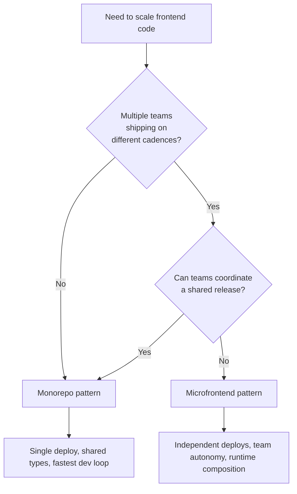

# Chapter 0: The Angular Ecosystem

"Angular" is not a single npm package. Installing it pulls in a constellation of focused libraries -- one for signals and change detection, another for the router, another for forms, yet another for animations -- plus a family of dev tools, builders, and integration helpers. Around this official core sits a small ecosystem of semi-official packages that most production Angular codebases depend on: NgRx for state management at scale, Nx for monorepo tooling, angular-eslint for linting, Sheriff for boundary enforcement.

This chapter is a reference. Newcomers use it to orient themselves in the package landscape; experienced developers return to it when they need to remember which package owns which concern. It is not meant to be read linearly. Skim the category headings, find the package you need, and follow the cross-reference to the chapter where it is used in depth.

> **Version note:** Versions shown track Angular v21 stable, the baseline used throughout the companion FinancialApp. Run `ng update` or `nx migrate` to upgrade an existing workspace -- see [Chapter 30](ch30-advanced-nx.md) for the upgrade workflow and [Chapter 51](ch51-migrations.md) for major-version migrations.

---

## Official `@angular/*` Packages

### Core Framework

These are the packages nearly every Angular application depends on. `@angular/core` is non-negotiable; the rest are optional in theory but near-universal in practice.

| Package | Version | Type | Description |
|---|---|---|---|
| `@angular/core` | `~21.0.0` | dep | The framework itself: the component system, signals (`signal`, `computed`, `effect`, `resource`, `linkedSignal`), dependency injection (`inject`, `InjectionToken`), change detection (zoneless), and lifecycle primitives. See [Chapter 2](ch02-signal-components.md) and [Chapter 3](ch03-reactive-signals.md). |
| `@angular/common` | `~21.0.0` | dep | Common directives and pipes you use in nearly every template: `NgIf` and `NgFor` (superseded by `@if`/`@for` in v21), `CurrencyPipe`, `DatePipe`, `DecimalPipe`, `NgOptimizedImage`, the `HttpClient` (via `@angular/common/http`), the `Location` service, and locale registration helpers. |
| `@angular/compiler` | `~21.0.0` | dep | The Angular template compiler runtime. Required for JIT compilation; still bundled at build time even when AOT compilation is used. You rarely import from it directly. |
| `@angular/compiler-cli` | `~21.0.0` | dev | The AOT compiler invoked by the build pipeline. Transforms templates into optimized JavaScript at build time. You interact with it via the CLI, not directly. |
| `@angular/router` | `~21.0.0` | dep | The router: `Routes`, `provideRouter`, guards (`CanActivateFn`, `CanDeactivateFn`), resolvers (`ResolveFn`), and `RouterLink`/`RouterOutlet`. Signal-based input binding lives here (`withComponentInputBinding`). Covered in [Chapter 4](ch04-router.md) and [Chapter 12](ch12-initialization-routes.md). |
| `@angular/forms` | `~21.0.0` | dep | Template-driven forms (legacy `NgModel`), reactive forms (legacy `FormControl`), and the new **Signal Forms** API (`formField`, `formGroup`, `formArray`) introduced in v21. See [Chapter 6](ch06-signal-forms.md). |
| `@angular/animations` | `~21.0.0` | dep | The animation engine: `trigger`, `state`, `transition`, `animate`, `keyframes`, `query`, `stagger`. Optional -- only loaded when `provideAnimationsAsync()` is called. Covered in [Chapter 27](ch27-material-design-system.md) and expanded in [Chapter 37](ch37-animations-deep-dive.md). |

### Platform Adapters

Different execution environments need different platform packages. Most applications use `@angular/platform-browser`; SSR applications add `@angular/platform-server`; JIT setups and some testing harnesses pull in `@angular/platform-browser-dynamic`.

| Package | Version | Type | Description |
|---|---|---|---|
| `@angular/platform-browser` | `~21.0.0` | dep | Bootstrap for browser environments (`bootstrapApplication`), `DomSanitizer`, `Title`, `Meta`, and the asynchronous animation loader (`provideAnimationsAsync`). |
| `@angular/platform-browser-dynamic` | `~21.0.0` | dep | JIT compilation bootstrap (`platformBrowserDynamic().bootstrapModule()`) and the entry point used by `BrowserDynamicTestingModule`. Not required for AOT-only production builds but commonly pulled in by testing setups and legacy NgModule-based apps. |
| `@angular/platform-server` | `~21.0.0` | dep | Bootstrap for Node.js server-side rendering. Used together with `@angular/ssr`. See [Chapter 17](ch17-defer-ssr-hydration.md). |

### Rendering and Hybrid

These packages extend the client-only baseline with server rendering and service workers.

| Package | Version | Type | Description |
|---|---|---|---|
| `@angular/ssr` | `~21.0.0` | dep | Server-side rendering infrastructure: hydration (`provideClientHydration`), incremental hydration, HTTP transfer cache (`withHttpTransferCache`), and hybrid routing with `ServerRoute`/`RenderMode`. Installed by `ng add @angular/ssr`. See [Chapter 17](ch17-defer-ssr-hydration.md). |
| `@angular/service-worker` | `~21.0.0` | dep | PWA support: `provideServiceWorker`, `SwUpdate`, `SwPush`, and the `ngsw-config.json` schema. Installed by `ng add @angular/pwa`. See [Chapter 26](ch26-pwa-service-workers.md). |

### UI Primitives

Angular ships three complementary UI libraries. The CDK provides unstyled building blocks; Material provides an opinionated design system; Aria (new in v21) provides headless accessible directives that you style yourself.

| Package | Version | Type | Description |
|---|---|---|---|
| `@angular/cdk` | `~21.0.0` | dep | Component Dev Kit: unstyled primitives including `Overlay`, `Portal`, `A11y` helpers (`LiveAnnouncer`, `cdkTrapFocus`, `FocusMonitor`), `DragDrop` (covered in [Chapter 36](ch36-drag-and-drop.md)), `ScrollingModule` for virtual scroll, `Table`, and `Layout` utilities (`BreakpointObserver`). |
| `@angular/material` | `~21.0.0` | dep | Material Design 3 components: `MatToolbar`, `MatTable`, `MatFormField`, `MatButton`, `MatDialog`, `MatSnackBar`, `MatTabs`, `MatDatepicker`, and many more. See [Chapter 27](ch27-material-design-system.md). |
| `@angular/aria` | `~21.0.0` | dep | **New in v21.** Headless, accessible directives implementing WAI-ARIA patterns: `ngToolbar`, `ngTabList`, `ngCombobox`, `ngAccordion`, `ngMenu`, `ngListbox`, `ngTree`, and more. You provide the HTML and styling; Angular Aria handles keyboard interactions and ARIA attributes. See [Chapter 22](ch22-accessibility-aria.md). |
| `@angular/material-moment-adapter` | `~21.0.0` | dep | Date adapter for `MatDatepicker` using Moment.js. |
| `@angular/material-luxon-adapter` | `~21.0.0` | dep | Date adapter for `MatDatepicker` using Luxon. The recommended modern option. |
| `@angular/material-date-fns-adapter` | `~21.0.0` | dep | Date adapter for `MatDatepicker` using date-fns. |

### Internationalization

| Package | Version | Type | Description |
|---|---|---|---|
| `@angular/localize` | `~21.0.0` | dep | The i18n pipeline: `$localize` template literal tagging, XLF message extraction via `ng extract-i18n`, and runtime locale loading. See [Chapter 15](ch15-internationalization.md). |

### Testing Utilities

Angular's testing utilities are not separate npm packages; they are **subpath entry points** of the core packages listed above. They ship with Angular v21 out of the box -- no extra install needed, but they are worth cataloging because teams easily miss them when hunting for test APIs.

| Entry point | Parent package | Description |
|---|---|---|
| `@angular/core/testing` | `@angular/core` | The `TestBed` API, `ComponentFixture`, `fakeAsync`, `tick`, `flush`, `inject` inside tests, and `rethrowApplicationErrors`. The core testing surface used in every unit test -- see [Chapter 7](ch07-testing-vitest.md). |
| `@angular/common/testing` | `@angular/common` | `MockLocationStrategy`, `SpyLocation` for testing code that depends on `Location`. |
| `@angular/common/http/testing` | `@angular/common` | `HttpTestingController`, `provideHttpClientTesting()` for simulating HTTP requests and asserting on outgoing calls. |
| `@angular/router/testing` | `@angular/router` | `RouterTestingHarness`, testing helpers for navigation and guard verification. |
| `@angular/platform-browser/testing` | `@angular/platform-browser` | `BrowserTestingModule` and `platformBrowserTesting()` for the AOT testing environment. |
| `@angular/platform-browser-dynamic/testing` | `@angular/platform-browser-dynamic` | `BrowserDynamicTestingModule` and `platformBrowserDynamicTesting()` for JIT-based tests. |

The CDK and Material ship a separate **component test harness** framework. These are distributed under the parent package but imported from subpaths, and they unlock DOM-free component interactions in tests.

| Package / entry point | Version | Type | Description |
|---|---|---|---|
| `@angular/cdk/testing` | `~21.0.0` | dev | Component test harness framework: `HarnessLoader`, `ComponentHarness`, `TestElement`. Used to interact with components through stable APIs instead of brittle DOM selectors. |
| `@angular/cdk/testing/testbed` | `~21.0.0` | dev | `TestbedHarnessEnvironment` for loading harnesses in Vitest/Jest unit tests. |
| `@angular/cdk/testing/protractor` | `~21.0.0` | dev | Protractor harness environment (legacy; prefer Playwright via a custom environment or `@angular/cdk/testing/webdriver`). |
| `@angular/material/{component}/testing` | `~21.0.0` | dev | Per-component harness modules: `MatButtonHarness`, `MatFormFieldHarness`, `MatTableHarness`, `MatSnackBarHarness`, and so on. Import from `@angular/material/button/testing` and similar subpaths. |

### Key Subpaths

Several important Angular APIs live at **subpaths** of the core packages rather than in separate npm packages. They are easy to miss when browsing the package list, so they are called out here.

| Entry point | Parent package | Description |
|---|---|---|
| `@angular/core/rxjs-interop` | `@angular/core` | `toSignal`, `toObservable`, `rxResource`, `outputFromObservable`, `outputToObservable`, `pendingUntilEvent`. The bridge between signals and RxJS -- used throughout [Chapter 3](ch03-reactive-signals.md) and [Chapter 32](ch32-rxjs-deep-dive.md). |
| `@angular/common/http` | `@angular/common` | `HttpClient`, `provideHttpClient`, `withInterceptors`, `withXsrfConfiguration`, `withHttpTransferCache`, `HttpInterceptorFn`. See [Chapter 12](ch12-initialization-routes.md). |
| `@angular/platform-browser/animations/async` | `@angular/platform-browser` | `provideAnimationsAsync()` -- the lazy animation loader preferred over `provideAnimations()` (see [Chapter 1](ch01-getting-started.md)). |
| `@angular/router/upgrade` | `@angular/router` | Interop shims for hybrid AngularJS + Angular routing during migration (see [Chapter 51](ch51-migrations.md)). |

### Dev Tooling and Build

These are devDependencies that power the CLI and the build. You install them during project creation and rarely touch them afterward.

| Package | Version | Type | Description |
|---|---|---|---|
| `@angular/cli` | `~21.0.0` | dev | The `ng` command: `ng new`, `ng generate`, `ng serve`, `ng build`, `ng test`, `ng e2e`, `ng add`, `ng update`, `ng mcp`. See [Chapter 1](ch01-getting-started.md). |
| `@angular/build` | `~21.0.0` | dev | The esbuild/Vite-based application builder and dev server for Angular v17+. Replaces the legacy webpack builder. Registered as `@angular/build:application` and `@angular/build:dev-server` in project targets. |
| `@angular/language-service` | `~21.0.0` | dev | Language server for IDE template support -- autocomplete, hover documentation, and diagnostics inside both inline and external templates. Consumed by the VS Code "Angular Language Service" extension and other TypeScript-aware editors. |
| `@angular-devkit/build-angular` | `~21.0.0` | dev | The legacy webpack-based builder, still shipped for compatibility with older configurations. New projects use `@angular/build` instead. |
| `@angular-devkit/architect` | `~21.0.0` | dev | The target/builder orchestration layer beneath `ng build`/`ng serve`. Invoked indirectly in day-to-day use; authoring custom builders requires importing from it. |
| `@angular-devkit/schematics` | `~21.0.0` | dev | The schematic authoring framework used by `ng generate` and `ng add`. Needed when writing custom generators. See [Chapter 30](ch30-advanced-nx.md). |
| `@angular-devkit/core` | `~21.0.0` | dev | Core utilities shared by the devkit: JSON schema, logger, file tree abstractions. Transitive dependency of the schematics API. |

### Integration Helpers

Optional packages for specific interop scenarios.

| Package | Version | Type | Description |
|---|---|---|---|
| `@angular/elements` | `~21.0.0` | dep | Wraps Angular components as framework-agnostic Custom Elements (Web Components). Use when embedding Angular UI in a React/Vue/legacy page. See [Chapter 39](ch39-angular-elements.md). |
| `@angular/upgrade` | `~21.0.0` | dep | Interop with AngularJS (1.x) during incremental migration. See [Chapter 51](ch51-migrations.md). |
| `@angular/fire` | `~19.0.0` | dep | Official Firebase bindings: Firestore, Auth, Storage, Cloud Functions. Released on an independent cadence from core Angular -- check the compatibility matrix in the AngularFire README before upgrading. |
| `@angular/google-maps` | `~21.0.0` | dep | Google Maps component wrappers: `google-map`, `map-marker`, `map-polyline`. |
| `@angular/youtube-player` | `~21.0.0` | dep | YouTube iframe API component wrapper. |

---

## Ecosystem Packages

Packages outside the `@angular` scope that the book and the companion FinancialApp depend on.

### NgRx

State management and reactive utilities maintained by a core team aligned with Angular. Used heavily in [Chapter 9](ch09-ngrx-signal-store.md).

| Package | Version | Type | Description |
|---|---|---|---|
| `@ngrx/signals` | `~21.0.0` | dep | Signal-native state management: `signalStore`, `withState`, `withComputed`, `withMethods`, `withHooks`. The recommended modern approach. See [Chapter 9](ch09-ngrx-signal-store.md). |
| `@ngrx/store` | `~21.0.0` | dep | Classic Redux-style global store: `StoreModule`, reducers, selectors. Still maintained for teams with existing investment in this pattern. |
| `@ngrx/effects` | `~21.0.0` | dep | Side-effect orchestration for `@ngrx/store`: `createEffect`, action streams, observable workflows. |
| `@ngrx/entity` | `~21.0.0` | dep | Normalized entity collection helpers. Composes with both `signalStore` (`withEntities`) and `@ngrx/store`. |
| `@ngrx/router-store` | `~21.0.0` | dep | Surfaces router state as signals or observables for use in stores and effects. |
| `@ngrx/store-devtools` | `~21.0.0` | dep | Redux DevTools browser-extension integration for inspecting state changes and time-travel debugging. |
| `@ngrx/operators` | `~21.0.0` | dep | RxJS operators tailored for state management: `tapResponse`, `mapResponse`, `concatLatestFrom`. |
| `@ngrx/eslint-plugin` | `~21.0.0` | dev | Lint rules enforcing NgRx best practices: action hygiene, selector usage, effect patterns. |
| `@ngrx/schematics` | `~21.0.0` | dev | Code generators for NgRx artifacts: `ng generate @ngrx/schematics:signal-store`, `action`, `effect`, `entity`, `reducer`. |
| `@ngrx/toolkit` | `~21.0.0` | dep | Experimental extensions for `@ngrx/signals`: mutations, events, devtools integration for signal stores. Pre-stable API. |

NgRx follows Angular's major-version cadence -- NgRx v21 targets `@angular/core@^21.0.0`. See the [NgRx release notes](https://github.com/ngrx/platform/releases) when upgrading.

### Nx

The monorepo platform the FinancialApp is built on. See [Chapter 14](ch14-monorepos-libraries.md) for fundamentals and [Chapter 30](ch30-advanced-nx.md) for advanced features.

| Package | Version | Type | Description |
|---|---|---|---|
| `nx` | `~21.0.0` | dev | The core Nx CLI and task runner. Provides `nx affected`, task caching, the project graph, and `nx migrate`. |
| `@nx/angular` | `~21.0.0` | dev | Angular-specific generators, executors, and migrations for Nx workspaces. Wraps `@angular-devkit/build-angular` and `@angular/build`. |
| `@nx/workspace` | `~21.0.0` | dev | Core workspace utilities: `nx init`, project creation, and cross-tech generators. |
| `@nx/devkit` | `~21.0.0` | dev | API for authoring custom Nx generators and executors. Required when writing the workspace generators from [Chapter 30](ch30-advanced-nx.md). |
| `@nx/js` | `~21.0.0` | dev | Generic TypeScript library generator; used for libraries that are not Angular-specific. |
| `@nx/eslint` | `~21.0.0` | dev | ESLint integration for Nx projects: `@nx/eslint:lint` executor and module-boundary rules. |
| `@nx/vite` | `~21.0.0` | dev | Vite and Vitest integration. Provides the `@nx/vite:test` executor used throughout the FinancialApp. |
| `@nx/jest` | `~21.0.0` | dev | Jest integration. Alternative to `@nx/vite:test` for teams on Jest. |
| `@nx/playwright` | `~21.0.0` | dev | Playwright integration for E2E testing. See [Chapter 25](ch25-e2e-playwright.md). |
| `@nx/cypress` | `~21.0.0` | dev | Cypress E2E integration; an alternative to Playwright for teams standardized on Cypress. |
| `@nx/storybook` | `~21.0.0` | dev | Storybook integration: generators, executors, and build targets. See [Chapter 28](ch28-storybook.md). |

### Linting

Official angular-eslint rules and the Angular schematic adapter.

| Package | Version | Type | Description |
|---|---|---|---|
| `@angular-eslint/eslint-plugin` | `~21.0.0` | dev | ESLint rules for TypeScript Angular code: component-class-suffix, directive-selector, use-lifecycle-interface. |
| `@angular-eslint/eslint-plugin-template` | `~21.0.0` | dev | ESLint rules for Angular HTML templates: accessibility, bindings, control flow. Works with the template parser. |
| `@angular-eslint/template-parser` | `~21.0.0` | dev | Custom ESLint parser for Angular template syntax so the template rules can operate on `.html` files. |
| `@angular-eslint/schematics` | `~21.0.0` | dev | `ng add` and `ng generate` schematics for adding and configuring angular-eslint. |
| `@angular-eslint/builder` | `~21.0.0` | dev | An Angular builder that runs ESLint through the CLI (`ng lint`). Nx uses `@nx/eslint` instead. |

### Architecture Enforcement

| Package | Version | Type | Description |
|---|---|---|---|
| `@softarc/sheriff-core` | `~0.16.0` | dev | Dependency rule enforcement between modules. Declarative configuration (`sheriff.config.ts`) catches forbidden imports at lint time. Used throughout the FinancialApp to keep shared libraries from importing app code. See [Chapter 8](ch08-architecture.md). |

### Schematics-Only Packages

These packages are used via `ng add` to scaffold configuration and wiring -- they run once and are not kept as permanent dependencies in most projects.

| Package | Description |
|---|---|
| `@angular/pwa` | Scaffolds `@angular/service-worker`, `manifest.webmanifest`, `ngsw-config.json`, and icons. Runs once via `ng add @angular/pwa`. See [Chapter 26](ch26-pwa-service-workers.md). |
| `@angular/ssr` (schematic) | The `ng add @angular/ssr` schematic wires SSR into an existing app. After it runs, the runtime `@angular/ssr` dep listed above remains. |

---

## Nx: Monorepo vs Microfrontend

Nx supports two architectural patterns for scaling frontend code: a **monorepo** where multiple apps and libraries share a single codebase and build pipeline, and a **microfrontend** setup where independently deployed applications are composed at runtime. Both have their place. This section is a decision framework and configuration reference -- it does not re-teach Nx fundamentals (see [Chapter 14](ch14-monorepos-libraries.md)) or Native Federation mechanics (see [Chapter 18](ch18-micro-frontends.md)).

### Decision Framework



Choose a **monorepo** when:

- One team or a few cooperating teams own the codebase
- All apps can release on a shared cadence
- Strong compile-time type sharing between apps and libraries matters more than independent deployment
- Dev loop speed and atomic refactors outweigh runtime isolation

Choose **microfrontends** when:

- Multiple teams ship to the same product on truly independent schedules
- Teams must deploy without coordinating with other teams
- Framework-version heterogeneity is a temporary reality (migrating from AngularJS or React)
- Clear organizational boundaries justify the added operational complexity

A rule of thumb: start with a monorepo. Move to microfrontends only when the monorepo approach can no longer accommodate your team structure. The two patterns are not mutually exclusive -- Nx monorepos can host microfrontend setups where the shell and each remote are separate apps in the same workspace.

### Monorepo Configuration

A minimal Nx monorepo for the FinancialApp uses three configuration files: `nx.json` for workspace-wide defaults, per-project `project.json` files, and `tsconfig.base.json` for path mappings. A `sheriff.config.ts` enforces boundaries between libraries.

```json
// nx.json
{
  "$schema": "./node_modules/nx/schemas/nx-schema.json",
  "defaultProject": "financial-app",
  "namedInputs": {
    "default": ["{projectRoot}/**/*", "sharedGlobals"],
    "production": [
      "default",
      "!{projectRoot}/**/*.spec.ts",
      "!{projectRoot}/tsconfig.spec.json"
    ]
  },
  "targetDefaults": {
    "build": { "dependsOn": ["^build"], "inputs": ["production", "^production"], "cache": true },
    "test":  { "inputs": ["default", "^production"], "cache": true },
    "lint":  { "inputs": ["default", "{workspaceRoot}/eslint.config.js"], "cache": true }
  }
}
```

```json
// apps/financial-app/project.json
{
  "name": "financial-app",
  "$schema": "../../node_modules/nx/schemas/project-schema.json",
  "projectType": "application",
  "sourceRoot": "apps/financial-app/src",
  "prefix": "fin",
  "tags": ["app:financial-app"],
  "targets": {
    "build": { "executor": "@angular/build:application" },
    "serve": { "executor": "@angular/build:dev-server" },
    "test":  { "executor": "@nx/vite:test" },
    "lint":  { "executor": "@nx/eslint:lint" }
  }
}
```

```json
// libs/shared/models/project.json
{
  "name": "shared-models",
  "$schema": "../../../node_modules/nx/schemas/project-schema.json",
  "projectType": "library",
  "sourceRoot": "libs/shared/models/src",
  "prefix": "lib",
  "tags": ["shared:models"],
  "targets": {
    "lint": { "executor": "@nx/eslint:lint" },
    "test": { "executor": "@nx/vite:test" }
  }
}
```

```json
// tsconfig.base.json
{
  "compilerOptions": {
    "paths": {
      "@financial-app/shared/models":      ["libs/shared/models/src/index.ts"],
      "@financial-app/shared/ui":          ["libs/shared/ui/src/index.ts"],
      "@financial-app/shared/data-access": ["libs/shared/data-access/src/index.ts"]
    }
  }
}
```

```typescript
// sheriff.config.ts
import { noDependencies, SheriffConfig } from '@softarc/sheriff-core';

export const sheriffConfig: SheriffConfig = {
  version: 1,
  tagging: {
    'apps/<app>': 'app:<app>',
    'libs/shared/<lib>': 'shared:<lib>',
  },
  depRules: {
    'app:*': ['shared:*'],
    'shared:models':      noDependencies,
    'shared:ui':          ['shared:models'],
    'shared:data-access': ['shared:models'],
  },
};
```

One build pipeline, one deploy artifact, one release. TypeScript paths provide compile-time type sharing between the app and the libraries. Sheriff enforces the dependency graph at lint time. Tests and builds are cached and only rerun for affected projects (`nx affected -t test`).

### Microfrontend Configuration

A microfrontend setup introduces one new concept: remotes exposing modules and a shell loading them at runtime. Each remote is an Nx app with a federation configuration; the shell is an Nx app that reads a manifest of remote URLs. The underlying monorepo conventions (tsconfig paths, sheriff rules, Nx caching) remain the same.

```javascript
// apps/accounts-mfe/federation.config.js
const { withNativeFederation, shareAll } = require('@angular-architects/native-federation/config');

module.exports = withNativeFederation({
  name: 'accounts-mfe',
  exposes: {
    './routes': './apps/accounts-mfe/src/app/accounts.routes.ts',
  },
  shared: {
    ...shareAll({
      singleton: true,
      strictVersion: true,
      requiredVersion: 'auto',
    }),
  },
});
```

```json
// apps/shell/src/assets/federation.manifest.json
{
  "accounts-mfe":   "https://accounts.financialapp.com/remoteEntry.json",
  "portfolio-mfe":  "https://portfolio.financialapp.com/remoteEntry.json",
  "onboarding-mfe": "https://onboarding.financialapp.com/remoteEntry.json"
}
```

```typescript
// apps/shell/src/main.ts
import { initFederation } from '@angular-architects/native-federation';

initFederation('federation.manifest.json')
  .then(() => import('./bootstrap'))
  .catch(err => console.error(err));
```

```typescript
// apps/shell/src/app/app.routes.ts
import { loadRemoteModule } from '@angular-architects/native-federation';
import { Routes } from '@angular/router';

export const appRoutes: Routes = [
  {
    path: 'accounts',
    loadChildren: () =>
      loadRemoteModule('accounts-mfe', './routes').then(m => m.ACCOUNTS_ROUTES),
  },
  {
    path: 'portfolio',
    loadChildren: () =>
      loadRemoteModule('portfolio-mfe', './routes').then(m => m.PORTFOLIO_ROUTES),
  },
];
```

```json
// apps/accounts-mfe/project.json (federation targets)
{
  "name": "accounts-mfe",
  "targets": {
    "build":  { "executor": "@angular-architects/native-federation:build" },
    "serve":  { "executor": "@angular-architects/native-federation:serve", "options": { "port": 4201 } }
  }
}
```

Each remote deploys independently to its own host. The shell reads `federation.manifest.json` at startup and lazily loads remotes on route match. Dependency sharing (`shareAll`, `singleton`, `strictVersion`) prevents the user from downloading Angular three times. See [Chapter 18](ch18-micro-frontends.md) for routing across MFEs, authentication coordination, and shared state strategies.

### Side-by-Side Comparison

| Concern | Monorepo | Microfrontend |
|---|---|---|
| Deploy units | One artifact, one deploy | One artifact per remote plus the shell |
| Build pipeline | Single `nx build` (with `nx affected` for incremental) | Independent pipelines per remote and shell |
| Type sharing | Compile-time via TypeScript paths | Runtime module contracts; types must be published or duplicated |
| Dependency sharing | Single `node_modules`, one Angular version | Runtime `shareAll` with version negotiation; risk of duplication |
| Release cadence | Coordinated across apps | Independent per remote |
| Test boundary | Workspace-level; `nx affected` reruns only impacted projects | Per-app test suites; integration tests across MFEs are manual |
| Runtime composition | Static at build time | Dynamic via federation manifest |
| Refactoring across boundaries | Atomic (single commit touches everything) | Multi-commit, multi-deploy with version coordination |
| Dev loop | One `nx serve` runs everything | One dev server per MFE plus the shell |
| Operational complexity | Low | High |

The monorepo wins on developer productivity and type safety. The microfrontend setup wins on team autonomy and independent deployment. Most FinancialApp-sized projects never need the latter.

---

## Reading Path

If you are new to Angular, start at [Chapter 1](ch01-getting-started.md) and read Part I through Part III in order. Architects should also read [Chapter 8](ch08-architecture.md) and [Chapter 14](ch14-monorepos-libraries.md). Teams evaluating micro frontends should read [Chapter 18](ch18-micro-frontends.md) before adopting the pattern. This chapter stays on your reference shelf -- come back whenever you need to remember which package owns which concern.
