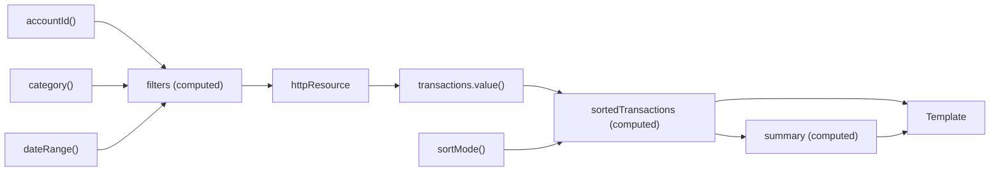

# Chapter 3: Reactive Design with Signals

In [Chapter 2](ch02-signal-components.md) we built components that declare their inputs and outputs with signals. That alone was enough to eliminate a significant class of change-detection bugs. But signals are not just a component API -- they are the foundation of a reactive programming model that replaces zone.js, simplifies asynchronous data fetching, and lets Angular determine *exactly* which views need to update and *when*.

This chapter explores that model in depth. We will start with the primitives -- `signal()`, `computed()`, `resource()`, and `effect()` -- and then examine the semantics that make them reliable: glitch-free propagation, equality checks, and the reactive context. Finally, we will wire these primitives together into a realistic reactive flow: the FinancialApp's transaction filter and search pipeline.

> **Companion code**: The examples in this chapter correspond to files in `financial-app/libs/shared/data-access/src/` and `financial-app/apps/financial-app/src/app/features/transactions/`. Run them locally with `nx serve financial-app`.

---

## Building Blocks of Reactive Design

Angular's signal API is intentionally small. A handful of primitives compose into arbitrarily complex reactive graphs, much like a few LEGO brick shapes can build anything. Before we compose them, we need to understand each one individually.

### Computed Signals

A `computed()` signal derives its value from other signals. It is lazy -- the computation runs only when you read the computed signal, and only if at least one dependency has changed since the last read. The framework caches the result, so subsequent reads with unchanged dependencies return instantly.

```typescript
import { signal, computed } from '@angular/core';

const transactions = signal<Transaction[]>([]);
const category = signal('');

const filtered = computed(() => {
  const cat = category();
  if (!cat) return transactions();
  return transactions().filter(
    (t) => t.category.toLowerCase().includes(cat.toLowerCase()),
  );
});
```

Reading `filtered()` calls the derivation function and tracks both `transactions` and `category` as dependencies. If you later call `category.set('utilities')`, Angular marks `filtered` as stale. The next read -- whether from a template binding or another computed -- re-evaluates the function.

Two properties make computed signals powerful:

1. **Laziness**: if nobody reads `filtered`, the filter logic never runs. This matters when a tab is hidden or a route is inactive.
2. **Memoization**: repeated reads with unchanged dependencies return the cached value with zero computation cost.

Computed signals are the workhorse of derived state. Reach for them whenever one piece of state can be expressed as a pure function of other pieces.

### Resources

Not all state lives in memory. Most applications spend a significant portion of their time waiting for HTTP responses, database queries, or other asynchronous operations. Angular's resource APIs bridge the gap between asynchronous data and the synchronous signal graph.

> **Experimental API notice**: All resource APIs -- `resource()`, `httpResource()`, and `rxResource()` -- are marked as *developer preview* in Angular v21. Their core shape is stable and safe to adopt, but minor signature changes are possible in future releases. The Angular team has signaled (no pun intended) that stabilization is a priority, and production applications are already using these APIs successfully.

Every resource shares the same conceptual model: you provide a reactive request function, and the resource returns a signal-based handle with `.value()`, `.status()`, `.isLoading()`, and `.error()` properties. When the inputs to the request function change, the resource automatically cancels any in-flight request and starts a new one.

#### httpResource

`httpResource()` is the highest-level resource API. It wraps `HttpClient` internally, so you get interceptors, testing support, and all the infrastructure Angular developers are already familiar with -- without writing a single `subscribe()` call.

```typescript
import { httpResource } from '@angular/common/http';
import { signal } from '@angular/core';

const accountId = signal(42);

const transactions = httpResource<Transaction[]>(() => ({
  url: `/api/accounts/${accountId()}/transactions`,
}), {
  defaultValue: [],
});
```

When `accountId` changes, the resource cancels any pending request and issues a new `GET`. The template reads `transactions.value()` and binds directly -- no subscription management, no async pipe, no explicit loading flags.

You can pass a full request configuration including HTTP method, headers, query parameters, and a response parser:

```typescript
const filteredTransactions = httpResource<Transaction[]>(() => {
  const f = filters();
  const params: Record<string, string> = {};
  if (f.category) params['category'] = f.category;
  if (f.startDate) params['startDate'] = f.startDate;
  if (f.endDate) params['endDate'] = f.endDate;
  return { url: `${apiUrl}/transactions`, params };
}, {
  defaultValue: [],
});
```

This pattern maps directly to the `TransactionService.getTransactions()` method in the companion code (see `libs/shared/data-access/src/transaction.service.ts`).

#### rxResource

If your data pipeline involves RxJS operators -- debouncing user input, retrying on failure, combining multiple streams -- `rxResource()` lets you return an `Observable` instead of a `Promise`:

```typescript
import { rxResource } from '@angular/core/rxjs-interop';
import { debounceTime, switchMap } from 'rxjs';

const searchTerm = signal('');

const searchResults = rxResource({
  request: () => searchTerm(),
  loader: ({ request: term }) =>
    inject(HttpClient)
      .get<Transaction[]>('/api/transactions/search', {
        params: { q: term },
      }),
});
```

The `request` function runs in a reactive context, so it tracks signal dependencies automatically. When `searchTerm` changes, the resource invokes the `loader` with the new value, cancelling any previous in-flight Observable via `switchMap` semantics internally.

Use `rxResource` when you need the operator ecosystem. For straightforward HTTP calls, prefer `httpResource` -- it requires less ceremony and covers the majority of use cases.

#### resource (Promise-based)

The base `resource()` function accepts a `loader` that returns a `Promise`. It sits between `httpResource` (which handles HTTP specifics for you) and `rxResource` (which gives you the full Observable toolkit):

```typescript
import { resource, signal } from '@angular/core';

const accountId = signal(1);

const account = resource({
  request: () => accountId(),
  loader: async ({ request: id, abortSignal }) => {
    const res = await fetch(`/api/accounts/${id}`, { signal: abortSignal });
    if (!res.ok) throw new Error(`HTTP ${res.status}`);
    return res.json() as Promise<Account>;
  },
});
```

The framework passes an `AbortSignal` to the loader so that cancelled requests can free network resources. This is the right choice when you are working with `fetch()` directly, calling a third-party SDK that returns promises, or running in an environment without `HttpClient`.

### Effects

An `effect()` runs a side-effect function whenever any signal it reads changes. Effects are the escape hatch from the pure, declarative world of signals and computed values into the imperative world of DOM manipulation, logging, analytics, and local storage.

```typescript
import { effect, signal } from '@angular/core';

const filters = signal({ category: '', startDate: '', endDate: '' });

effect(() => {
  const f = filters();
  console.log('Filters changed:', f);
  localStorage.setItem('txn-filters', JSON.stringify(f));
});
```

Effects run asynchronously after the signal graph stabilizes. They are *not* suitable for propagating state changes (use `computed()` for that). We will return to this point in "Discussing Explicit Effects" below.

---

## Signal Semantics in Angular

The primitives are simple to use, but their behavior rests on several semantic guarantees that are worth understanding. These guarantees are what make signals *reliable* rather than merely *convenient*.

### Signals in the Component Lifecycle

In a zoneless Angular application (which is the default starting with Angular v19), signals notify the framework directly that a view needs updating. There is no `NgZone`, no patching of `setTimeout` or `Promise`, and no whole-tree dirty-checking pass. Instead:

1. A signal's value changes (via `.set()`, `.update()`, or a resource reload).
2. Angular marks every view that reads that signal as dirty.
3. On the next change-detection cycle, only the dirty views re-render.

This targeted invalidation is why zoneless applications scale better: updating a single filter signal in the transactions feature does not cause the accounts dashboard to re-check its bindings.

Signals integrate with the component lifecycle at two points:

- **Creation**: signals defined as class fields are available immediately in the constructor and in `ngOnInit`. Unlike observables, there is no timing concern with "too early" subscriptions.
- **Destruction**: computed signals and effects created within an injection context are automatically cleaned up when the component is destroyed. If you create an effect outside an injection context, you must provide a `DestroyRef` or `Injector` and manage teardown yourself.

### Auto-Tracking and the Reactive Context

When you call a signal inside a `computed()` or `effect()`, Angular records that signal as a dependency. This is called *auto-tracking*, and the scope in which tracking occurs is the *reactive context*.

Auto-tracking is the reason you never need to declare a dependency array (as you would with React's `useMemo` or `useEffect`). The framework discovers dependencies dynamically at runtime:

```typescript
const showPending = signal(false);
const transactions = signal<Transaction[]>([]);

const visible = computed(() => {
  if (!showPending()) return transactions();
  return transactions().filter((t) => t.pending);
});
```

If `showPending()` returns `false`, Angular records only `showPending` and `transactions` as dependencies but does *not* read into any nested signal inside the `filter` callback. If `showPending` later becomes `true`, the next evaluation discovers the same two dependencies. The dependency set is recalculated on every evaluation, so it always reflects the actual code path taken.

### Discussing Explicit Effects

Effects are powerful, but they are also the most common source of signal-related bugs. The Angular team's guidance is clear: **prefer computed signals and resources over effects whenever possible**.

The temptation is to use an effect to "watch" a signal and set another signal in response:

```typescript
// Anti-pattern: propagating state through an effect
const category = signal('');
const filteredTransactions = signal<Transaction[]>([]);

effect(() => {
  const cat = category();
  filteredTransactions.set(
    allTransactions().filter((t) => t.category === cat),
  );
});
```

This works, but it introduces a timing gap: `filteredTransactions` is momentarily stale between the `category` change and the effect execution. A `computed()` eliminates that gap entirely because it evaluates lazily at read time.

Reserve effects for genuine side effects:

- Persisting state to `localStorage` or a URL query parameter
- Logging and analytics
- Synchronizing with non-Angular APIs (a chart library, a map widget)
- Triggering a resource reload that cannot be expressed as a reactive request function

When you do use an effect, keep it focused: one effect, one responsibility.

### Untracking

Sometimes you need to read a signal inside a reactive context without establishing a dependency. The `untracked()` function serves this purpose:

```typescript
import { computed, untracked, signal } from '@angular/core';

const transactions = signal<Transaction[]>([]);
const logCount = signal(0);

const sorted = computed(() => {
  const txns = transactions();
  const count = untracked(() => logCount());
  console.log(`Sorting ${txns.length} transactions (log #${count})`);
  return [...txns].sort((a, b) => b.date.localeCompare(a.date));
});
```

Here, `sorted` depends on `transactions` but *not* on `logCount`. Changing `logCount` will not cause `sorted` to re-evaluate. Use `untracked()` sparingly -- it is a sharp tool that can create subtle bugs if a dependency is accidentally excluded.

### Glitch-Free Property

A "glitch" in reactive programming is a momentary inconsistency: a consumer reads a stale value because one of its dependencies has updated but another has not propagated yet. Angular's signal implementation guarantees **glitch-free** reads by evaluating the graph lazily and topologically.

Consider this diamond dependency:

```typescript
const amount = signal(100);
const taxRate = signal(0.2);
const tax = computed(() => amount() * taxRate());
const total = computed(() => amount() + tax());
```

When `amount` changes from 100 to 200, both `tax` and `total` are stale. If `total` were evaluated eagerly after `amount` updated but before `tax` recalculated, it would momentarily produce `200 + 20 = 220` (wrong) instead of `200 + 40 = 240` (correct). Angular avoids this by deferring evaluation until `total()` is actually read. At that point, it walks the graph, ensures `tax` is fresh, then evaluates `total` with consistent inputs.

This property means you can build arbitrarily deep signal graphs without worrying about intermediate inconsistencies. The FinancialApp's transaction pipeline -- with its filters, sort, and aggregation computed signals -- relies on this guarantee heavily.

### Equality and Immutability

By default, signals use `Object.is()` to determine whether a new value is different from the current one. Setting a signal to the same primitive value it already holds is a no-op: no dependents are notified, no views are marked dirty.

For objects and arrays, `Object.is()` compares by reference. This means *mutating* an existing array and calling `.set()` with the same reference will not trigger updates:

```typescript
const items = signal([1, 2, 3]);

const arr = items();
arr.push(4);
items.set(arr); // No update -- same reference
```

The fix is to produce a new reference:

```typescript
items.update((prev) => [...prev, 4]); // New array, triggers update
```

You can supply a custom equality function when creating a signal:

```typescript
const filters = signal(
  { category: '', startDate: '', endDate: '' },
  {
    equal: (a, b) =>
      a.category === b.category &&
      a.startDate === b.startDate &&
      a.endDate === b.endDate,
  },
);
```

This avoids unnecessary re-renders when the filter object is reconstructed with the same values -- a common occurrence in template-driven forms.

---

## Establishing a Reactive Flow

The individual primitives are useful, but the real payoff comes when you compose them into a *reactive flow* -- a directed graph of signals, computed values, and resources that transforms user intent into displayed data with no imperative glue code.

### Thinking in Terms of the Signal Graph

Before writing code, it helps to sketch the signal graph. Here is the one we will build for the FinancialApp's transaction search feature:



Reading the graph left to right: the user's filter inputs (`accountId`, `category`, `dateRange`) feed into a combined `filters` computed signal. That computed signal drives an `httpResource` that fetches matching transactions from the API. The resource's `.value()` signal feeds into a `sortedTransactions` computed, which also reads `sortMode`. Finally, a `summary` computed derives aggregate statistics. The template reads `sortedTransactions` and `summary` and renders the results.

Every node in this graph is either a writable signal (user input) or a derived signal (computed / resource). There are no imperative `.subscribe()` calls, no manual state synchronization, and no effect chains. When the user types a new category, the change propagates through the graph automatically.

### Implementing the Reactive Flow

Let us translate the graph into code. The component class below replaces the imperative version in the companion code's `transaction-search.component.ts` with a fully reactive implementation:

```typescript
import {
  Component,
  computed,
  inject,
  signal,
  linkedSignal,
} from '@angular/core';
import { httpResource } from '@angular/common/http';
import { toSignal } from '@angular/core/rxjs-interop';
import { ActivatedRoute } from '@angular/router';
import { map } from 'rxjs';
import { Transaction } from '@financial-app/shared/models';
import { TransactionCardComponent } from '@financial-app/shared/ui';

type SortMode = 'date' | 'amount' | 'category';

@Component({
  selector: 'app-transaction-search',
  standalone: true,
  imports: [TransactionCardComponent],
  templateUrl: './transaction-search.component.html',
  styleUrl: './transaction-search.component.scss',
})
export class TransactionSearchComponent {
  private readonly route = inject(ActivatedRoute);

  // -- Source signals (user input) --
  readonly accountId = toSignal(
    this.route.queryParamMap.pipe(
      map((p) => {
        const raw = p.get('accountId');
        return raw ? Number(raw) : null;
      }),
    ),
    { initialValue: null },
  );
  readonly category = signal('');
  readonly dateRange = signal({ start: '', end: '' });
  readonly sortMode = signal<SortMode>('date');

  // linkedSignal: derived from accountId but resettable by the user.
  // When accountId changes from route params, selectedAccount follows.
  // The user can also override it manually.
  readonly selectedAccount = linkedSignal(() => this.accountId());

  // -- Derived state --
  readonly filters = computed(() => {
    const params: Record<string, string> = {};
    const acct = this.selectedAccount();
    if (acct != null) params['accountId'] = String(acct);
    const cat = this.category();
    if (cat) params['category'] = cat;
    const range = this.dateRange();
    if (range.start) params['startDate'] = range.start;
    if (range.end) params['endDate'] = range.end;
    return params;
  });

  // -- Async data (httpResource is experimental) --
  readonly txnResource = httpResource<Transaction[]>(() => ({
    url: '/api/transactions',
    params: this.filters(),
  }), {
    defaultValue: [],
  });

  readonly sortedTransactions = computed(() => {
    const txns = this.txnResource.value();
    return this.sort(txns, this.sortMode());
  });

  readonly summary = computed(() => {
    const txns = this.txnResource.value();
    const credits = txns
      .filter((t) => t.type === 'credit')
      .reduce((sum, t) => sum + t.amount, 0);
    const debits = txns
      .filter((t) => t.type === 'debit')
      .reduce((sum, t) => sum + t.amount, 0);
    return { credits, debits, net: credits - debits };
  });

  private sort(txns: Transaction[], mode: SortMode): Transaction[] {
    const sorted = [...txns];
    switch (mode) {
      case 'date':
        return sorted.sort((a, b) => b.date.localeCompare(a.date));
      case 'amount':
        return sorted.sort((a, b) => b.amount - a.amount);
      case 'category':
        return sorted.sort((a, b) =>
          a.category.localeCompare(b.category),
        );
    }
  }
}
```

Several things to notice:

**`linkedSignal()`** creates a signal that is both derived and writable. `selectedAccount` tracks `accountId` by default (so navigating to `?accountId=5` updates it automatically), but the user can also call `selectedAccount.set(12)` from the UI. The next time `accountId` changes from the route, `selectedAccount` snaps back to the new route value. This pattern is ideal for "default-but-overridable" UI state.

**`httpResource()`** replaces the manual `subscribe()` / `loading` / `error` dance from the imperative version. The resource's reactive request function reads `this.filters()`, so any change to `category`, `dateRange`, or `selectedAccount` triggers a new HTTP request automatically. The resource handles cancellation of stale requests internally.

**`toSignal()`** converts the route's `queryParamMap` observable into a signal at the RxJS boundary. Once converted, the value participates in the signal graph like any other signal. For the reverse direction -- exposing a signal to RxJS-based code -- use `toObservable()`:

```typescript
import { toObservable } from '@angular/core/rxjs-interop';
import { debounceTime } from 'rxjs';

const category$ = toObservable(this.category).pipe(debounceTime(300));
```

This is useful when you want to debounce a rapidly-changing input signal before feeding it into a resource, or when you need to integrate with a library that expects an Observable.

**No effects.** The entire pipeline is expressed declaratively. There is no `effect()` wiring `category` to `filteredTransactions` to `sortedResults`. Each derived value is a `computed()` that reads its dependencies and returns a result. The framework handles the rest.

In a zoneless application, this reactive flow also determines change detection. When `httpResource` resolves with new transaction data, Angular marks the template bindings that read `sortedTransactions()` and `summary()` as dirty. Only those bindings re-evaluate -- the rest of the page is untouched. There is no `NgZone.run()`, no `markForCheck()`, and no `ChangeDetectorRef`. Signals notify the framework directly.

For deeper patterns around state management -- including SignalStore, state normalization, and optimistic updates -- see [Chapter 5](ch05-state-management.md).

---

## Summary

Signals give Angular a reactive primitive that is synchronous, glitch-free, and deeply integrated with the rendering engine. In this chapter we covered:

- **`signal()`** for writable state, **`computed()`** for derived state, and **`linkedSignal()`** for derived-but-writable state that can be overridden by the user.
- **Resources** (`httpResource`, `rxResource`, `resource`) for bridging asynchronous data into the signal graph. All three are experimental in Angular v21 but stable enough for production use with the understanding that minor API adjustments may occur.
- **`effect()`** as a disciplined escape hatch for side effects -- not for propagating state.
- **Auto-tracking** eliminates manual dependency arrays. The reactive context discovers dependencies at runtime.
- **Glitch-free propagation** guarantees that every read sees a consistent snapshot of the signal graph, even in diamond-shaped dependency structures.
- **Equality semantics** (`Object.is()` by default, custom comparators when needed) prevent unnecessary re-renders and reward immutable data patterns.
- **`toSignal()` / `toObservable()`** at the boundary between the signal world and the Observable world, keeping RxJS interop clean.
- A complete **reactive flow** for the FinancialApp transaction pipeline, expressed entirely through signals and computed values with zero imperative glue.

The mental model shift is straightforward: stop thinking about *when* things happen and start thinking about *what depends on what*. Define the relationships, and Angular handles the propagation.

In the next chapter, we will apply these reactive patterns to forms and validation, where signals replace much of the ceremony that Reactive Forms traditionally required.
