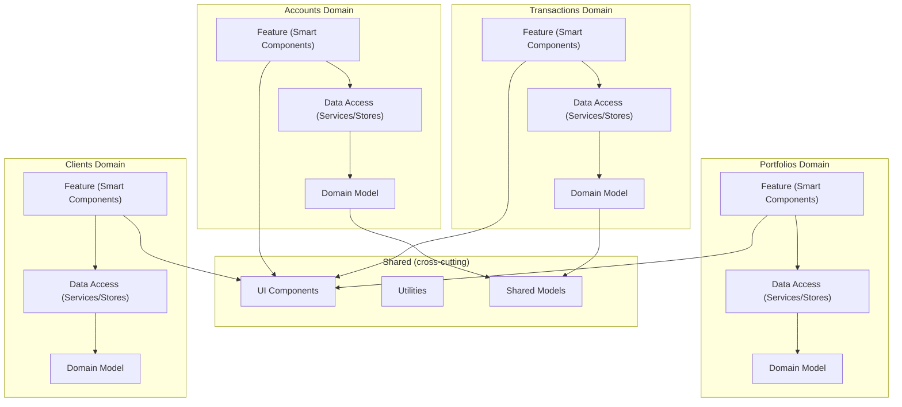
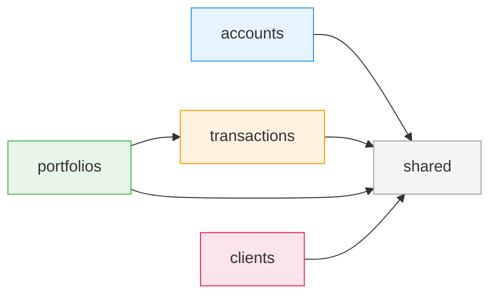

# Chapter 11: Sustainable Architectures for Modern Angular

Most Angular applications begin as a single module with a handful of components. The team moves fast, features ship, and the codebase grows. Then, somewhere around the 50-component mark, something shifts. A change in the transactions domain breaks an unrelated test in accounts. A junior developer accidentally imports a deep internal service from portfolios. Build times creep upward. Code reviews become archaeology expeditions.

This chapter addresses a single question: **how do you structure an Angular application so that it remains maintainable as it scales?** The answer is not a framework or a library -- it is a set of architectural patterns that guide where code lives, how modules communicate, and what boundaries you enforce. We will apply these patterns to our running example, the FinancialApp, whose four primary domains -- accounts, transactions, portfolios, and clients -- give us realistic boundaries to work with.

## Vertical Slicing

### Reasons for Vertical Slicing

Traditional layered architectures split an application horizontally: a UI layer, a service layer, a data-access layer. Each layer spans every domain. When a developer needs to implement a new "portfolio performance" feature, they touch files in every layer, often in directories far apart from each other.

Vertical slicing inverts this. Instead of organizing by technical concern, you organize by **business capability**. Each slice contains everything it needs -- components, services, stores, models -- to deliver a single domain's functionality.

The benefits are practical:

- **Reduced coupling**: changes to the transactions domain stay inside the transactions slice. The accounts team does not need to review them.
- **Team autonomy**: in larger organizations, different teams can own different slices with minimal coordination overhead.
- **Incremental extraction**: a vertical slice is the natural unit for extracting into a micro-frontend or a separate library if the application outgrows a monolith.
- **Cognitive locality**: everything a developer needs to understand a feature lives in one directory tree.

### Finding Boundaries

The hardest part of vertical slicing is deciding where one slice ends and another begins. Cut too finely and you end up with dozens of slices that constantly import from each other. Cut too coarsely and you are back to a monolith in all but name.

Good boundaries share several properties:

1. **High internal cohesion**: the code within a slice changes together frequently. In the FinancialApp, the transaction list, transaction detail, and transaction filters all evolve in lockstep.
2. **Low external coupling**: the slice can do most of its work without reaching into other slices. Transactions need a client ID, but they do not need to know how the clients domain validates addresses.
3. **Alignment with business language**: if domain experts talk about "accounts" and "portfolios" as separate concepts, your slices should mirror that language.
4. **Stable interfaces**: the surface area between slices should be narrow and change infrequently. A `ClientRef` type shared across slices is fine; sharing a full `ClientFormState` is a red flag.

### Event Storming

Event Storming, developed by Alberto Brandolini, is a collaborative workshop technique for discovering domain boundaries. You gather developers and domain experts in a room (or a virtual whiteboard) and map out the business events that flow through the system.

For the FinancialApp, an Event Storming session might produce events like:

- *Account Opened*, *Account Closed*, *Account Suspended*
- *Transaction Initiated*, *Transaction Approved*, *Transaction Settled*
- *Portfolio Created*, *Portfolio Rebalanced*, *Holdings Updated*
- *Client Onboarded*, *Client KYC Verified*, *Client Offboarded*

Events that cluster together typically belong in the same bounded context. Notice how the account events form a tight cluster with little overlap with the portfolio events. That clustering is your signal for where to draw boundaries.

You do not need to adopt full Domain-Driven Design to benefit from Event Storming. Even a two-hour session with sticky notes (or their digital equivalent) can save weeks of refactoring later.

### Different Models

A crucial insight from DDD is that **the same real-world concept can have different models in different contexts**. A "client" in the accounts domain might be a simple reference with an ID and display name. In the clients domain, it is a rich aggregate with contact information, KYC status, and risk profiles.

In the FinancialApp, this manifests as separate TypeScript interfaces:

```typescript
// @financial-app/clients/model
export interface Client {
  id: string;
  fullName: string;
  email: string;
  kycStatus: 'pending' | 'verified' | 'expired';
  riskProfile: RiskProfile;
  onboardedAt: Date;
}

// @financial-app/accounts/model
export interface ClientRef {
  clientId: string;
  displayName: string;
}
```

The accounts domain does not need the full `Client` model. It works with `ClientRef` -- a lightweight projection that contains only what accounts needs. This prevents the accounts domain from developing hidden dependencies on client internals.

### Different Slicing in the Frontend

Backend microservices often slice along aggregate boundaries. Frontend slicing follows different pressures because the UI inherently **composes** data from multiple domains onto a single screen.

A portfolio dashboard might display:

- The portfolio's holdings (portfolios domain)
- The client's name and risk profile (clients domain)
- Recent transactions against the portfolio (transactions domain)

This does not mean your frontend slice must merge all three domains. Instead, the dashboard component lives in the **portfolios** slice and consumes narrow interfaces from the other slices. The key rule: **depend on abstractions at slice boundaries, not on internal implementation details**.

Frontend slicing also introduces a category that backends rarely need: **shared UI infrastructure**. Components like data tables, form controls, and layout shells are not domain-specific. They belong in a shared layer that all slices can consume (see [Chapter 3](ch03-components.md) for component design patterns).

## Structuring Verticals

### The Architecture Matrix

The architecture matrix is a two-dimensional model for organizing code. One axis represents **domains** (your vertical slices), and the other represents **layers** within each slice.



Within each domain, dependencies flow downward: features depend on data access, which depends on the domain model. Across domains, dependencies are either forbidden or strictly controlled through the shared layer.

The matrix gives you a vocabulary for architectural decisions: "This component is a **feature** in the **transactions** domain." That precision makes code reviews faster and onboarding smoother.

### Feature-Local Source Code

Feature-local code means that everything a feature needs lives in a single directory subtree. For the FinancialApp, the transactions domain might look like this:

```
src/app/domains/
  transactions/
    feature/
      transaction-list.component.ts
      transaction-detail.component.ts
      transaction-filters.component.ts
      transaction-list.routes.ts
    data-access/
      transaction.store.ts
      transaction-api.service.ts
    model/
      transaction.model.ts
      transaction-status.type.ts
    index.ts          <-- public API barrel
```

The `index.ts` barrel file is the **only** entry point other domains should use. It explicitly exports the public surface area:

```typescript
// @financial-app/transactions (index.ts)
export { TransactionStore } from './data-access/transaction.store';
export { Transaction, TransactionStatus } from './model/transaction.model';
export { transactionRoutes } from './feature/transaction-list.routes';
```

Everything not exported through the barrel is considered internal. This convention is lightweight but powerful -- it establishes information hiding without any build tooling.

### Implementation Options

The architecture matrix can be implemented at different levels of formality depending on your team's size and needs:

| Approach | Enforcement | Best For |
|---|---|---|
| **Convention-based** | Code review, naming conventions | Small teams (2-5 devs) |
| **Barrel exports** | TypeScript path mappings + barrels | Medium teams (5-15 devs) |
| **Nx libraries** | Separate library projects with tags | Large teams, monorepos |
| **Sheriff rules** | Automated lint-time enforcement | Any team wanting hard guarantees |

For most applications, barrel exports with path mappings strike the right balance. You get clear boundaries without the overhead of managing dozens of library projects. We will explore each of these in the sections that follow.

## Implementing a Modulith

A **modulith** is a monolithic application with well-defined internal module boundaries. It deploys as a single unit but is structured so that modules could, in principle, be extracted independently. For Angular applications, the modulith is often the sweet spot: you get the simplicity of a single build with the maintainability of modular architecture.

### Project Structure for a Modulith

The FinancialApp as a modulith uses a flat domain structure under `src/app/domains/`:

```
src/app/
  domains/
    accounts/
      feature/
      data-access/
      model/
      index.ts
    transactions/
      feature/
      data-access/
      model/
      index.ts
    portfolios/
      feature/
      data-access/
      model/
      index.ts
    clients/
      feature/
      data-access/
      model/
      index.ts
  shared/
    ui/
    util/
    model/
    index.ts
  app.component.ts
  app.routes.ts
  app.config.ts
```

Each domain is self-contained. The `app.routes.ts` file wires domains together using lazy-loaded routes:

```typescript
// app.routes.ts
import { Routes } from '@angular/router';

export const appRoutes: Routes = [
  {
    path: 'accounts',
    loadChildren: () =>
      import('@financial-app/accounts').then(m => m.accountRoutes),
  },
  {
    path: 'transactions',
    loadChildren: () =>
      import('@financial-app/transactions').then(m => m.transactionRoutes),
  },
  {
    path: 'portfolios',
    loadChildren: () =>
      import('@financial-app/portfolios').then(m => m.portfolioRoutes),
  },
  {
    path: 'clients',
    loadChildren: () =>
      import('@financial-app/clients').then(m => m.clientRoutes),
  },
];
```

Lazy loading is not just a performance optimization here -- it is an **architectural signal**. If a domain can be lazy-loaded, it proves that its dependencies are properly isolated.

### Information Hiding

Information hiding is the principle that a module should expose only what other modules need and nothing more. In TypeScript, we enforce this through barrel files and deliberate exports.

Consider what happens without information hiding. A developer in the portfolios domain discovers that `TransactionApiService` has a convenient `getRecentByPortfolio()` method. They import it directly:

```typescript
// BAD: deep import into another domain's internals
import { TransactionApiService }
  from '../../transactions/data-access/transaction-api.service';
```

This creates an invisible coupling. When the transactions team refactors their API service, they unknowingly break the portfolios domain. With barrel exports, this import would be flagged immediately -- `TransactionApiService` is internal and not part of the public API.

The discipline is simple: **if you need something from another domain, it must be in that domain's barrel.** If it is not there, either add it to the public API (a deliberate architectural decision) or find another way to achieve your goal.

### Enforcing your Architecture with Sheriff

Conventions enforced only through code review are conventions that will erode. [Sheriff](https://github.com/softarc-consulting/sheriff) is a lightweight linting tool that enforces module boundaries at build time.

Sheriff uses a `sheriff.config.ts` file to define which modules can depend on which:

```typescript
// sheriff.config.ts
import { SheriffConfig } from '@softarc/sheriff-core';

export const sheriffConfig: SheriffConfig = {
  depRules: {
    'root': ['domains/*', 'shared'],
    'domains/accounts': ['shared'],
    'domains/transactions': ['shared'],
    'domains/portfolios': ['shared', 'domains/transactions'],
    'domains/clients': ['shared'],
    'shared': [],
  },
  tags: {
    'domains/<domain>/feature': ['type:feature'],
    'domains/<domain>/data-access': ['type:data-access'],
    'domains/<domain>/model': ['type:model'],
    'shared/ui': ['type:ui'],
    'shared/util': ['type:util'],
  },
};
```

This configuration encodes two rules:

1. **Domain boundaries**: each domain can depend on `shared` but not on other domains (except portfolios, which has a declared dependency on transactions).
2. **Layer rules**: features can depend on data-access and model; data-access can depend on model; model depends on nothing within the domain.

When a developer writes an illegal import, the ESLint rule provided by Sheriff reports an error immediately -- not in code review, not in CI, but in the editor as they type.

### Visualizing Dependencies with Detective

[Detective](https://github.com/nickvdyck/detective) and similar tools generate visual dependency graphs from your source code. For the FinancialApp, a dependency graph might look like this:



A clean dependency graph has several properties:

- **No cycles**: if A depends on B and B depends on A, you have a tightly coupled mess. Break cycles by extracting the shared concern into a third module or using event-based communication.
- **Shared is a leaf**: the shared layer depends on nothing else. If shared starts importing from a domain, your abstraction is leaking.
- **Sparse connections**: most domains connect only to shared. Direct domain-to-domain edges (like portfolios to transactions) should be rare and deliberate.

Run your dependency visualization as part of CI. When a new edge appears in the graph, it should trigger a conversation: "Is this dependency intentional? Should it go through shared instead?"

### Lightweight Path Mappings

TypeScript path mappings in `tsconfig.json` make barrel imports ergonomic and reinforce boundaries:

```json
{
  "compilerOptions": {
    "paths": {
      "@financial-app/accounts": ["src/app/domains/accounts/index.ts"],
      "@financial-app/transactions": ["src/app/domains/transactions/index.ts"],
      "@financial-app/portfolios": ["src/app/domains/portfolios/index.ts"],
      "@financial-app/clients": ["src/app/domains/clients/index.ts"],
      "@financial-app/shared": ["src/app/shared/index.ts"]
    }
  }
}
```

With these mappings, imports become clean and intention-revealing:

```typescript
import { TransactionStore } from '@financial-app/transactions';
import { ClientRef } from '@financial-app/clients';
import { DataTableComponent } from '@financial-app/shared';
```

Path mappings also serve as a **migration aid**. If you later extract the transactions domain into an Nx library or a separate package, the import paths stay the same. Every consumer of `@financial-app/transactions` continues to work -- only the mapping target changes.

Keep your path mappings flat. Avoid mapping into sub-layers like `@financial-app/transactions/data-access`. The whole point of the barrel is that consumers should not know or care about internal structure.

## Lightweight Stores and Your Architecture

Signal-based stores (see [Chapter 5](ch05-state-management.md) for fundamentals and [Chapter 12](ch10-ngrx-signal-store.md) for NgRx SignalStore) are not just a state management tool -- they are an architectural building block. Where you place stores and how they communicate has a profound impact on your application's maintainability.

### Unidirectional Data Flow

Unidirectional data flow means that data moves in one direction through your application: from stores to components, and from components back to stores via explicit actions. Components never mutate store state directly.

```
User Action --> Component --> Store Method --> State Update --> Signal --> Component Re-renders
```

This pattern makes state changes predictable and traceable. When a bug appears, you know that state only changed because a store method was called. You can log, intercept, or replay those calls.

In the FinancialApp, a transaction approval flow follows this pattern:

```typescript
// transaction-detail.component.ts
@Component({
  selector: 'app-transaction-detail',
  template: `
    <h2>{{ store.selectedTransaction()?.description }}</h2>
    <button (click)="approve()" [disabled]="store.isApproving()">
      Approve
    </button>
  `,
})
export class TransactionDetailComponent {
  protected readonly store = inject(TransactionStore);

  approve(): void {
    this.store.approveTransaction(this.store.selectedTransaction()!.id);
  }
}
```

The component reads state through signals and dispatches intent through store methods. It never reaches into the store's internals to mutate state.

### Where to Put a Lightweight Store?

Stores live in the **data-access** layer of their domain. This positions them between the feature components (which consume them) and the API services (which feed them):

```
Feature Components
       |
       v
   Store (data-access)
       |
       v
   API Service (data-access)
       |
       v
   Backend
```

A store is typically provided at the **route level** using Angular's route-level providers. This scopes the store's lifetime to the route and ensures cleanup on navigation:

```typescript
// transaction-list.routes.ts
import { TransactionStore } from '../data-access/transaction.store';

export const transactionRoutes: Routes = [
  {
    path: '',
    providers: [TransactionStore],
    children: [
      { path: '', component: TransactionListComponent },
      { path: ':id', component: TransactionDetailComponent },
    ],
  },
];
```

This approach avoids the "global store" anti-pattern where every piece of state lives in a single root-level store. Domain-scoped stores are easier to reason about, test, and dispose of.

### Granularity of a Store

How much state should a single store manage? Too little, and you end up with dozens of micro-stores that are hard to coordinate. Too much, and you recreate the "god service" problem.

A good heuristic: **one store per domain feature area**. In the FinancialApp:

| Store | Responsibility |
|---|---|
| `AccountStore` | Account list, selected account, account operations |
| `TransactionStore` | Transaction list, filters, selected transaction, approval workflow |
| `PortfolioStore` | Portfolio list, holdings, rebalancing state |
| `ClientStore` | Client list, selected client, KYC status |

Each store manages the state for its domain's primary feature. If a domain grows complex enough to warrant splitting (e.g., a separate `TransactionApprovalStore`), do so -- but start with one store per domain and split only when you feel the pain.

### Communication Between Stores

Sometimes domains need to coordinate. When a client is offboarded, the accounts domain needs to know so it can flag the client's accounts. How should this communication work?

**Option 1: Shared signals via a facade.** A lightweight shared service exposes signals that multiple stores can read:

```typescript
// shared/model/active-client.service.ts
@Injectable({ providedIn: 'root' })
export class ActiveClientService {
  private readonly _activeClientId = signal<string | null>(null);
  readonly activeClientId = this._activeClientId.asReadonly();

  setActiveClient(id: string): void {
    this._activeClientId.set(id);
  }
}
```

Both `AccountStore` and `PortfolioStore` can inject `ActiveClientService` and react to changes through `computed()` or `effect()`. The communication is explicit and traceable.

**Option 2: Router as the source of truth.** Often, the active entity is already encoded in the URL (`/clients/42/accounts`). Stores can derive their context from route parameters, eliminating the need for a shared service entirely. This approach is especially powerful in the FinancialApp, where navigation naturally scopes data to a client or account.

**Option 3: Event bus (use sparingly).** For truly decoupled communication -- where the publisher should not know about subscribers -- a lightweight event bus works. But events are harder to trace than direct dependencies. Reserve this pattern for cross-cutting concerns like notifications or audit logging.

### Preventing Cycles, Redundancies, and Inconsistencies

Three pathologies plague poorly structured state management:

**Cycles** occur when Store A depends on Store B and Store B depends on Store A. The fix is to extract the shared concern. If both `AccountStore` and `TransactionStore` need the active client, that state belongs in `ActiveClientService`, not in either store.

**Redundancies** occur when the same data is stored in multiple places. If both `AccountStore` and `ClientStore` hold a copy of the client's display name, they can drift out of sync. Instead, one store should be the **source of truth**, and others should derive what they need via `computed()`:

```typescript
// In AccountStore
readonly clientName = computed(() => {
  const clientId = this.activeClientId();
  return this.clientService.getDisplayName(clientId);
});
```

**Inconsistencies** occur when stores update asynchronously and temporarily disagree. A transaction is approved in `TransactionStore`, but `PortfolioStore` still shows the old holdings. Mitigate this by ensuring that write operations invalidate dependent reads. If approving a transaction affects portfolio holdings, the approval method should trigger a holdings refresh:

```typescript
async approveTransaction(id: string): Promise<void> {
  await this.transactionApi.approve(id);
  this.reload();
  this.portfolioStore.invalidateHoldings();
}
```

The architectural rule: **draw your store dependency graph and verify it is a DAG (directed acyclic graph)**. If you find a cycle, refactor until it is gone.

## Summary

Sustainable Angular architecture is not about choosing the right framework or library -- it is about making deliberate structural decisions and enforcing them consistently.

The core ideas of this chapter:

- **Vertical slicing** organizes code by business capability rather than technical layer. Use Event Storming to discover boundaries and allow different domains to maintain different models of the same concepts.
- **The architecture matrix** provides a two-dimensional organizing principle: domains on one axis, layers (feature, data-access, model) on the other. Dependencies flow downward within a domain and through shared across domains.
- **The modulith** is the practical sweet spot for most Angular applications. Barrel exports establish public APIs, path mappings make imports clean, and tools like Sheriff enforce boundaries at lint time.
- **Lightweight stores** are architectural building blocks, not just state containers. Place them in the data-access layer, scope them to routes, and keep communication between stores explicit and acyclic.

These patterns compose. A well-sliced modulith with route-scoped signal stores and Sheriff-enforced boundaries can scale to hundreds of components without becoming unmaintainable. And when the day comes to extract a domain into its own deployable, the boundaries are already drawn.

In [Chapter 12](ch10-ngrx-signal-store.md), we will see how NgRx SignalStore builds on these architectural foundations with features like `withEntities()` and `withDevtools()` that add structure to the store patterns introduced here.
