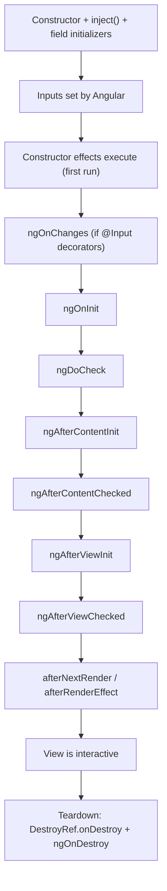

# Directives, Templates, and Containers

Components are the building blocks of Angular applications, but they are not the only way to attach behavior to the DOM. Directives let you extend existing elements with custom logic -- highlighting a row when a transaction exceeds a threshold, formatting a currency input as the user types, or toggling a tooltip on hover. Templates and containers take this further by giving you programmatic control over *what* renders and *when*, enabling patterns like reusable data tables and dynamic modal dialogs.

This chapter builds three artifacts for the FinancialApp: a `highlight` directive that visually flags high-value transactions, a `dataTable` structural directive that renders tabular data from a caller-provided template, and a `confirmDialog` modal that asks users to confirm fund transfers before execution. All three demonstrate how directive and template APIs keep components lean while pushing cross-cutting behavior into reusable units.

> **Companion code:** The directives live in `financial-app/src/app/shared/directives/`, and the confirm dialog in `financial-app/src/app/shared/components/confirm-dialog/`.

---

## Attribute Directives

Attribute directives attach behavior to an existing element without introducing a new DOM node. Unlike components, they have no template -- they modify the host element's appearance, behavior, or accessibility attributes. If you have built components with signals and `inject()` as described in [Chapter 2](ch02-signal-components.md), attribute directives will feel familiar: they use the same dependency injection, lifecycle, and standalone registration.

### Defining Directives

A directive is a class decorated with `@Directive`. The `selector` uses CSS attribute syntax so Angular knows which elements to attach it to:

```typescript
// financial-app/src/app/shared/directives/highlight.directive.ts
import { Directive, ElementRef, inject } from '@angular/core';

@Directive({
  selector: '[appHighlight]',
})
export class HighlightDirective {
  private el = inject(ElementRef);

  constructor() {
    this.el.nativeElement.style.backgroundColor = '#fff3cd';
  }
}
```

The `inject(ElementRef)` call gives the directive a reference to its host DOM element. Because directives are standalone by default in Angular v21, no module declaration is needed -- import it directly into whatever component uses it. Applying it is as simple as adding the attribute:

```html
<tr appHighlight>
  <td>{{ transaction.description }}</td>
  <td>{{ transaction.amount | currency }}</td>
</tr>
```

Every `<tr>` tagged with `appHighlight` gets a pale yellow background. This works, but a hardcoded color is not very useful.

### Communicating with the Environment

Directives accept inputs just like components. To make the highlight configurable, add `input()` signals and switch to `Renderer2` for DOM mutations:

```typescript
import { Directive, ElementRef, Renderer2, effect, inject, input } from '@angular/core';

@Directive({ selector: '[appHighlight]' })
export class HighlightDirective {
  private el = inject(ElementRef);
  private renderer = inject(Renderer2);

  color = input<string>('#fff3cd');
  threshold = input<number>(0);
  amount = input<number>(0);

  constructor() {
    effect(() => {
      if (this.amount() >= this.threshold()) {
        this.renderer.setStyle(this.el.nativeElement, 'backgroundColor', this.color());
      } else {
        this.renderer.removeStyle(this.el.nativeElement, 'backgroundColor');
      }
    });
  }
}
```

`Renderer2` matters for server-side rendering and testing, where direct DOM access may not be available. The `effect()` re-runs whenever any input signal changes, keeping the highlight in sync. The template passes values through bindings:

```html
<tr appHighlight [threshold]="10000" [amount]="transaction.amount" [color]="'#f8d7da'">
  <td>{{ transaction.description }}</td>
  <td>{{ transaction.amount | currency }}</td>
</tr>
```

The directive knows nothing about transactions -- it only knows about numbers and colors, making it reusable across the entire application.

### Directives and Template Variables

Directives can *export* values to the template using `exportAs`. This is useful when a directive manages state that the template needs to read:

```typescript
@Directive({
  selector: '[appCurrencyValidator]',
  exportAs: 'currencyValidator',
})
export class CurrencyValidatorDirective {
  private el = inject(ElementRef);

  isValid = computed(() => {
    const value = parseFloat(this.el.nativeElement.value);
    return !isNaN(value) && value > 0;
  });
}
```

In the template, reference the exported instance through a template variable:

```html
<input type="text" appCurrencyValidator #validator="currencyValidator" />

@if (!validator.isValid()) {
  <span class="error">Please enter a valid amount.</span>
}
```

The `#validator="currencyValidator"` syntax binds the directive instance to a template variable, making its public API available declaratively.

### Controlled DOM Manipulations

Sometimes a directive needs to add or remove DOM elements around its host. A tooltip directive illustrates the pattern:

```typescript
@Directive({ selector: '[appTooltip]' })
export class TooltipDirective {
  private el = inject(ElementRef);
  private renderer = inject(Renderer2);
  text = input.required<string>();
  private tooltipEl: HTMLElement | null = null;

  constructor() {
    this.renderer.listen(this.el.nativeElement, 'mouseenter', () => {
      this.tooltipEl = this.renderer.createElement('span');
      this.renderer.addClass(this.tooltipEl, 'tooltip');
      this.renderer.appendChild(this.tooltipEl, this.renderer.createText(this.text()));
      this.renderer.appendChild(this.el.nativeElement.parentNode, this.tooltipEl);
    });
    this.renderer.listen(this.el.nativeElement, 'mouseleave', () => {
      if (this.tooltipEl) {
        this.renderer.removeChild(this.el.nativeElement.parentNode, this.tooltipEl);
        this.tooltipEl = null;
      }
    });
  }
}
```

All DOM mutations go through `Renderer2`. This ensures the directive works in all rendering environments and gives Angular's change detection visibility into the modifications.

> **Rule of thumb:** Use `Renderer2` for creating, removing, or modifying elements. Use `ElementRef` only for *reading* element properties. Direct writes to `nativeElement` bypass Angular's abstraction layer.

---

## Modern Template Primitives

Before going further into directives, let's cover the small vocabulary of template-level building blocks you will use in every following section: template reference variables, `@let`, the `@empty` block of `@for`, `<ng-container>`, and `<ng-template>`. None of these are directives in the traditional sense -- they are Angular's built-in template syntax for naming, grouping, and conditionally rendering content. Fluency with them is what separates tidy templates from tangled ones.

### Template Reference Variables (`#ref`)

A template reference variable names an element, component, or directive instance so other parts of the template can read from it:

```html
<input #amount type="number" />
<button (click)="transfer(amount.value)">Transfer</button>
```

The `#amount` turns into a read-only handle on the `HTMLInputElement`. The button reads `amount.value` directly without a backing field on the component. Template refs also work on components and directives, where they give access to the instance:

```html
<app-transaction-form #form></app-transaction-form>
<button (click)="form.submit()">Save</button>
```

When a directive uses `exportAs`, the reference picks up the exported instance:

```html
<input appCurrencyValidator #validator="currencyValidator" />
@if (!validator.isValid()) {
  <span class="error">Enter a positive amount.</span>
}
```

To read a template reference from the component class, use `viewChild()` (covered in depth in [Chapter 10](ch10-signal-queries.md)):

```typescript
import { viewChild, ElementRef } from '@angular/core';

private amountInput = viewChild.required<ElementRef<HTMLInputElement>>('amount');

focusAmount() {
  this.amountInput().nativeElement.focus();
}
```

`viewChild.required()` returns a signal. Reading it gives the strongly-typed reference. Because the result is a signal, you can use it inside `effect()` and `computed()` without worrying about timing -- it resolves automatically when the view is initialized.

### `@let` Template Variables

Templates often repeat the same expression. Consider:

```html
@if (transaction.amount > 10000 && transaction.type === 'debit') {
  <strong>Large debit: {{ transaction.amount | currency }}</strong>
} @else if (transaction.amount > 10000 && transaction.type === 'credit') {
  <strong>Large credit: {{ transaction.amount | currency }}</strong>
}
```

`@let` introduces a local, reactive template variable that caches the expression's value:

```html
@let isLarge = transaction.amount > 10000;
@let amount = transaction.amount | currency;

@if (isLarge && transaction.type === 'debit') {
  <strong>Large debit: {{ amount }}</strong>
} @else if (isLarge && transaction.type === 'credit') {
  <strong>Large credit: {{ amount }}</strong>
}
```

The rules that matter:

- `@let` is lexically scoped to the block it appears in (or the template root). It is visible to siblings and descendants, but not to ancestors or unrelated subtrees.
- It participates in change detection: if `transaction.amount` changes, `amount` re-evaluates and the pipe re-runs.
- It is evaluated lazily the first time it is read. Declaring unused `@let` expressions is free.
- It cannot be reassigned from the template. It is a named expression, not a mutable variable.

A common use case: capturing the result of an async pipe or a resource value:

```html
@let trips = tripsResource.value() ?? [];
@if (trips.length > 0) {
  @for (trip of trips; track trip.id) {
    <app-trip-row [trip]="trip" />
  }
} @else {
  <p>No trips found.</p>
}
```

Without `@let`, you would either write `tripsResource.value() ?? []` twice or reach for a parent `computed()`.

### `@empty` in `@for`

`@for` has a built-in fallback for empty collections. Instead of manually checking `.length`:

```html
@for (txn of transactions(); track txn.id) {
  <app-transaction-card [transaction]="txn" />
} @empty {
  <p class="muted">No transactions in this period.</p>
}
```

The `@empty` block renders whenever the tracked collection is empty. It is a small convenience, but it dramatically reduces the number of defensive `@if`/`@else` wrappers in real templates.

### `<ng-container>` for Invisible Grouping

`<ng-container>` renders nothing of its own -- it is purely a logical container. Use it when you need to apply control flow or a structural directive without introducing a wrapper element:

```html
<tbody>
  @for (txn of transactions(); track txn.id) {
    <ng-container>
      <tr class="main-row"><td>{{ txn.description }}</td></tr>
      @if (txn.pending) {
        <tr class="detail-row"><td>Pending approval</td></tr>
      }
    </ng-container>
  }
</tbody>
```

Two `<tr>` elements per transaction, no wrapping `<div>` that would break HTML's table structure. `<ng-container>` is also the canonical anchor for programmatic `ViewContainerRef.createEmbeddedView()` calls, as we will see in the next section.

### `<ng-template>` and Programmatic Rendering

`<ng-template>` defines a block of HTML that Angular does *not* render by default. It is rendered explicitly -- either by a structural directive (like the `@if` and `@for` blocks, which desugar to templates under the hood), or by your own code via `ViewContainerRef`:

```html
<ng-template #summaryTpl let-name="accountName" let-balance="balance">
  <div class="summary-card">
    <h3>{{ name }}</h3>
    <p>{{ balance | currency }}</p>
  </div>
</ng-template>

<ng-container #outlet></ng-container>
```

The `let-name` syntax binds template variables to keys in the context object passed at instantiation time. The "Code-based Content Projection" section below dives into the render-on-demand pattern using this exact primitive.

For template-level composition without code, the `*ngTemplateOutlet` directive stamps a named template at a given location:

```html
<ng-template #errorTpl>
  <div class="error">Something went wrong.</div>
</ng-template>

@if (hasError) {
  <ng-container *ngTemplateOutlet="errorTpl" />
}
```

This is useful for extracting repeated template fragments without promoting them to full components. The newer `@if`/`@else if` syntax replaces most but not all uses of `*ngTemplateOutlet`; the outlet remains valuable when you genuinely want the same template instantiated in multiple locations.

---

## Component & Directive Lifecycle

Signals and effects handle most reactive glue in Angular v21, but every component and directive still has a lifecycle: it is created, its inputs are set, its view and children initialize, content projects in, and eventually it is destroyed. Knowing which hooks fire when -- and which are obsolete in a signal-first codebase -- prevents a whole class of timing bugs.

### The Modern Approach: `effect()`, `DestroyRef`, Render Hooks

In a zoneless Angular app, most "do this when the component is ready" and "react to input changes" work is handled without any classic lifecycle hook.

**`effect()`** runs once when its reactive dependencies first read, and again whenever any dependency changes. It replaces the `ngOnChanges` / `ngOnInit` / "subscribe to `valueChanges`" patterns combined:

```typescript
import { Component, effect, inject, input } from '@angular/core';

@Component({ /* ... */ })
export class AccountSummaryComponent {
  accountId = input.required<number>();
  private accounts = inject(AccountsService);

  constructor() {
    effect(() => {
      this.accounts.load(this.accountId());
    });
  }
}
```

The effect runs on the first change detection pass (replacing `ngOnInit`) and whenever `accountId()` changes (replacing `ngOnChanges`). No hook declarations, no `SimpleChanges` objects to destructure.

**`DestroyRef`** gives you a place to register cleanup without implementing `OnDestroy`:

```typescript
import { DestroyRef, inject } from '@angular/core';

@Component({ /* ... */ })
export class LiveFeedComponent {
  private destroyRef = inject(DestroyRef);

  constructor() {
    const socket = new WebSocket('wss://example.com/feed');
    this.destroyRef.onDestroy(() => socket.close());
  }
}
```

`takeUntilDestroyed()` (from `@angular/core/rxjs-interop`) is just a thin wrapper around `DestroyRef` that completes an observable on teardown -- the single-line replacement for the classic `destroyed$` subject pattern.

**`afterNextRender()`** and **`afterRenderEffect()`** handle DOM-read work that must happen after Angular has flushed a render:

```typescript
import { afterNextRender, Component, ElementRef, inject, viewChild } from '@angular/core';

@Component({
  selector: 'app-chart-panel',
  template: `<canvas #canvas width="600" height="300"></canvas>`,
})
export class ChartPanelComponent {
  private canvas = viewChild.required<ElementRef<HTMLCanvasElement>>('canvas');

  constructor() {
    afterNextRender(() => {
      const ctx = this.canvas().nativeElement.getContext('2d')!;
      // measure element, initialize a chart library, etc.
    });
  }
}
```

`afterNextRender` runs once after the next render. `afterRenderEffect` re-runs on every render and is intended for persistent DOM reads (virtual scroll position, focus restoration). Both execute outside the change-detection cycle, so reading DOM dimensions is safe and mutating state does not trigger a re-render loop.

### Classic Lifecycle Hooks

You will still encounter the classic hooks in existing code, third-party libraries, and situations where the modern equivalents do not apply. Each is an interface from `@angular/core` that a class implements:

- **`OnInit`** -- `ngOnInit()` runs once after Angular has set the first round of input values. In signal-first code, prefer a constructor `effect()` or field initializer. Reach for `ngOnInit` only when you need the guarantee that all inputs have been set (rare; `effect` handles that through signal semantics).
- **`OnDestroy`** -- `ngOnDestroy()` runs once when the component or directive is torn down. Modern replacement: `DestroyRef.onDestroy()` or `takeUntilDestroyed()`.
- **`OnChanges`** -- `ngOnChanges(changes: SimpleChanges)` runs before `ngOnInit` and whenever a non-signal `@Input()` changes. `SimpleChanges` gives you the previous and current values plus a `firstChange` flag. In a signal-inputs codebase this is obsolete: `effect()` sees every change automatically, and if you need the previous value you can capture it with a local variable inside the effect. `ngOnChanges` still runs for decorator-style `@Input()` properties, which is why you see it in legacy code.
- **`DoCheck`** -- `ngDoCheck()` runs on every change detection cycle. It exists for building custom change detection (for example, when an input is a mutable object and the default shallow equality check misses mutations). Avoid it unless you are writing library code; the performance cost is per-cycle, forever.
- **`AfterContentInit`** / **`AfterContentChecked`** -- projected `<ng-content>` is ready or has been checked. Modern equivalent: read `contentChild()` / `contentChildren()` signal queries ([Chapter 10](ch10-signal-queries.md)), optionally inside an effect.
- **`AfterViewInit`** / **`AfterViewChecked`** -- the component's own view (child components, template refs) is ready or has been checked. Modern equivalent: read `viewChild()` / `viewChildren()` signal queries, optionally inside `afterNextRender` if you need to touch the DOM.

A single component rarely needs more than one or two hooks. If you find yourself implementing three or more, that is usually a signal (pun intended) that the component is doing too much and should be split.

### Ordering: Modern and Classic Side by Side

The full ordering for a single instantiation pass -- with the modern equivalents called out -- looks like this:



On subsequent change detection passes everything between `ngOnChanges` and `afterViewChecked` runs again (minus `*Init` variants, which only run once). Effects re-run whenever their dependencies change.

### Cleanup Patterns

The two correct ways to run cleanup code:

```typescript
// Modern:
constructor() {
  const destroyRef = inject(DestroyRef);
  const subscription = this.data$.subscribe(...);
  destroyRef.onDestroy(() => subscription.unsubscribe());
}
```

```typescript
// Classic (equivalent):
export class MyComponent implements OnDestroy {
  private subscription = this.data$.subscribe(...);
  ngOnDestroy() { this.subscription.unsubscribe(); }
}
```

For RxJS specifically, neither is usually needed -- `takeUntilDestroyed()` inside the pipe is the terser equivalent:

```typescript
this.data$.pipe(takeUntilDestroyed()).subscribe(...);
```

All three approaches compose. A single component can mix `takeUntilDestroyed` for observables, `DestroyRef.onDestroy` for a WebSocket close, and `ngOnDestroy` for a legacy imperative cleanup -- Angular runs them all at teardown.

See [Chapter 24](ch24-performance.md) for how zoneless change detection affects when each hook fires and the implications for performance-sensitive work.

---

## Code-based Content Projection

Content projection with `<ng-content>` works well for static slot-based layouts, but projected content is instantiated eagerly and cannot receive parameters from the projecting component. When you need to project content *lazily* or pass context data into it, you need `TemplateRef` and `ViewContainerRef`.

### Templates and Containers

A `<ng-template>` defines a block of HTML that Angular does *not* render by default -- an inert blueprint. To render it, you need a `ViewContainerRef`, a reference to a DOM location where Angular can insert views:

```typescript
import { Component, TemplateRef, ViewContainerRef, viewChild } from '@angular/core';

@Component({
  selector: 'app-lazy-panel',
  template: `
    <button (click)="toggle()">Toggle Content</button>
    <ng-container #outlet></ng-container>
    <ng-template #content>
      <div class="panel-body">
        <p>This content is created lazily, only when the button is clicked.</p>
      </div>
    </ng-template>
  `,
})
export class LazyPanelComponent {
  private outlet = viewChild.required('outlet', { read: ViewContainerRef });
  private content = viewChild.required<TemplateRef<unknown>>('content');
  private visible = false;

  toggle() {
    this.visible = !this.visible;
    this.visible
      ? this.outlet().createEmbeddedView(this.content())
      : this.outlet().clear();
  }
}
```

The `viewChild()` signal queries (covered in [Chapter 10](ch10-signal-queries.md)) give us typed references to both the container and the template. `createEmbeddedView()` stamps out the template and inserts it at the container's location; `clear()` removes it. The content is never instantiated until the user clicks the button.

### Passing Parameters to Templates

Templates become powerful when they accept context objects. The `createEmbeddedView()` method takes an optional context argument whose properties become template variables:

```typescript
@Component({
  selector: 'app-account-summary',
  template: `
    <ng-container #outlet></ng-container>
    <ng-template #summaryTpl let-name="accountName" let-balance="balance">
      <div class="summary-card">
        <h3>{{ name }}</h3>
        <p class="balance">{{ balance | currency }}</p>
      </div>
    </ng-template>
  `,
})
export class AccountSummaryComponent implements OnInit {
  private outlet = viewChild.required('outlet', { read: ViewContainerRef });
  private summaryTpl = viewChild.required<TemplateRef<unknown>>('summaryTpl');
  accounts = input.required<Account[]>();

  ngOnInit() {
    for (const account of this.accounts()) {
      this.outlet().createEmbeddedView(this.summaryTpl(), {
        accountName: account.name,
        balance: account.balance,
      });
    }
  }
}
```

The `let-name="accountName"` syntax binds the template variable `name` to the context object's `accountName` property. Each `createEmbeddedView()` call creates an independent view with its own context. This pattern is the foundation of structural directives: accept a template, manage a container, stamp out views with context.

---

## Structural Directives

Structural directives add, remove, or manipulate DOM elements. Angular's built-in `@if`, `@for`, and `@switch` are the most common examples, but you can create your own when built-in control flow does not fit your needs.

### Desugaring Structural Directives

The asterisk syntax (`*appDirective`) is syntactic sugar. Angular wraps the host element in an `<ng-template>` and passes it to the directive. This template:

```html
<tr *appRepeat="let item of items; trackBy: trackFn">
  <td>{{ item.name }}</td>
</tr>
```

Desugars to:

```html
<ng-template appRepeat [appRepeatOf]="items" [appRepeatTrackBy]="trackFn" let-item>
  <tr><td>{{ item.name }}</td></tr>
</ng-template>
```

The `let item` declaration becomes the template's implicit context variable (`$implicit`). The `of items` becomes an input named `appRepeatOf` -- the directive name concatenated with the keyword. This naming convention is how Angular maps the microsyntax to directive inputs.

### Implementing a Simple DataTable

Here is a `dataTable` directive that renders tabular data using a caller-provided row template -- the pattern used in FinancialApp's transaction list, where different views need different column layouts for the same data:

```typescript
// financial-app/src/app/shared/directives/data-table.directive.ts
import { Directive, TemplateRef, ViewContainerRef, effect, inject, input } from '@angular/core';

export interface DataTableContext<T> {
  $implicit: T;
  index: number;
  isEven: boolean;
}

@Directive({ selector: '[appDataTable]' })
export class DataTableDirective<T> {
  private templateRef = inject(TemplateRef<DataTableContext<T>>);
  private viewContainer = inject(ViewContainerRef);
  appDataTableOf = input.required<T[]>();

  constructor() {
    effect(() => {
      this.viewContainer.clear();
      this.appDataTableOf().forEach((item, index) => {
        this.viewContainer.createEmbeddedView(this.templateRef, {
          $implicit: item, index, isEven: index % 2 === 0,
        });
      });
    });
  }
}
```

The directive injects `TemplateRef` (the desugared `<ng-template>`) and `ViewContainerRef` (the insertion point). When input data changes, the effect clears existing views and stamps out fresh ones. Usage in a component template:

```html
<table class="transaction-table">
  <thead><tr><th>Date</th><th>Description</th><th>Amount</th></tr></thead>
  <tbody>
    <tr *appDataTable="let txn of transactions()"
        appHighlight [threshold]="10000" [amount]="txn.amount">
      <td>{{ txn.date | date:'shortDate' }}</td>
      <td>{{ txn.description }}</td>
      <td>{{ txn.amount | currency }}</td>
    </tr>
  </tbody>
</table>
```

The caller controls the row layout. The directive handles iteration. The `highlight` directive layers on top, flagging high-value rows. This composition of attribute and structural directives keeps each piece focused on a single responsibility.

### Using ViewContainerRef Directly to Display Templates

Sometimes you need finer control than the asterisk syntax provides -- inserting a template at a location that is *not* the directive's host, or inserting multiple templates into the same container. The explicit approach uses `<ng-container>` as an anchor:

```typescript
@Component({
  selector: 'app-transaction-view',
  template: `
    <button (click)="showDetails()">Show Details</button>
    <ng-container #detailsSlot></ng-container>
    <ng-template #detailsTpl let-txn>
      <section class="transaction-details">
        <h3>{{ txn.description }}</h3>
        <p>{{ txn.amount | currency }} &mdash; {{ txn.status }}</p>
      </section>
    </ng-template>
  `,
})
export class TransactionViewComponent {
  private detailsSlot = viewChild.required('detailsSlot', { read: ViewContainerRef });
  private detailsTpl = viewChild.required<TemplateRef<unknown>>('detailsTpl');
  selectedTransaction = input.required<Transaction>();

  showDetails() {
    this.detailsSlot().clear();
    this.detailsSlot().createEmbeddedView(this.detailsTpl(), {
      $implicit: this.selectedTransaction(),
    });
  }
}
```

You decide when views are created, cleared, or replaced. The `<ng-container>` produces no DOM output -- it is purely a logical anchor.

### Accessing the ViewContainerRef via Signal Queries

Earlier Angular versions required `@ViewChild` with `{ read: ViewContainerRef }`. Modern Angular replaces this with `viewChild()` signal queries, which integrate naturally with the reactivity system:

```typescript
private container = viewChild.required('outlet', { read: ViewContainerRef });
```

The `{ read: ViewContainerRef }` option tells Angular to resolve the query as a container reference rather than an element reference -- the same mechanism described in [Chapter 10](ch10-signal-queries.md), applied to container access. Because `viewChild()` returns a signal, you can use it inside `effect()`:

```typescript
constructor() {
  effect(() => {
    const container = this.container();
    container.clear();
    for (const txn of this.transactions()) {
      container.createEmbeddedView(this.rowTemplate(), { $implicit: txn });
    }
  });
}
```

This reactive approach eliminates the need for `ngAfterViewInit` lifecycle hooks. The effect runs as soon as the view query resolves and re-runs whenever input data changes.

---

## Host Bindings & Element Access

Directives attach to an element; components *are* an element. Both cases raise the same practical questions: how do you style or wire events on that host element, how do you read it from TypeScript, and how do you expose an API that templates can reach with `#ref="..."` variables? The answers -- `host: {}`, `ElementRef`, `Renderer2`, `exportAs` -- are the small toolbox every directive author reaches for. This section walks through each, building toward a pair of worked examples that appear in `financial-app`: `FinTooltipDirective` and `HighlightRowDirective`.

### The `host` Metadata Property

Angular's modern style guide prefers the `host: {}` object in the `@Directive` (or `@Component`) decorator over the older `@HostBinding` / `@HostListener` decorators. The object keys describe what to bind -- properties, attributes, classes, styles, and events -- and the values are expressions evaluated in the directive's class scope.

```typescript
import { Directive, input, signal } from '@angular/core';

@Directive({
  selector: '[appHighlightRow]',
  host: {
    'class': 'app-highlight-row',              // static class
    '[class.is-active]': 'active()',           // dynamic class binding
    '[attr.aria-selected]': 'active()',        // ARIA attribute binding
    '[style.cursor]': 'clickable() ? "pointer" : "default"',
    '(mouseenter)': 'onHover(true)',           // host event listener
    '(mouseleave)': 'onHover(false)',
    '(focus)': 'onHover(true)',
    '(blur)': 'onHover(false)',
  },
})
export class HighlightRowDirective {
  clickable = input(true);
  private readonly activeSignal = signal(false);
  readonly active = this.activeSignal.asReadonly();

  onHover(isActive: boolean) {
    this.activeSignal.set(isActive);
  }
}
```

Notice the four binding syntaxes, each mirrored from template bindings you already know:

- **`'class'`** / **`'style'`** / **`'id'`** -- static strings applied to the host.
- **`'[prop]'`** -- bind a host element property or `@Input` on the host component.
- **`'[class.name]'`** / **`'[attr.name]'`** / **`'[style.name]'`** -- toggle classes, set attributes, or set styles reactively.
- **`'(event)'`** -- listen to an event on the host.

The expressions can reference signals (`active()`), inputs, and methods. Angular re-evaluates them on every change detection cycle, which in a zoneless app means "whenever a consumed signal updates."

The decorator-based equivalent still works and sometimes appears in older codebases:

```typescript
import { Directive, HostBinding, HostListener, input, signal } from '@angular/core';

@Directive({ selector: '[appHighlightRow]' })
export class HighlightRowDirective {
  clickable = input(true);
  private readonly activeSignal = signal(false);

  @HostBinding('class.is-active') get isActive() { return this.activeSignal(); }
  @HostBinding('attr.aria-selected') get ariaSelected() { return this.activeSignal(); }
  @HostListener('mouseenter') onEnter() { this.activeSignal.set(true); }
  @HostListener('mouseleave') onLeave() { this.activeSignal.set(false); }
}
```

The `host: {}` form is preferred because it keeps all host-related metadata in one place and plays more nicely with AOT optimizations. Use the decorators only when you need to inherit host behavior across a class hierarchy.

### `ElementRef<T>` for Reading Native Elements

`ElementRef` is Angular's typed wrapper around the host's DOM element. It has exactly one meaningful property: `nativeElement`. Inject it when you need to *read* something about the element -- measure its size, check its current value, find a sibling:

```typescript
import { Directive, ElementRef, inject } from '@angular/core';

@Directive({ selector: '[appAutoWidth]' })
export class AutoWidthDirective {
  private host = inject(ElementRef<HTMLInputElement>);

  measure(): number {
    return this.host.nativeElement.scrollWidth;
  }
}
```

The generic parameter `ElementRef<HTMLInputElement>` is the simplest way to get strong typing on `nativeElement`. Without it, `nativeElement` is typed as `any`.

Two rules that will save you hours of debugging:

- **Read through `ElementRef`. Write through `Renderer2`.** Direct writes to `nativeElement` (`el.style.color = 'red'`, `el.setAttribute(...)`) work in the browser but break during SSR and are harder to test. `Renderer2` is the platform-agnostic alternative.
- **`ElementRef` is not available during SSR for DOM queries.** The `nativeElement` exists but is a synthetic DOM node. Code that measures real layout must run in `afterNextRender`, not in the constructor.

### `Renderer2` for Platform-Safe DOM Writes

`Renderer2` works identically in the browser, in an SSR environment, and inside a test runner because it dispatches operations through a platform-provided implementation. The API is a thin wrapper around the handful of DOM verbs you need:

```typescript
import { Directive, ElementRef, inject, Renderer2, effect, input } from '@angular/core';

@Directive({ selector: '[appBadge]' })
export class BadgeDirective {
  private host = inject(ElementRef<HTMLElement>);
  private renderer = inject(Renderer2);

  status = input<'pending' | 'cleared' | 'failed'>('cleared');

  constructor() {
    effect(() => {
      this.renderer.setAttribute(this.host.nativeElement, 'data-status', this.status());
      this.renderer.addClass(this.host.nativeElement, `badge--${this.status()}`);
    });
  }
}
```

The verbs: `createElement`, `createText`, `appendChild`, `insertBefore`, `removeChild`, `addClass`, `removeClass`, `setStyle`, `removeStyle`, `setProperty`, `setAttribute`, `removeAttribute`, and `listen`. Full API in the [Renderer2 reference](https://angular.dev/api/core/Renderer2). These cover essentially every mutation a directive needs to make. For SSR specifics and when platform-checking matters, see [Chapter 17](ch17-defer-ssr-hydration.md).

### `exportAs` for Template References

A directive becomes accessible as a template reference when you give it a name via `exportAs`:

```typescript
import { computed, Directive, signal } from '@angular/core';

@Directive({
  selector: '[appFinTooltip]',
  exportAs: 'finTooltip',
  host: {
    '(mouseenter)': 'show()',
    '(mouseleave)': 'hide()',
    '(focus)': 'show()',
    '(blur)': 'hide()',
  },
})
export class FinTooltipDirective {
  private visibleSignal = signal(false);
  readonly visible = this.visibleSignal.asReadonly();
  readonly invisible = computed(() => !this.visible());

  show() { this.visibleSignal.set(true); }
  hide() { this.visibleSignal.set(false); }
  toggle() { this.visibleSignal.update((v) => !v); }
}
```

In a template, `#tip="finTooltip"` captures the directive instance in a template variable named `tip`. Everything on the instance is then reachable:

```html
<button
  appFinTooltip
  #tip="finTooltip"
  aria-describedby="amount-help">
  ?
</button>

@if (tip.visible()) {
  <div id="amount-help" role="tooltip" class="tooltip">
    Amounts must be at least $0.01.
  </div>
}

<button type="button" (click)="tip.toggle()">Toggle manually</button>
```

This pattern shines when the directive owns a bit of transient state (open/closed, valid/invalid, active/inactive) that the surrounding template wants to read without duplicating the logic into the parent component.

### Worked Example: `HighlightRowDirective`

Putting host bindings, `exportAs`, and accessibility together. `HighlightRowDirective` marks a transaction row as selectable via keyboard, exposes its hover/focus state to the template, and plays nicely with ARIA:

```typescript
// apps/financial-app/src/app/shared/directives/highlight-row.directive.ts
import { Directive, input, signal } from '@angular/core';

@Directive({
  selector: '[appHighlightRow]',
  standalone: true,
  exportAs: 'finHighlight',
  host: {
    'class': 'highlight-row',
    'tabindex': '0',
    '[attr.role]': 'interactive() ? "button" : null',
    '[attr.aria-selected]': 'active()',
    '[class.is-active]': 'active()',
    '(mouseenter)': 'setActive(true)',
    '(mouseleave)': 'setActive(false)',
    '(focus)': 'setActive(true)',
    '(blur)': 'setActive(false)',
  },
})
export class HighlightRowDirective {
  interactive = input(true);

  private readonly activeSignal = signal(false);
  readonly active = this.activeSignal.asReadonly();

  setActive(value: boolean) {
    this.activeSignal.set(value);
  }
}
```

A template uses it to drive both the visual state and a detail panel:

```html
<tr
  appHighlightRow
  #row="finHighlight"
  [interactive]="true"
  (click)="selectTransaction(txn)">
  <td>{{ txn.description }}</td>
  <td>{{ txn.amount | currency }}</td>
</tr>

@if (row.active()) {
  <tr class="detail-row">
    <td colspan="2">Press Enter to view details.</td>
  </tr>
}
```

The host bindings set `role`, `tabindex`, and `aria-selected` so screen readers announce state changes correctly -- see [Chapter 22](ch22-accessibility-aria.md) for the broader accessibility context. The `exportAs: 'finHighlight'` makes the active state readable from the template without a backing field on the parent component.

---

## Dynamic Components

Directives and templates handle most DOM manipulation needs, but sometimes you need to create an entire component at runtime -- one not declared in any template. Modal dialogs are the classic example: the dialog component does not exist in the DOM until the user triggers an action, and it should be destroyed when dismissed.

### Modal Dialogs

FinancialApp needs a confirmation dialog for sensitive operations like fund transfers. The dialog component is deliberately generic -- inputs for content, outputs for user decisions:

```typescript
// financial-app/src/app/shared/components/confirm-dialog/confirm-dialog.component.ts
import { Component, input, output } from '@angular/core';

@Component({
  selector: 'app-confirm-dialog',
  template: `
    <div class="dialog-backdrop" (click)="cancelled.emit()">
      <div class="dialog-panel" (click)="$event.stopPropagation()">
        <h2>{{ title() }}</h2>
        <p>{{ message() }}</p>
        <div class="dialog-actions">
          <button class="btn-secondary" (click)="cancelled.emit()">Cancel</button>
          <button class="btn-primary" (click)="confirmed.emit()">Confirm</button>
        </div>
      </div>
    </div>
  `,
})
export class ConfirmDialogComponent {
  title = input('Confirm Action');
  message = input('Are you sure you want to proceed?');
  confirmed = output<void>();
  cancelled = output<void>();
}
```

It knows nothing about transfers or accounts. That generality is what makes it reusable.

### Instantiating Components via Code

To display the dialog dynamically, use `ViewContainerRef.createComponent()`. It takes a component class and returns a `ComponentRef` with access to the instance's inputs and outputs:

```typescript
// financial-app/src/app/features/transactions/transfer.component.ts
import { Component, ComponentRef, ViewContainerRef, viewChild } from '@angular/core';
import { ConfirmDialogComponent } from '../../shared/components/confirm-dialog/confirm-dialog.component';

@Component({
  selector: 'app-transfer',
  template: `
    <form (ngSubmit)="initiateTransfer()">
      <label>Recipient <input type="text" [(ngModel)]="recipient" name="recipient" /></label>
      <label>Amount <input type="number" [(ngModel)]="amount" name="amount" /></label>
      <button type="submit">Transfer Funds</button>
    </form>
    <ng-container #dialogHost></ng-container>
  `,
})
export class TransferComponent {
  private dialogHost = viewChild.required('dialogHost', { read: ViewContainerRef });
  private dialogRef: ComponentRef<ConfirmDialogComponent> | null = null;
  recipient = '';
  amount = 0;

  initiateTransfer() {
    if (this.dialogRef) return;
    this.dialogRef = this.dialogHost().createComponent(ConfirmDialogComponent);

    this.dialogRef.setInput('title', 'Confirm Transfer');
    this.dialogRef.setInput('message', `Transfer $${this.amount.toFixed(2)} to ${this.recipient}?`);

    this.dialogRef.instance.confirmed.subscribe(() => this.closeDialog(true));
    this.dialogRef.instance.cancelled.subscribe(() => this.closeDialog(false));
  }

  private closeDialog(execute: boolean) {
    if (execute) { /* delegate to TransferService */ }
    this.dialogRef?.destroy();
    this.dialogRef = null;
  }
}
```

Several things to note:

1. **No template declaration.** `ConfirmDialogComponent` does not appear in the template -- it is created entirely through code when the user clicks "Transfer Funds."
2. **`setInput()` for signal inputs.** `ComponentRef.setInput()` is the public API for setting input values on dynamically created components.
3. **Output subscription.** Outputs are `Observable`-compatible, so you subscribe directly. When `destroy()` is called, Angular tears down the component and its subscriptions.
4. **Lifecycle ownership.** The creating component owns the dialog's lifecycle -- fundamentally different from template-driven rendering where Angular manages this automatically.

For more complex scenarios, wrap the pattern in a service that creates dialogs outside any specific view hierarchy:

```typescript
@Injectable({ providedIn: 'root' })
export class DialogService {
  private appRef = inject(ApplicationRef);
  private environmentInjector = inject(EnvironmentInjector);

  open<T>(component: Type<T>, inputs?: Record<string, unknown>): ComponentRef<T> {
    const host = document.createElement('div');
    document.body.appendChild(host);
    const ref = createComponent(component, {
      hostElement: host,
      environmentInjector: this.environmentInjector,
    });
    if (inputs) {
      Object.entries(inputs).forEach(([k, v]) => ref.setInput(k, v));
    }
    this.appRef.attachView(ref.hostView);
    return ref;
  }

  close(ref: ComponentRef<unknown>) {
    this.appRef.detachView(ref.hostView);
    ref.destroy();
    ref.location.nativeElement.parentNode?.removeChild(ref.location.nativeElement);
  }
}
```

This service uses `createComponent()` with `EnvironmentInjector` to attach the dialog to the application's change detection tree and append it directly to the document body -- the same pattern behind Angular Material's `MatDialog` and CDK overlay system.

---

## Pipes: Built-in and Custom

Pipes are tiny transformation functions that templates can apply inline with the `|` operator. They exist to keep templates expressive -- formatting a currency, localizing a date, slicing a string -- without pushing trivial transformations into the component class. Most pipes you use will be built-in; writing your own is a five-minute affair for anything specific to your domain.

### When to Reach for a Pipe vs. a `computed()`

The pipe and the `computed()` signal often cover the same ground. A rule that holds up in practice:

- **Pipe** when the transformation is *purely a function of its input*, used in exactly one place in the template, and does not need to cache or share its result outside that template.
- **`computed()`** when the transformation has dependencies beyond a single value, needs to be shared between multiple templates, or is already part of the component's public API.

The `currency` pipe formatting `transaction.amount` is obviously a pipe. A total-by-category breakdown that several template regions and tests read is obviously a `computed()`. The middle ground -- "is this pending, overdue, or on-time?" -- usually goes in `computed()` because it tends to grow over time.

### Built-in Pipes Tour

Angular ships several pipes in `@angular/common` that cover the majority of formatting needs:

```html
<!-- transactional -->
{{ transaction.amount | currency:'USD':'symbol':'1.2-2' }}
{{ transaction.amount | decimal:'1.0-0' }}
{{ transaction.score | percent:'1.1-1' }}
{{ transaction.date | date:'mediumDate' }}
{{ transaction.date | date:'yyyy-MM-dd HH:mm' }}

<!-- string manipulation -->
{{ transaction.description | slice:0:40 }}...
{{ account.name | titlecase }}
{{ account.name | uppercase }}
{{ account.type | lowercase }}

<!-- data introspection -->
<pre>{{ transaction | json }}</pre>

<!-- structural -->
@for (entry of account | keyvalue; track entry.key) {
  <li>{{ entry.key }}: {{ entry.value }}</li>
}

<!-- async -->
{{ pricesResource.value() | async }}
```

A few things worth internalizing:

- **`currency`** takes four arguments: currency code, display style (`symbol`, `code`, `symbol-narrow`, or a literal string), digit info, and locale. The digit-info `'1.2-2'` means "at least 1 integer digit, exactly 2 fractional digits."
- **`date`** accepts named presets (`short`, `medium`, `long`, `full`, plus `Date`, `Time` suffixes) or explicit format strings (`yyyy-MM-dd`). For locale-sensitive output, the locale is driven by `LOCALE_ID` -- see [Chapter 15](ch15-internationalization.md).
- **`async`** subscribes to an Observable or Promise and unsubscribes on destroy. With signal-based components you will usually reach for `toSignal` instead, but `| async` is still the shortest path when an observable exists and you just need its latest value in the template.
- **`json`** is purely a debugging tool; it serializes the value pretty-printed. Never ship it in production templates where the value contains sensitive data.
- **`keyvalue`** iterates the entries of an object or Map in a stable order (sorted by key). Essential for `@for` over object-shaped data.

### Writing a Custom Pipe

A custom pipe is a class decorated with `@Pipe` that implements `PipeTransform.transform`. Standalone by default in v21 -- no module registration required:

```typescript
// apps/financial-app/src/app/shared/pipes/mask-account-number.pipe.ts
import { Pipe, PipeTransform } from '@angular/core';

@Pipe({
  name: 'maskAccountNumber',
  standalone: true,
})
export class MaskAccountNumberPipe implements PipeTransform {
  transform(value: string | number | null | undefined, visibleDigits = 4): string {
    if (value == null) return '';
    const digits = String(value).replace(/\D/g, '');
    if (digits.length <= visibleDigits) return digits;
    const maskedCount = digits.length - visibleDigits;
    return '*'.repeat(maskedCount) + digits.slice(-visibleDigits);
  }
}
```

Import it wherever it is used:

```typescript
@Component({
  selector: 'app-account-row',
  imports: [MaskAccountNumberPipe],
  template: `
    <td>{{ account.number | maskAccountNumber }}</td>
    <td>{{ account.number | maskAccountNumber:6 }}</td>
  `,
})
export class AccountRowComponent { /* ... */ }
```

The `transform` method's first parameter is the value before the `|`. Subsequent parameters become the arguments after the `:` separators. The return type becomes the template expression's type -- fully checked by the Angular compiler.

### Pure vs. Impure Pipes

Angular classifies pipes as *pure* or *impure*. The decorator flag:

```typescript
@Pipe({ name: 'example', pure: true })   // default
@Pipe({ name: 'example', pure: false })
```

A **pure** pipe executes its `transform` only when Angular detects a new input reference (or a different primitive value). It is idempotent -- the same inputs always produce the same output. Pure pipes are cheap because Angular caches the result until the input reference changes.

An **impure** pipe executes on every change detection cycle. It is the escape hatch for transformations that depend on external state (current time, the state of a service, the position of an element). The cost is significant: the pipe runs on every interaction that triggers change detection, not just when its input changes.

**Almost always use pure pipes.** The few legitimate impure pipes -- `async`, `date` with a live-clock feature, a keyframe-time formatter -- are already built in or rare enough that you can write them once per codebase. If your custom pipe depends on a service, reach for a `computed()` or a dedicated signal in the component, not for `pure: false`.

### Locale-Sensitive Pipes

Currency, decimal, percent, and date pipes all respect `LOCALE_ID`. Changing the application locale at startup changes what every `| currency` in the template produces. FinancialApp uses this for its i18n strategy -- see [Chapter 15](ch15-internationalization.md) for how to configure locales, swap currency formatting per user, and handle RTL layouts. The `CurrencyFormatPipe` in `apps/financial-app/src/app/shared/pipes/currency-format.pipe.ts` wraps `Intl.NumberFormat` directly for cases that need a fixed locale independent of the global setting.

### Testing a Pipe

Pipes are pure functions wrapped in a class. Test the `transform` method directly:

```typescript
import { describe, it, expect } from 'vitest';
import { MaskAccountNumberPipe } from './mask-account-number.pipe';

describe('MaskAccountNumberPipe', () => {
  const pipe = new MaskAccountNumberPipe();

  it('masks all but the last 4 digits by default', () => {
    expect(pipe.transform('1234567890')).toBe('******7890');
  });

  it('respects a custom visible-digits argument', () => {
    expect(pipe.transform('1234567890', 6)).toBe('****567890');
  });

  it('strips non-digits before masking', () => {
    expect(pipe.transform('12-34-5678')).toBe('**5678');
  });

  it('returns empty string for null or undefined', () => {
    expect(pipe.transform(null)).toBe('');
    expect(pipe.transform(undefined)).toBe('');
  });
});
```

No `TestBed` setup required. This is the main reason to write pipes -- pure functions are trivially testable, composable, and reusable.

---

## Summary

Directives, templates, and containers form the lower-level toolkit beneath Angular's component model. The progression follows increasing power and responsibility:

- **Attribute directives** modify existing elements -- style, behavior, accessibility -- without altering structure.
- **Template primitives** (`#ref`, `@let`, `@empty`, `<ng-container>`, `<ng-template>`) provide the small vocabulary that every richer pattern builds on.
- **Component and directive lifecycle** is increasingly handled by `effect()`, `DestroyRef`, and render hooks; the classic hooks (`ngOnInit`, `ngOnDestroy`, `ngOnChanges`, `ngAfterViewInit`) remain available when needed.
- **Templates and containers** project and repeat content lazily, with parameterized context.
- **Structural directives** use `TemplateRef` and `ViewContainerRef` to add or remove DOM subtrees based on data.
- **Host bindings and element access** (`host: {}`, `ElementRef`, `Renderer2`, `exportAs`) wire a directive to its DOM element safely and expose its state to consuming templates.
- **Dynamic components** create full component instances outside the template via `createComponent()`.
- **Pipes** turn inline transformations into reusable, testable functions and keep templates expressive.

Each level gives you more control but requires you to manage more lifecycle concerns. Prefer the simplest tool that solves your problem: use attribute directives before reaching for structural ones, and use template-driven rendering before reaching for `createComponent()`.

In the next chapter, we will see how Angular's router builds on many of these same primitives -- `ViewContainerRef`, lazy loading, and dynamic instantiation -- to manage navigation and route-level component rendering.
