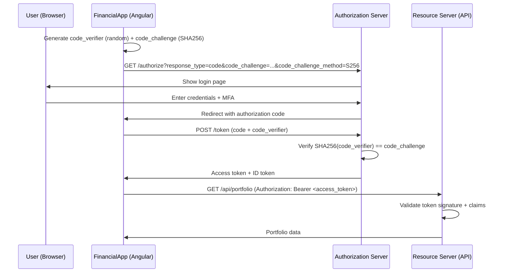

# Chapter 27: Authentication & Authorization

Every application that handles sensitive data must answer two questions: *who is this user?* (authentication) and *what are they allowed to do?* (authorization). For a financial application like FinancialApp -- where users view portfolio balances, execute trades, and manage account details -- getting these answers wrong means exposing real money to real attackers.

This chapter surveys the two dominant approaches to securing web applications: cookie-based authentication and token-based security. We will trace the evolution from simple session cookies through OAuth 2 and OpenID Connect, examine the threat models that shaped each protocol, and arrive at the current recommendation for Angular SPAs: the Backend-for-Frontend (BFF) pattern with server-side OAuth 2.

> **Prerequisites:** This chapter assumes familiarity with Angular's router guards and HTTP interceptors covered in [Chapter 48](ch13-initialization-routes.md). We will use `HttpInterceptorFn` and `CanActivateFn` extensively.

---

## Cookie-based Authentication

The simplest authentication model is also the oldest. The server creates a session after the user logs in, stores session state (in memory, a database, or a distributed cache), and sends back a cookie containing a session identifier. The browser automatically attaches this cookie to every subsequent request to the same origin.

For FinancialApp, a cookie-based login flow looks like this:

1. The user submits credentials to `POST /api/login`.
2. The server validates credentials, creates a session, and responds with `Set-Cookie: SESSION_ID=abc123`.
3. The browser stores the cookie and includes it on every request to the API.
4. The server looks up the session on each request to identify the user.

This model is straightforward, but the security of the entire system depends on the attributes set on that cookie.

### Security-Attributes for Cookies

A session cookie without proper attributes is an invitation for attack. Modern servers should set every security-relevant attribute:

| Attribute    | Value        | Purpose                                                       |
| ------------ | ------------ | ------------------------------------------------------------- |
| `HttpOnly`   | `true`       | Prevents JavaScript from reading the cookie, mitigating XSS.  |
| `Secure`     | `true`       | Cookie is only sent over HTTPS.                               |
| `SameSite`   | `Strict/Lax` | Restricts cross-origin sending, mitigating CSRF.              |
| `Path`       | `/api`       | Limits the cookie to API routes.                              |
| `Max-Age`    | `3600`       | Expires the session after a bounded time window.              |

A well-configured `Set-Cookie` header for FinancialApp looks like:

```
Set-Cookie: SESSION_ID=abc123; HttpOnly; Secure; SameSite=Lax; Path=/api; Max-Age=3600
```

The `HttpOnly` flag is especially critical. If an attacker manages to inject a script (XSS), they cannot steal the session cookie with `document.cookie`. The `Secure` flag ensures the cookie never travels over an unencrypted connection -- non-negotiable for financial data.

### Cookies and XSRF

Even with `SameSite` cookies, defense-in-depth demands explicit XSRF (Cross-Site Request Forgery) protection. The classic attack: a malicious page tricks the user's browser into making a state-changing request to FinancialApp while the session cookie is still valid. If the server cannot distinguish a legitimate request from a forged one, it will happily execute a fund transfer.

Angular provides built-in XSRF protection through `withXsrfConfiguration()`:

```typescript
// app.config.ts
export const appConfig: ApplicationConfig = {
  providers: [
    provideHttpClient(
      withXsrfConfiguration({
        cookieName: 'XSRF-TOKEN',
        headerName: 'X-XSRF-TOKEN',
      })
    ),
  ],
};
```

The double-submit cookie pattern works as follows: the server sets a non-`HttpOnly` XSRF token cookie. Angular's `HttpClient` reads this cookie and attaches its value as a custom header (`X-XSRF-TOKEN`) on mutating requests. Since a cross-origin attacker cannot read cookies from FinancialApp's domain, they cannot forge the header, and the server rejects the request.

> **Note:** `SameSite=Lax` alone prevents CSRF on most modern browsers, but older browsers and edge cases (e.g., top-level navigations with `GET` side effects) still warrant the double-submit pattern.

---

## Token-based Security

Cookie-based authentication works well when the browser and the API share the same origin. But modern architectures often separate the frontend from the API, run multiple microservices, or integrate with third-party identity providers. This is where token-based security shines.

Instead of maintaining server-side sessions, the server issues a token -- a self-contained credential -- that the client stores and presents on each request. The token carries claims about the user and is cryptographically signed so the server can verify it without a session lookup.

### OAuth 2

OAuth 2 is an *authorization* framework (RFC 6749). It was not designed to authenticate users -- it was designed to let a user grant limited access to their resources on one service to another service, without sharing credentials.

The key roles in OAuth 2:

- **Resource Owner** -- the user (the FinancialApp customer).
- **Client** -- the application requesting access (FinancialApp's Angular SPA).
- **Authorization Server** -- the service that authenticates the user and issues tokens (e.g., Azure AD, Auth0, Keycloak).
- **Resource Server** -- the API that holds protected resources (FinancialApp's backend).

OAuth 2 defines several *grant types* (flows) for different scenarios. The critical insight is that OAuth 2 alone tells the client *what the user can access*, but not *who the user is*. That gap is filled by OpenID Connect.

### Authenticating Users with OpenID Connect

OpenID Connect (OIDC) is a thin identity layer built on top of OAuth 2. Where OAuth 2 provides an **access token** (authorizing API calls), OIDC adds an **ID token** (asserting the user's identity).

The ID token answers the authentication question:

- **Who is this user?** -- The `sub` (subject) claim uniquely identifies them.
- **When did they authenticate?** -- The `auth_time` claim records it.
- **How did they authenticate?** -- The `amr` (authentication methods) claim lists the factors used.

For FinancialApp, OIDC means we delegate the hard problem of credential management (password hashing, MFA enrollment, brute-force protection) to a dedicated authorization server, and our Angular application receives a signed assertion that the user is who they claim to be.

### JSON Web Token

Both the access token and the ID token are typically encoded as JSON Web Tokens (JWTs). A JWT has three Base64url-encoded parts separated by dots:

```
header.payload.signature
```

- **Header** -- specifies the signing algorithm (`RS256`, `ES256`).
- **Payload** -- contains the claims (`sub`, `iss`, `exp`, `aud`, roles, permissions).
- **Signature** -- the cryptographic signature that proves the token was issued by the authorization server and has not been tampered with.

An example decoded payload for a FinancialApp access token:

```json
{
  "sub": "user-42",
  "iss": "https://auth.financialapp.com",
  "aud": "https://api.financialapp.com",
  "exp": 1750000000,
  "scope": "portfolio:read trades:write",
  "roles": ["investor"]
}
```

> **Security warning:** Never store sensitive data in a JWT payload. The payload is encoded, not encrypted -- anyone who intercepts the token can decode and read the claims.

### OAuth 2 and OIDC Flows

OAuth 2 defines multiple grant types. The choice of flow depends on the type of client and the security requirements:

| Flow                              | Client Type            | Tokens Returned              | Suitable For             |
| --------------------------------- | ---------------------- | ---------------------------- | ------------------------ |
| Authorization Code                | Server-side app        | Access + ID + Refresh        | Traditional web apps     |
| Authorization Code + PKCE         | Public client (SPA)    | Access + ID (+ Refresh)      | SPAs, mobile apps        |
| Client Credentials                | Machine-to-machine     | Access only                  | Service accounts, daemons|
| ~~Implicit~~                      | ~~Public client~~      | ~~Access + ID~~              | **Deprecated.** Do not use. |
| ~~Resource Owner Password~~       | ~~Trusted client~~     | ~~Access + ID + Refresh~~    | **Deprecated.** Do not use. |

The **Authorization Code flow with PKCE** (Proof Key for Code Exchange) is the only recommended flow for public clients like Angular SPAs. The implicit flow is deprecated because it exposes tokens in URL fragments, making them vulnerable to browser history leaks and referer header exfiltration.

The PKCE extension protects against authorization code interception attacks by binding the code to the client that requested it:



The `code_verifier` is a high-entropy random string generated by the SPA. The `code_challenge` is its SHA-256 hash. Even if an attacker intercepts the authorization code (e.g., via a malicious browser extension), they cannot exchange it for tokens without the original `code_verifier`.

### Client-side OAuth 2

Historically, Angular SPAs performed the full OAuth 2 flow in the browser. The application redirected to the authorization server, received tokens, and stored them in memory or `localStorage`. An `HttpInterceptorFn` then attached the access token to outgoing API requests:

```typescript
export const authInterceptor: HttpInterceptorFn = (req, next) => {
  const authService = inject(AuthService);
  const token = authService.accessToken();

  if (token && req.url.startsWith('/api')) {
    const authedReq = req.clone({
      setHeaders: { Authorization: `Bearer ${token}` },
    });
    return next(authedReq);
  }

  return next(req);
};
```

A route guard restricts navigation to authenticated users:

```typescript
export const authGuard: CanActivateFn = () => {
  const authService = inject(AuthService);
  const router = inject(Router);

  if (authService.isAuthenticated()) {
    return true;
  }

  return router.createUrlTree(['/login']);
};
```

This approach works, but it has a fundamental security problem: **the browser is a hostile environment for storing tokens**. Any JavaScript running on the page -- including injected scripts from XSS vulnerabilities, compromised third-party libraries, or malicious browser extensions -- can access tokens stored in `localStorage`, `sessionStorage`, or even JavaScript closures (via prototype pollution or debugging tools).

For a financial application, this risk is unacceptable. If an attacker steals an access token, they can make API calls as the user -- viewing balances, initiating transfers -- until the token expires.

### Current Recommendation: Server-side OAuth 2

The industry consensus for securing SPAs has shifted decisively toward the **Backend-for-Frontend (BFF)** pattern. Rather than handling tokens in the browser, FinancialApp delegates the OAuth 2 flow to a lightweight backend proxy.

The BFF architecture works as follows:

1. **The Angular SPA never sees tokens.** It authenticates by calling the BFF, which initiates the OAuth 2 Authorization Code flow with PKCE server-side.
2. **The BFF stores tokens in a server-side session**, secured by an `HttpOnly`, `Secure`, `SameSite` cookie -- exactly the cookie-based model from the first section of this chapter.
3. **The BFF proxies API requests**, attaching the access token from its session store. The browser only sends the session cookie.
4. **Token refresh happens server-side.** The BFF uses the refresh token to obtain new access tokens without any browser involvement.

This pattern combines the security strengths of both approaches:

- **Cookie security** -- the session cookie is `HttpOnly` (immune to XSS theft) and `SameSite` (resistant to CSRF).
- **OAuth 2/OIDC benefits** -- the application still uses standard protocols, delegated identity, and fine-grained scopes.
- **No tokens in the browser** -- the largest attack surface is eliminated entirely.

From Angular's perspective, the BFF pattern simplifies the frontend code dramatically. The interceptor no longer manages tokens -- it just ensures credentials (cookies) are included:

```typescript
export const bffInterceptor: HttpInterceptorFn = (req, next) => {
  if (req.url.startsWith('/api')) {
    const bffReq = req.clone({ withCredentials: true });
    return next(bffReq);
  }
  return next(req);
};
```

The route guard checks authentication status via a simple BFF endpoint:

```typescript
export const authGuard: CanActivateFn = () => {
  const http = inject(HttpClient);
  const router = inject(Router);

  return http.get<{ authenticated: boolean }>('/bff/session').pipe(
    map((session) => session.authenticated || router.createUrlTree(['/login'])),
    catchError(() => of(router.createUrlTree(['/login'])))
  );
};
```

The BFF itself is a thin server (Node.js, .NET, Python) that handles:

- Initiating the authorization code flow
- Exchanging the code for tokens
- Storing tokens in a server-side session
- Proxying API calls with the access token
- Refreshing tokens before they expire
- Revoking tokens on logout

This pattern is recommended by the IETF's "OAuth 2.0 for Browser-Based Applications" (draft-ietf-oauth-browser-based-apps), the OpenID Foundation, and major identity providers including Microsoft, Auth0, and Okta.

> **Trade-off:** The BFF adds operational complexity -- another service to deploy, monitor, and scale. For applications with lower security requirements, client-side PKCE with in-memory token storage and short-lived access tokens may be acceptable. For FinancialApp, the BFF is non-negotiable.

---

## Enterprise SSO and Identity Providers

The OAuth 2 and OIDC flows covered above describe the protocols. What they do not describe is what those protocols look like when the "authorization server" is not a consumer sign-up flow but a corporate identity provider with thirty years of accumulated policy. Enterprise identity is where the simple picture bends, and where a financial application has to live.

### Why Enterprise Is Different

In a consumer OAuth world, each application maintains its own user database and a password reset email is the fallback. In an enterprise world, the identity provider (IdP) is the source of truth for every application. A user's existence, their group memberships, their entitlement to log in at all, and -- critically -- their ability to be revoked in seconds when HR marks them terminated all live in the IdP. FinancialApp does not own the identity; it consumes an assertion that a named employee, on a known device, is permitted to sign in right now.

The dominant enterprise IdPs -- **Okta**, **Microsoft Entra ID** (formerly Azure AD), **Ping Identity**, and self-hosted products like **Keycloak** and **ForgeRock** -- all speak OIDC, and all layer several capabilities on top of it:

- **Mandatory SSO.** Users never see a FinancialApp login form. They click "Sign in", get bounced to the corporate IdP, complete MFA (typically FIDO2 or a push to an authenticator app), and return with an ID token that already carries their corporate identity.
- **Conditional access.** The IdP inspects device, network, time of day, and a risk score before issuing tokens. A managed laptop on the corporate VPN gets a long session; a personal phone on hotel Wi-Fi may be rejected outright.
- **Centralised revocation.** When an employee leaves, their IdP account is disabled and every downstream application loses access on the next token refresh -- no per-app deprovisioning needed.
- **Entitlement claims.** Group and role claims arrive inside the ID token, so FinancialApp can check `role: trader` without maintaining its own authorization database.

### SAML 2.0 vs OIDC

Enterprise environments typically support two federation protocols. **SAML 2.0** predates OAuth -- it is XML-based, browser-mediated, and was the default for B2B SaaS federation through the 2010s. It remains the contract of record for most legacy enterprise integrations: HR systems, procurement portals, and older internal tools that have not been re-federated. **OIDC** is the modern default for anything greenfield, especially SPAs and mobile apps, because its JSON tokens are far simpler to handle in JavaScript and its flows are designed around bearer tokens rather than signed XML assertions.

For a new Angular application like FinancialApp, prefer OIDC. When a legacy partner requires SAML, use the BFF from earlier in this chapter as the SAML termination point: the browser still sees only a session cookie, and the BFF translates SAML assertions into the internal session just as it would OIDC tokens. **WS-Federation** is a third, Microsoft-originated protocol still seen in older SharePoint and ADFS integrations; it is effectively superseded by OIDC for new work, but you will encounter it when connecting to pre-Entra Microsoft systems. Microsoft's documentation at `learn.microsoft.com/entra` is the canonical reference for which protocol to choose per scenario.

### Concrete Libraries

Three libraries dominate Angular enterprise SSO:

- **`@azure/msal-angular`** -- Microsoft's official Entra ID SDK. Handles silent token refresh, MFA challenges, and B2C policies. Use it when your IdP is Entra ID and you want Microsoft-supported token handling.
- **`angular-auth-oidc-client`** -- a vendor-neutral OIDC client implementing Authorization Code + PKCE against any compliant IdP. Preferred when multiple IdPs are in play or when you want to avoid a vendor-specific dependency.
- **`@okta/okta-angular`** -- Okta's Angular SDK. Wraps the hosted sign-in widget and exposes an `OktaAuthGuard` and an HTTP interceptor that mirror the patterns from earlier in this chapter.

All three interoperate with the BFF pattern; each can also run fully in the browser for lower-risk applications where client-side PKCE is acceptable.

### Device-Bound Session Tokens

Bearer tokens are vulnerable to theft: anyone who obtains a copy can use it until it expires. For a financial application that runs on managed corporate devices, two mechanisms bind tokens to the device that originally received them:

- **DPoP (Demonstrating Proof-of-Possession, RFC 9449).** The client generates a key pair and signs each API request with the private key. The authorization server binds the issued token to the public key. A stolen token without the corresponding private key is useless.
- **Mutual TLS (mTLS).** Both client device and server present certificates during the TLS handshake. The IdP issues tokens bound to the client certificate's thumbprint. Again, a stolen token without the client certificate and its private key is useless.

For retail browser users, DPoP and mTLS are usually overkill and often not feasible in a consumer browser. For internal trader workstations, where devices are provisioned by IT and a single trade can move millions of dollars, they are the expected baseline. The decision point is the blast radius of a stolen token: the larger it is, the stronger the binding needs to be.

### Wiring an OIDC Callback in `app.config.ts`

Whichever library you choose, the Angular integration point is the same: a provider in `app.config.ts` that initialises the OIDC client, and a route that receives the authorization-code callback. The following uses `angular-auth-oidc-client` against Entra ID:

```typescript
// app.config.ts
import { ApplicationConfig } from '@angular/core';
import { provideRouter } from '@angular/router';
import {
  provideAuth,
  LogLevel,
  withDefaultFeatures,
} from 'angular-auth-oidc-client';
import { routes } from './app.routes';

export const appConfig: ApplicationConfig = {
  providers: [
    provideRouter(routes),
    provideAuth(
      {
        config: {
          authority: 'https://login.microsoftonline.com/<tenant-id>/v2.0',
          redirectUrl: window.location.origin + '/auth/callback',
          postLogoutRedirectUri: window.location.origin,
          clientId: '<spa-client-id>',
          scope: 'openid profile email api://financial-app/portfolio.read',
          responseType: 'code',
          useRefreshToken: true,
          silentRenew: true,
          renewTimeBeforeTokenExpiresInSeconds: 30,
          logLevel: LogLevel.Warn,
        },
      },
      withDefaultFeatures(),
    ),
  ],
};
```

The callback route renders a small component that waits for `checkAuth()` to resolve, then navigates to the originally requested route:

```typescript
// auth-callback.component.ts
@Component({
  standalone: true,
  template: `<p>Completing sign-in...</p>`,
})
export class AuthCallbackComponent {
  private oidc = inject(OidcSecurityService);
  private router = inject(Router);

  constructor() {
    this.oidc.checkAuth().subscribe(({ isAuthenticated }) =>
      this.router.navigateByUrl(isAuthenticated ? '/portfolio' : '/login'),
    );
  }
}
```

From the component's perspective, nothing about the enterprise plumbing is visible. The SDK handles the redirect dance, the PKCE verifier, the token storage, and silent renewal. What the chapter opened with as "call an API with a session" is, under the hood, a small fraction of the work -- but the consuming component never has to know.

---

## Summary

Authentication and authorization are not features to bolt on -- they are architectural decisions that shape the entire application.

- **Cookie-based authentication** is simple and well-understood. Proper cookie attributes (`HttpOnly`, `Secure`, `SameSite`) and XSRF protection are essential. Angular provides built-in XSRF support via `withXsrfConfiguration()`.
- **OAuth 2** is an authorization framework that delegates access decisions to an authorization server. **OpenID Connect** adds an identity layer, providing user authentication via ID tokens.
- **JWTs** encode claims in a signed, self-contained format. They are the standard token format for both access tokens and ID tokens. Never store sensitive data in the payload.
- **Authorization Code + PKCE** is the only recommended OAuth 2 flow for public clients. The implicit flow and resource owner password grant are deprecated.
- **Client-side token storage is inherently risky** in browser environments. XSS, malicious dependencies, and browser extensions can all exfiltrate tokens.
- **The BFF pattern** is the current best practice for SPAs handling sensitive data. It moves token management server-side, secures the browser session with `HttpOnly` cookies, and eliminates the token-in-browser attack surface.

For FinancialApp, the BFF pattern provides the strongest security posture while keeping the Angular frontend clean and simple. The functional guards and interceptors from [Chapter 48](ch13-initialization-routes.md) remain the same -- only what they attach to requests changes (cookies instead of bearer tokens).

In the next chapter, we will explore how to test these security patterns, including mocking authentication state in unit tests and verifying guard behavior in integration tests.
