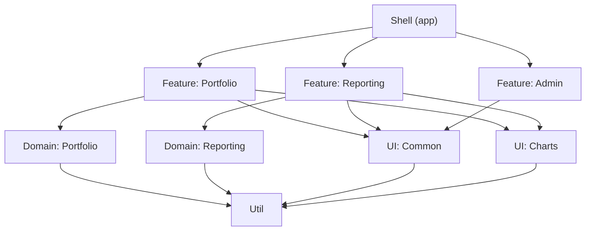

# Analyzing Your Architecture with Forensic Techniques

Architecture decisions rarely age gracefully. The layering you chose in sprint one erodes over months of feature pressure, team turnover, and deadline-driven shortcuts. The good news is that your version control system has been silently recording every compromise. Forensic code analysis turns that history into actionable insight -- revealing which modules are secretly coupled, which files attract the most churn, and whether your team structure is fighting or reinforcing your intended architecture.

This chapter moves away from writing code and toward *evaluating* it. We will apply forensic techniques to the **FinancialApp**, the example application we have been evolving since [Chapter 8](ch08-architecture.md). You will learn to visualize dependency layers, detect temporal coupling through git history, identify architectural hotspots, and align team boundaries with module boundaries using Conway's Law as a guide. Along the way we will explore two tools -- **Detective** for Angular-specific dependency analysis and **CodeScene** for deeper, repository-wide forensic insight.

---

## The Example Application Examined

Throughout earlier chapters we built FinancialApp as a modular Angular workspace. Its intended layering looks like this:

- **Shell** -- top-level layout, routing, and navigation
- **Feature libraries** -- `portfolio`, `reporting`, `admin`, each encapsulating a vertical slice
- **Domain libraries** -- shared business logic such as `portfolio-domain` and `reporting-domain`
- **UI libraries** -- reusable presentational components (`ui-common`, `ui-charts`)
- **Util libraries** -- pure functions and helpers with no Angular dependency

In [Chapter 14](ch14-monorepos-libraries.md) we enforced these layers with Nx module boundaries and lint rules. Those rules tell us what *should not* happen. Forensic analysis tells us what *actually did* happen.

Before reaching for specialized tooling, a quick `git log --oneline --since="6 months ago" | wc -l` gives us a coarse pulse check. If the repository has seen several hundred commits over that window, there is enough history to surface meaningful patterns. FinancialApp has roughly 400 commits across four contributors -- a realistic size for the techniques in this chapter.

---

## Analyzing Layering

The first question any architect should ask is: *does the code still respect the intended layers?* Static analysis catches explicit import violations, but it misses a subtler class of problems -- implicit coupling introduced by shared mutable state, coordinated deployments, or features that always change together despite living in separate libraries.

A layered architecture is healthy when:

1. **Dependencies point downward.** Feature libraries depend on domain and UI libraries, never the reverse.
2. **Peer layers do not know about each other.** `portfolio` should not import from `reporting`.
3. **Lower layers are stable.** Util and domain libraries change less frequently than feature libraries.

We can verify the first two properties with static tooling (the Nx dependency graph, ESLint boundaries). The third property -- *stability* -- requires commit history. A domain library that changes as often as a feature library is a smell: either the domain model is immature, or feature-specific logic has leaked downward.



The diagram above represents the *intended* dependency flow. The goal of forensic analysis is to discover whether reality still matches this picture -- and where it does not.

---

## Forensic Analysis for Architects: A Brief Overview

The idea of mining version control history for architectural insight was popularized by Adam Tornhill in *Your Code as a Crime Scene* (2015). The core premise is simple: **files that change together are coupled, regardless of what the import graph says.** This "temporal coupling" or "change coupling" is invisible to linters and compilers, yet it is one of the strongest predictors of defect density and maintenance cost.

Forensic analysis rests on a handful of metrics derived from git history:

- **Change frequency (churn):** How often a file is modified. High-churn files deserve the most attention because every future change will touch them.
- **Change coupling:** When two files consistently appear in the same commits, they are temporally coupled. If those files live in different modules, the module boundary may be an illusion.
- **Code age:** Recently modified code carries more risk than code that has been stable for months. A heat map of code age reveals where active development is concentrated.
- **Complexity trend:** Tracking cyclomatic complexity over time shows whether a file is growing healthier or accumulating debt.
- **Author dispersion:** How many developers touch a given file or module. High dispersion can indicate unclear ownership; low dispersion can indicate knowledge silos.

None of these metrics require specialized languages or frameworks. They work on any git repository, which makes them equally applicable to Angular frontends and Python backends. What matters is how you *interpret* the results in the context of your architecture.

---

## Using Detective

**Detective** is an open-source tool created by Manfred Steyer and the Angular Architects team. It analyzes an Nx workspace and produces an interactive dependency visualization that goes beyond the built-in `nx graph`. Where the Nx graph shows static import relationships, Detective layers on additional data: module categories, boundary violations, and -- crucially -- the ability to overlay git-derived metrics onto the graph.

### Getting Started

Detective runs as a CLI tool against your workspace:

```bash
npx @angular-architects/detective
```

It reads your `project.json` / `angular.json` configuration, resolves TypeScript imports, and generates an interactive HTML report. The report renders each library as a node, colored by its layer category (feature, domain, UI, util), with edges representing import dependencies.

### What to Look For

When examining the Detective output for FinancialApp, pay attention to:

- **Cross-layer edges.** An arrow from a domain library up to a feature library indicates a dependency inversion. This might be a circular dependency waiting to happen.
- **Clusters of tightly connected nodes.** If three feature libraries are all connected to each other, they may belong in a single library -- or they share a domain concept that should be extracted.
- **Orphan nodes.** Libraries with no incoming edges might be dead code. Libraries with no outgoing edges are either pure leaf utilities or incorrectly isolated.

Detective is particularly valuable during code reviews and architecture retrospectives. Rather than debating module boundaries in the abstract, the team can point at a concrete visualization and ask: "Should this edge exist?"

---

## Change Coupling

Change coupling is the most powerful forensic technique for architects. It answers the question: *which files change together, and should they?*

### Extracting Change Coupling from Git

At its simplest, change coupling analysis works like this:

1. Extract the list of files changed in each commit over a time window.
2. For every pair of files that appear in the same commit, increment a co-change counter.
3. Rank pairs by co-change frequency and filter for pairs that cross module boundaries.

A quick shell pipeline demonstrates the concept:

```bash
git log --format='%H' --since='6 months ago' | while read sha; do
  echo "---$sha---"
  git diff-tree --no-commit-id --name-only -r "$sha"
done
```

This produces a commit-grouped file list that can be fed into a script to compute pair frequencies. In practice, you will want a proper tool (Detective, CodeScene, or code-maat) rather than ad-hoc scripts, but understanding the underlying mechanism helps you interpret the results.

### Interpreting Results in FinancialApp

Suppose the analysis reveals that `portfolio-domain/src/lib/holdings.service.ts` and `reporting/src/lib/summary-report.component.ts` appear together in 60% of commits over the last three months. This is a red flag. These files live in different layers (domain vs. feature) and different verticals (portfolio vs. reporting). Their high coupling suggests one of two things:

- **Shared concept:** Both files depend on a data model that should be extracted into a shared domain library.
- **Feature leak:** Business logic that belongs in the domain layer has leaked into the reporting feature, forcing synchronized changes.

Either way, the module boundary is not doing its job. Without forensic analysis, this coupling would remain invisible until a developer stumbles into a merge conflict or introduces a regression by changing one file without the other.

---

## Hotspots as an Indicator of Architectural Problems

A **hotspot** is a file (or module) that combines high change frequency with high complexity. These are the most dangerous files in your codebase: they change often, they are hard to understand, and therefore they are the most likely to harbor defects.

### Identifying Hotspots

Hotspot analysis overlays two dimensions:

| Metric | Source | Meaning |
|---|---|---|
| Change frequency | `git log --format='%H' -- <file> \| wc -l` | How often the file is modified |
| Complexity | Lines of code, cyclomatic complexity, or indentation depth | How hard the file is to understand |

Files that score high on both axes are hotspots. Files that are complex but rarely change are technical debt you can afford to defer. Files that change often but are simple are healthy -- they are easy to modify safely.

### Hotspots in FinancialApp

In our example application, a likely hotspot is `portfolio/src/lib/portfolio-dashboard.component.ts`. As the primary entry point for the portfolio feature, it has accumulated responsibility over time: data fetching, chart configuration, filter state management, and export logic. It is both the most-changed and the most-complex file in its library.

The architectural response to a hotspot is not always to refactor the file itself. Sometimes the file is a hotspot *because* the architecture is wrong. If `portfolio-dashboard.component.ts` is changing frequently, ask why:

- Is it handling responsibilities that belong in a service? Extract them.
- Is it coordinating too many child components? Introduce a container/presenter split.
- Is it changing because an upstream domain model keeps shifting? Stabilize the model first.

Hotspot analysis directs your refactoring energy where it will have the most impact, rather than spreading it evenly across the codebase.

---

## Team Alignment and Conway's Law

> "Any organization that designs a system will produce a design whose structure is a copy of the organization's communication structure."
> -- Melvin Conway, 1967

Conway's Law is not merely an observation -- it is a force. If your team structure does not match your intended architecture, the architecture will bend to match the team. Forensic analysis can reveal this misalignment before it becomes entrenched.

### Measuring Team-Architecture Alignment

Author dispersion analysis maps developers to modules. For FinancialApp, the ideal mapping looks like this:

| Module | Primary Authors | Alignment |
|---|---|---|
| `portfolio` + `portfolio-domain` | Team A (2 developers) | Good -- single team owns the vertical |
| `reporting` + `reporting-domain` | Team B (2 developers) | Good |
| `ui-common` | All teams | Expected -- shared ownership of common components |
| `admin` | Team A + Team B | Risk -- no clear owner |

The `admin` module is a concern. When multiple teams contribute to a module without clear ownership, several problems follow:

- **Conflicting conventions.** Each team brings its own patterns, leading to inconsistency.
- **Diffuse responsibility.** Nobody feels accountable for the module's health.
- **Coordination overhead.** Changes require cross-team communication, slowing delivery.

The forensic fix may be organizational rather than technical: assign a clear owner for `admin`, or split it into sub-modules aligned with each team's area of expertise.

### The Inverse Conway Maneuver

If Conway's Law says the architecture will mirror the team structure, then deliberately restructuring teams to match the *desired* architecture should produce better results. This is the "Inverse Conway Maneuver" described by Thoughtworks. In practice, it means that decisions about library boundaries in [Chapter 14](ch14-monorepos-libraries.md) should be informed by team topology, and vice versa. The module graph and the org chart are two views of the same system.

---

## From Detective to Code Scene

Detective is an excellent starting point for Angular workspaces, but its scope is limited to static dependency analysis within a single Nx workspace. For teams that want deeper forensic insight -- temporal coupling, hotspot analysis, author dispersion, and complexity trends over time -- **CodeScene** is the natural next step.

CodeScene (codescene.com) is a commercial platform built on the forensic code analysis ideas from *Your Code as a Crime Scene*. It connects directly to your git repository and continuously analyzes commit history to produce:

- **Hotspot maps** with complexity trend overlays
- **Temporal coupling** matrices that highlight implicit dependencies across files and repositories
- **Knowledge maps** showing author distribution and bus-factor risk
- **Code health** scores that track maintainability over time
- **Delivery risk** predictions based on historical patterns

### When to Use Which Tool

| Capability | Detective | CodeScene |
|---|---|---|
| Dependency visualization | Yes | Limited (not Angular-specific) |
| Module boundary enforcement | Via Nx integration | No |
| Temporal coupling analysis | No | Yes |
| Hotspot detection | No | Yes |
| Author / knowledge analysis | No | Yes |
| Complexity trends | No | Yes |
| Cost | Free / open-source | Commercial (free tier available) |

The two tools are complementary. Use Detective to verify that your static dependency graph is clean, and CodeScene to verify that your runtime development patterns (who changes what, when, and with what) align with your architectural intent.

For smaller teams or open-source projects, the forensic analysis concepts can also be applied using Adam Tornhill's open-source tool **code-maat**, which operates on git log output and produces CSV reports suitable for further analysis in a spreadsheet or notebook.

---

## Critical Review

Forensic code analysis is powerful, but it has limitations that deserve honest acknowledgment.

**History is not destiny.** High change coupling between two files in the past does not guarantee it will continue. Teams learn, architectures evolve, and a refactoring sprint can break historical patterns overnight. Treat forensic metrics as signals to investigate, not verdicts to act on blindly.

**Commit hygiene matters.** The quality of forensic analysis depends on the quality of your commit history. If developers routinely commit unrelated changes in a single commit (the "Friday afternoon mega-commit"), change coupling analysis will produce false positives. Conversely, if every line change gets its own commit, the signal-to-noise ratio drops. Encourage atomic, focused commits -- not just for forensic tooling, but for the health of your development process.

**Tooling is not a substitute for judgment.** Detective can show you a dependency edge. CodeScene can flag a hotspot. Neither tool can tell you whether the dependency is intentional or the hotspot is unavoidable. Architectural decisions require human context: business priorities, team capacity, and the cost of change. Use forensic data to inform the conversation, not to end it.

**Angular-specific nuances.** Some Angular patterns produce misleading forensic signals. For example, a barrel `index.ts` file that re-exports an entire library will appear as a hotspot simply because every new export requires touching it. Template files (`.html`) and style files (`.scss`) often co-change with their component `.ts` file, which is expected coupling, not a smell. Calibrate your analysis to ignore these known patterns.

Despite these caveats, forensic analysis fills a gap that static analysis and code review cannot. It reveals the *behavioral* architecture -- the one that emerges from how developers actually work -- and compares it against the *intended* architecture defined by module boundaries and dependency rules.

---

## Summary

Architecture diagrams describe intent; git history describes reality. In this chapter we bridged the gap between the two using forensic code analysis techniques applied to FinancialApp.

Key takeaways:

- **Layering verification** requires both static analysis (import graphs, lint rules) and temporal analysis (change frequency by layer). Stable lower layers are a sign of healthy architecture.
- **Change coupling** -- files that consistently change together -- is the most revealing forensic metric. When coupled files cross module boundaries, the boundary is eroding.
- **Hotspots** (high churn + high complexity) concentrate risk. Direct refactoring effort toward these files for maximum impact.
- **Conway's Law** means your team structure and your module structure are deeply intertwined. Forensic author-dispersion analysis reveals misalignment before it causes organizational friction.
- **Detective** provides Angular- and Nx-aware dependency visualization, making it the right starting tool for workspace-level analysis.
- **CodeScene** extends the analysis to temporal coupling, hotspots, knowledge maps, and complexity trends across the full repository history.
- Forensic metrics are **signals, not verdicts**. They start conversations about architecture; they do not end them.

The architecture patterns we established in [Chapter 8](ch08-architecture.md) and the module boundaries we enforced in [Chapter 14](ch14-monorepos-libraries.md) gave us a strong starting position. Forensic analysis ensures that position is maintained as the codebase and the team evolve over time.
