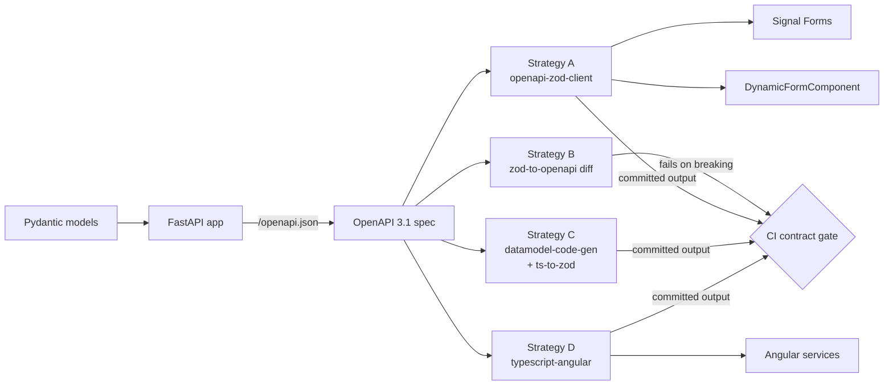

# Chapter 24: Advanced TypeScript & OpenAPI Service Generation

TypeScript is not just a type checker -- it is a design tool. The difference between a codebase where developers occasionally get bitten by a wrong ID or a malformed response and one where the compiler catches those mistakes before the code runs comes down to how deliberately you wield the type system. Most Angular tutorials stop at interfaces and generics. This chapter does not.

We will push TypeScript further -- branded types, discriminated unions, mapped types, template literal types -- and then connect all of it to the backend through OpenAPI code generation, closing the gap between the API contract and the Angular services that consume it. Every example builds on the FinancialApp we have been evolving since [Chapter 11](ch09-architecture.md).

> **Companion code:** `openapi.yaml` lives at `financial-app/` root. Generated types are in `libs/shared/api-client/`. Shared Zod schemas are in `libs/shared/validation/`. The `DynamicFormComponent` is in `libs/shared/ui/`.

---

## Branded Types for Domain IDs

In the FinancialApp, an `AccountId` is a `number`. A `TransactionId` is also a `number`. TypeScript's structural type system treats them as interchangeable, which means the compiler will happily let you pass a transaction ID to a function expecting an account ID. The bug surfaces at runtime -- or worse, in production when a user sees someone else's data.

Branded types solve this by attaching a phantom property that exists only at the type level:

```typescript
// libs/shared/models/src/ids.ts
declare const BrandSymbol: unique symbol;
type Brand<T, B> = T & { readonly [BrandSymbol]: B };

export type AccountId = Brand<number, 'AccountId'>;
export type TransactionId = Brand<number, 'TransactionId'>;
export type PortfolioId = Brand<number, 'PortfolioId'>;
export type ClientId = Brand<number, 'ClientId'>;

export function asAccountId(value: number): AccountId { return value as AccountId; }
export function asTransactionId(value: number): TransactionId { return value as TransactionId; }
```

At runtime, `asAccountId(42)` returns plain `42` -- no wrapper objects, no performance cost. But at compile time the branded types are incompatible:

```typescript
// libs/shared/data-access/src/account.service.ts
@Injectable({ providedIn: 'root' })
export class AccountService {
  private http = inject(HttpClient);

  getById(id: AccountId): Observable<Account> {
    return this.http.get<Account>(`/api/accounts/${id}`);
  }
}

// This compiles:
this.accountService.getById(asAccountId(route.params['id']));

// This does NOT compile:
const txId: TransactionId = asTransactionId(99);
this.accountService.getById(txId);
//                          ~~~ Type 'TransactionId' is not assignable to type 'AccountId'
```

The factory functions are the only entry points into the branded type. Place validation logic there -- range checks, non-negative assertions -- and every call site inherits the guarantee.

---

## Discriminated Unions for API Responses

API calls either succeed or fail, but the shape of the response differs between the two cases. A discriminated union makes this explicit:

```typescript
// libs/shared/models/src/api-result.ts
export interface ApiError { code: string; message: string; details?: Record<string, string[]>; }

export type ApiResult<T> =
  | { status: 'success'; data: T }
  | { status: 'error'; error: ApiError };
```

The `status` field is the discriminant. TypeScript narrows the union when you check it:

```typescript
// libs/shared/data-access/src/transaction-api.service.ts
submitTransaction(tx: TransactionDraft): Observable<ApiResult<Transaction>> {
  return this.http.post<Transaction>('/api/transactions', tx).pipe(
    map(data => ({ status: 'success' as const, data })),
    catchError((err: HttpErrorResponse) => of({
      status: 'error' as const,
      error: { code: err.error?.code ?? 'UNKNOWN', message: err.error?.message ?? 'Unexpected error' },
    })),
  );
}
```

In a template, `@switch` provides exhaustive narrowing:

```html
<!-- transaction-submit.component.html -->
@switch (result().status) {
  @case ('success') {
    <fin-transaction-card [transaction]="result().data" />
  }
  @case ('error') {
    <fin-error-banner [error]="result().error" />
  }
}
```

If you later add a third status -- `'pending'`, say -- TypeScript flags every `@switch` and `switch` statement that does not handle it. Discriminated unions convert runtime surprises into compile-time errors.

---

## Mapped Types for Form Models

The FinancialApp's `Transaction` interface defines the domain model. The transaction entry form from [Chapter 6](ch06-signal-forms.md) needs a form-specific model derived from it. Maintaining both by hand is a synchronization hazard -- add a field to the interface, forget the form model, and you have a silent bug.

Mapped types derive one shape from another. Conditional types filter out non-editable properties:

```typescript
// libs/shared/models/src/form-types.ts
import { FormField } from '@angular/forms/signals';

type FormModel<T> = { [K in keyof T]: FormField<T[K]> };

type EditableKeys<T> = {
  [K in keyof T]: T[K] extends Function ? never : K;
}[keyof T];

type EditableFields<T> = Pick<T, EditableKeys<T>>;

export type TransactionFormModel = FormModel<
  Omit<EditableFields<Transaction>, 'id' | 'createdAt' | 'status'>
>;
```

The result is a type where every editable field of `Transaction` maps to a `FormField` of the correct type. Add a `notes: string` property to `Transaction` and `TransactionFormModel` automatically includes `notes: FormField<string>`:

```typescript
// domains/transactions/transaction-entry.component.ts
export class TransactionEntryComponent {
  readonly form: TransactionFormModel = {
    description: formField(''),
    amount: formField(0),
    date: formField(new Date().toISOString().slice(0, 10)),
    accountId: formField(asAccountId(0)),
    category: formField(''),
    type: formField<'credit' | 'debit'>('debit'),
  };
}
```

If you forget a field, the compiler tells you. If you add a field with the wrong type, the compiler tells you. The mapped type is the single source of structural truth.

---

## Template Literal Types for Route Paths

Angular's `Router.navigate()` accepts `any[]`, which means a typo in a route segment compiles silently. Template literal types tighten this:

```typescript
// libs/shared/models/src/routes.ts
export type AppRoute =
  | '/accounts'       | `/accounts/${AccountId}`     | `/accounts/${AccountId}/transactions`
  | '/transactions'   | `/transactions/${TransactionId}`
  | '/portfolios'     | `/portfolios/${PortfolioId}`;
```

A thin wrapper around the router enforces these paths:

```typescript
// libs/shared/util/src/typed-router.ts
@Injectable({ providedIn: 'root' })
export class TypedRouter {
  private router = inject(Router);

  navigate(route: AppRoute, extras?: NavigationExtras): Promise<boolean> {
    return this.router.navigateByUrl(route, extras);
  }
}

// Usage -- this compiles:
this.typedRouter.navigate(`/accounts/${id}`);

// Compile error -- 'acocunts' is not assignable to AppRoute:
this.typedRouter.navigate(`/acocunts/${id}`);
```

The template literal type catches typos, validates that the ID brand matches the route segment, and provides autocompletion -- eliminating an entire class of navigation bugs.

---

## The `satisfies` Operator for Configuration

Angular route configuration is typically written one of two ways. With `as const`, you get perfect literal inference but lose type checking -- a misspelled `loadCompnent` slips through. With an explicit `Routes` annotation, you get checking but lose literal inference. The `satisfies` operator gives you both:

```typescript
// apps/financial-app/src/app/app.routes.ts
export const appRoutes = [
  {
    path: 'accounts',
    loadComponent: () => import('./domains/accounts/account-list.component').then(m => m.AccountListComponent),
  },
  {
    path: 'accounts/:id',
    loadComponent: () => import('./domains/accounts/account-detail.component').then(m => m.AccountDetailComponent),
    canActivate: [authGuard],
  },
] satisfies Routes;
```

TypeScript verifies that each object matches the `Route` interface -- catching misspelled properties and wrong types -- while preserving narrow literal types for `path` values. The same pattern applies to environment configurations, feature flag maps, and Material theme definitions from [Chapter 32](ch22-material-design-system.md).

---

## Utility Types for Component APIs

TypeScript's built-in utility types shape component input contracts precisely. The FinancialApp's `FinDataTable` column configuration demonstrates several in combination:

```typescript
// libs/shared/ui/src/data-table/column-config.ts
export interface ColumnDef<T> {
  key: keyof T & string;
  header: string;
  sortable?: boolean;
  format?: (value: T[keyof T]) => string;
}

export type ReadonlyTableConfig<T> = Readonly<{
  columns: readonly ColumnDef<T>[];
  pageSize: number;
  selectable: boolean;
}>;

type AccountSummary = Pick<Account, 'id' | 'name' | 'balance'>;
type AccountUpdate = Omit<Account, 'id' | 'createdAt' | 'updatedAt'>;

type TransactionStatus = 'pending' | 'approved' | 'rejected' | 'cancelled';
type TerminalStatus = Extract<TransactionStatus, 'approved' | 'rejected' | 'cancelled'>;
type ActionableStatus = Exclude<TransactionStatus, TerminalStatus>; // 'pending'
```

`Pick` and `Omit` narrow interfaces for specific use cases; `Extract` and `Exclude` operate on union types. These are not esoteric -- they are everyday tools. A component that accepts `Partial<TableConfig>` communicates clearly that every property is optional. One that accepts `Required<TableConfig>` demands everything. The types are the documentation.

---

## Generic Service Patterns

Most of the FinancialApp's data-access services follow the same shape: fetch a list, fetch one by ID, create, update, delete. A generic base class captures this pattern once:

```typescript
// libs/shared/data-access/src/crud.service.ts
@Injectable()
export abstract class CrudService<T extends { id: number }> {
  protected abstract readonly basePath: string;
  protected http = inject(HttpClient);

  getAll(params?: Record<string, string>): Observable<T[]> {
    return this.http.get<T[]>(this.basePath, { params });
  }
  getById(id: number): Observable<T> {
    return this.http.get<T>(`${this.basePath}/${id}`);
  }
  create(payload: Omit<T, 'id'>): Observable<T> {
    return this.http.post<T>(this.basePath, payload);
  }
  update(id: number, payload: Partial<Omit<T, 'id'>>): Observable<T> {
    return this.http.put<T>(`${this.basePath}/${id}`, payload);
  }
  delete(id: number): Observable<void> {
    return this.http.delete<void>(`${this.basePath}/${id}`);
  }
}

// libs/shared/data-access/src/account.service.ts
@Injectable({ providedIn: 'root' })
export class AccountService extends CrudService<Account> {
  protected readonly basePath = '/api/accounts';

  getByClientId(clientId: ClientId): Observable<Account[]> {
    return this.getAll({ clientId: String(clientId) });
  }
}
```

`AccountService.create()` expects `Omit<Account, 'id'>` -- not `any`, not `unknown`. The generic constraint `T extends { id: number }` ensures every entity type has an `id` field. This pairs well with the branded types from earlier: refine `getById` to accept `AccountId` in the concrete service for maximum safety.

---

## OpenAPI-Driven Service Generation

The TypeScript patterns above make your frontend type-safe internally, but the boundary between frontend and backend remains a trust gap. `http.get<Account>(...)` does not validate the response against the `Account` interface. If the backend renames a field, the frontend compiles happily and fails at runtime. OpenAPI code generation closes this gap by describing endpoints, request bodies, and response schemas in a machine-readable spec, then generating TypeScript types that match it exactly.

### Writing the Spec

The FinancialApp's API is described in an OpenAPI 3.1 specification. Here is an excerpt covering a path and its schemas:

```yaml
# financial-app/openapi.yaml
openapi: '3.1.0'
info: { title: FinancialApp API, version: 1.0.0 }
paths:
  /api/accounts:
    get:
      operationId: listAccounts
      parameters:
        - { name: clientId, in: query, schema: { type: integer } }
      responses:
        '200':
          content:
            application/json:
              schema: { type: array, items: { $ref: '#/components/schemas/Account' } }
  /api/transactions:
    post:
      operationId: createTransaction
      requestBody:
        required: true
        content:
          application/json:
            schema: { $ref: '#/components/schemas/TransactionDraft' }
      responses:
        '201':
          content:
            application/json:
              schema: { $ref: '#/components/schemas/Transaction' }
components:
  schemas:
    Account:
      type: object
      required: [id, name, balance, currency, status]
      properties:
        id: { type: integer }
        name: { type: string }
        balance: { type: number, format: double }
        currency: { type: string, enum: [USD, EUR, GBP, JPY] }
        status: { type: string, enum: [active, closed, frozen] }
    TransactionDraft:
      type: object
      required: [accountId, amount, type, category, date]
      properties:
        accountId: { type: integer }
        amount: { type: number, format: double, minimum: 0.01 }
        type: { type: string, enum: [credit, debit] }
        category: { type: string, minLength: 1 }
        date: { type: string, format: date }
        description: { type: string }
```

The full spec covers `/accounts/{id}`, `/transactions/{id}`, and `/portfolios` as well. The spec is the contract -- backend and frontend teams agree on this document, and code generation ensures both sides honor it.

### Generating Types and a Typed Client

Two packages handle code generation. `openapi-typescript` produces TypeScript types; `openapi-fetch` produces a typed HTTP client that uses those types. Install both and add generation scripts:

```bash
npm install -D openapi-typescript
npm install openapi-fetch
```

```json
{
  "scripts": {
    "generate:api": "openapi-typescript openapi.yaml -o libs/shared/api-client/src/schema.ts",
    "check:api": "npm run generate:api && git diff --exit-code libs/shared/api-client/"
  }
}
```

Running `npm run generate:api` produces a `schema.ts` file containing type definitions for every schema, path, and operation -- no manual translation.

### Using the Generated Client in Angular

`openapi-fetch` creates a client whose methods are typed by the generated schema. Wrap it in an Angular service for dependency injection and reactive data fetching:

```typescript
// libs/shared/api-client/src/account-api.service.ts
import createClient from 'openapi-fetch';
import type { paths } from './schema';

@Injectable({ providedIn: 'root' })
export class AccountApiService {
  private client = createClient<paths>({ baseUrl: '' });
  readonly accounts = httpResource<Account[]>(() => ({ url: '/api/accounts' }));

  async getById(id: AccountId) {
    const { data, error } = await this.client.GET('/api/accounts/{id}', {
      params: { path: { id } },
    });
    if (error) throw new Error('Failed to fetch account');
    return data;
  }
}
```

The `client.GET(...)` call is fully typed -- autocomplete suggests valid paths, `params` matches the spec's path and query parameters, and `data` carries the response schema type. If the spec changes and types are regenerated, any mismatch produces a compile error. For teams that prefer `HttpClient` and observables, `ng-openapi-gen` generates Angular-native services directly, at the cost of more generated code and tighter framework coupling.

---

## Shared Validation with Zod

The OpenAPI spec declares that `TransactionDraft.amount` must be at least `0.01` and `category` must have at least one character. The frontend form from [Chapter 6](ch06-signal-forms.md) validates the same rules. The backend validates them again. Three sources of truth is two too many. Zod schemas in a shared library solve this:

```typescript
// libs/shared/validation/src/transaction.schema.ts
import { z } from 'zod';

export const transactionDraftSchema = z.object({
  accountId: z.number().int().positive(),
  amount: z.number().positive().min(0.01, 'Amount must be at least $0.01'),
  type: z.enum(['credit', 'debit']),
  category: z.string().min(1, 'Category is required'),
  date: z.string().date('Must be a valid date (YYYY-MM-DD)'),
  description: z.string().optional(),
});

export type TransactionDraft = z.infer<typeof transactionDraftSchema>;
```

`z.infer<typeof transactionDraftSchema>` derives the TypeScript type directly from the schema -- there is no separate interface to maintain. In the transaction entry form, `safeParse` returns either validated data or structured field errors that map directly to form controls:

```typescript
// domains/transactions/transaction-entry.component.ts
import { transactionDraftSchema } from '@financial-app/shared/validation';

export class TransactionEntryComponent {
  submit(): void {
    const result = transactionDraftSchema.safeParse({
      accountId: this.form.accountId.value(),
      amount: this.form.amount.value(),
      type: this.form.type.value(),
      category: this.form.category.value(),
      date: this.form.date.value(),
      description: this.form.description.value(),
    });
    if (!result.success) { this.applyErrors(result.error.flatten().fieldErrors); return; }
    this.transactionApi.create(result.data).subscribe();
  }
}
```

The mock API uses the exact same schema:

```typescript
// mock-api/handlers/transactions.ts
import { transactionDraftSchema } from '@financial-app/shared/validation';

export const createTransactionHandler = http.post('/api/transactions', async ({ request }) => {
  const result = transactionDraftSchema.safeParse(await request.json());
  if (!result.success) {
    return HttpResponse.json(
      { code: 'VALIDATION_ERROR', details: result.error.flatten().fieldErrors },
      { status: 400 },
    );
  }
  return HttpResponse.json({ id: nextId(), ...result.data, status: 'pending' }, { status: 201 });
});
```

One schema, consumed by both sides. When a business rule changes -- say, the minimum amount increases to `1.00` -- you change it in one place, and both frontend and backend validation update together.

---

## Dynamic Form Generation from OpenAPI Schema

Some administrative screens in the FinancialApp need forms for entities that do not justify a hand-crafted component -- ad-hoc configuration editors, bulk data entry, or internal tools. The OpenAPI schema already describes the fields, their types, required status, and constraints. A `DynamicFormComponent` reads this metadata and renders form fields at runtime using the `FinFormField` and `FinCurrencyInput` wrappers from [Chapter 32](ch22-material-design-system.md):

```typescript
// libs/shared/ui/src/dynamic-form/dynamic-form.component.ts
interface SchemaProperty {
  type: string;
  enum?: string[];
  minimum?: number;
  maximum?: number;
  format?: string;
}

@Component({
  selector: 'fin-dynamic-form',
  imports: [FinFormField, FinCurrencyInput, ReactiveFormsModule],
  template: `
    @for (field of fields(); track field.key) {
      @switch (field.controlType) {
        @case ('currency') {
          <fin-currency-input [label]="field.label" [formControlName]="field.key" />
        }
        @case ('select') {
          <fin-form-field [label]="field.label">
            <select [formControlName]="field.key">
              @for (opt of field.options; track opt) {
                <option [value]="opt">{{ opt }}</option>
              }
            </select>
          </fin-form-field>
        }
        @default {
          <fin-form-field [label]="field.label">
            <input [type]="field.htmlType" [formControlName]="field.key" />
          </fin-form-field>
        }
      }
    }
  `,
})
export class DynamicFormComponent {
  schema = input.required<Record<string, SchemaProperty>>();
  requiredFields = input<string[]>([]);

  fields = computed(() =>
    Object.entries(this.schema()).map(([key, prop]) => ({
      key,
      label: key.replace(/([A-Z])/g, ' $1').replace(/^./, s => s.toUpperCase()),
      required: this.requiredFields().includes(key),
      controlType: prop.enum ? 'select' : prop.format === 'date' ? 'date'
        : key.toLowerCase().includes('amount') ? 'currency' : 'text',
      htmlType: prop.type === 'number' || prop.type === 'integer' ? 'number' : 'text',
      options: prop.enum ?? [],
    })),
  );
}
```

A consumer passes the `properties` object and the `required` array from an OpenAPI schema definition. The component translates these into live form fields with appropriate controls. Dynamic forms are not a replacement for hand-crafted components with tailored UX -- the transaction entry form from [Chapter 6](ch06-signal-forms.md) should remain bespoke. But for internal admin screens where entity types grow faster than the team's capacity to build custom forms, dynamic generation is a practical shortcut.

---

## Keeping Everything in Sync

The value of OpenAPI code generation depends on discipline. If the spec drifts from the actual backend, the generated types become a lie -- worse than no types at all, because they provide false confidence. The `check:api` script defined earlier catches drift in CI by regenerating types and failing if the output differs from what is committed. Add it to your pipeline alongside lint and test:

```yaml
# .github/workflows/ci.yml (excerpt)
- name: Verify API types are up to date
  run: npm run check:api
```

For teams using Zod schemas alongside OpenAPI, libraries like `zod-to-openapi` can generate OpenAPI schema fragments from Zod definitions, letting you author constraints in Zod and derive the spec. The ideal flow:

1. **Zod schema** is the single source of truth for validation rules and TypeScript types.
2. **OpenAPI spec** is generated or manually maintained, with CI verifying alignment.
3. **TypeScript types and HTTP client** are generated from the spec.
4. **CI** regenerates everything and fails on diff -- no manual synchronization, no trust gaps.

---

## Closing the Loop with a FastAPI Backend

Everything above makes your Angular frontend internally consistent, but it stops at the backend boundary. The `http.get<Account>()` call believes what you tell it; the server is free to return whatever shape it produces and neither side enforces agreement at runtime. The last step -- the hardest one to retrofit after the fact -- is closing the loop so that the backend's own source code *generates* the contract the frontend consumes, and CI refuses to ship if anything drifts.

This section is the conceptual bird's-eye view; [Appendix B0](ch52-appendix-b0-backend-fastapi.md) is the hands-on recipe with working scripts, Nx library layout, and CI workflow.

### Why a Closed Loop Matters

Three classes of bug disappear once the backend owns the contract and tools regenerate every frontend artifact from it.

- **Silent rename drift.** The backend renames `Account.balance` to `Account.currentBalance`. The frontend still compiles. A user sees `$0` in the UI and the bug ships. In a closed loop, the regeneration step produces a diff that fails CI: the frontend literally cannot consume a schema it does not know about.
- **"Types" that aren't validation.** `http.get<Account>()` is a TypeScript cast, not a runtime check. A malformed response still produces an object the compiler believes is an `Account` -- any downstream `account.balance * 0.05` quietly produces `NaN`. When the generated client pipes responses through Zod, every response is validated at the boundary.
- **Three copies of every validation rule.** The same "amount must be at least 0.01" rule lives in the backend validator, the OpenAPI spec, and the frontend form. Any one drifting breaks the other two. A single source of truth reduces the rule to one place that every layer consumes.

The FinancialApp's running example in Appendix B0 uses **FastAPI + Pydantic** as the backend because Pydantic is the canonical Python schema library and FastAPI's `/openapi.json` endpoint is free out of the box. The four frontend strategies below work identically against any backend that produces an OpenAPI 3.x spec.

### Four Topology Options

Each strategy is a different answer to "who owns the contract, and how do the frontend artifacts stay in lock-step?" Pick by team composition, backend stack, and how much framework integration matters.

1. **FastAPI-primary with `openapi-zod-client`.** Pydantic is the one source. A single generator emits both Zod schemas and a `Zodios` fetch client in one pass. Simplest pipeline. Best fit when your team is Python-first and wants runtime validation baked into every call with zero framework boilerplate.

2. **Zod + Pydantic co-equal with CI diff.** Frontend authors its own Zod schemas, backend authors Pydantic models, and a CI job serializes both to OpenAPI and runs `@redocly/openapi-diff` to catch breaking drift. No generation on either side. Best fit when the frontend has form-layer constraints (UX-specific messages, multi-field validators) that genuinely should not round-trip to the backend.

3. **Pydantic-primary via `datamodel-code-generator` + `ts-to-zod`.** Two-stage pipeline: OpenAPI -> TypeScript types -> Zod schemas. More configuration to tune, but handles complex inheritance and discriminated unions the simpler generators miss. Best fit for domain models with deep `allOf` hierarchies or custom `Annotated[]` transformations.

4. **OpenAPI Generator `typescript-angular`.** Produces an entire Angular library: `@Injectable({ providedIn: 'root' })` services returning `Observable<T>`, TypeScript interface models, a `Configuration` class. Uses `HttpClient` under the hood, so every pattern in this book (interceptors, XSRF, `httpResource`, SSR transfer cache) works unchanged. Publishable as an npm package via `ng-packagr`. Best fit for enterprise shops running multiple Angular apps against one API, or when the client library needs to ship externally.

### The Pipeline



Each arrow into `CI` represents a `git diff --exit-code` gate: the generator runs, its output is compared to what's committed, and any drift fails the build. The gate is the point of the whole apparatus.

### Contract Testing

Generating the artifacts is half the story. The other half is using them as the anchor for every test layer. Playwright specs round-trip the real FastAPI through the generated Zod schemas, validating each response's *actual* shape (not just what the spec says it should be). Vitest unit tests use the same Zod schemas to validate service responses, catching cases where middleware or serializers diverge from the declared contract. And a small `libs/shared/testing/` library exposes `toMatchSchema`, `zod-mock` factories, and an `mswHandlersFromSpec` generator so tests never hand-maintain fixtures that can drift. Appendix B0's testing section covers the patterns in detail.

### When the Backend Isn't Python

Every one of the four strategies is fundamentally backend-agnostic -- they consume OpenAPI 3.x JSON and don't care how it was produced. The same patterns apply to:

- **Node + Express** with `@asteasolutions/zod-to-openapi` (Zod-first, enables a shared Zod package across frontend and backend) or `tsoa` (decorator-first).
- **Spring Boot** with `springdoc-openapi` and Jakarta Bean Validation on Java records.
- **Go** with `oapi-codegen` (spec-first) or `swaggo/swag` (code-first).

Backend-specific gotchas -- Jackson date serialization, Go's `omitempty` semantics, shared-Zod monorepo patterns on Node -- live in the per-adapter appendices [B1](ch53-ch53-ch53-appendix-b1-backend-express.md), [B2](ch54-ch54-ch54-appendix-b2-backend-spring.md), and [B3](ch55-ch55-ch55-appendix-b3-backend-go.md). Each adapter is a ~4-page recipe following the same template so you can jump to your stack without reading the others.

---

## Summary

TypeScript's advanced type features and OpenAPI code generation are complementary tools that serve the same goal: making the boundary between what you *think* your code does and what it *actually* does as thin as possible.

- **Branded types** prevent ID mixups at compile time with zero runtime cost. Factory functions at the service boundary are the only entry points into branded values.
- **Discriminated unions** make API response handling exhaustive. The `status` discriminant narrows the type in both TypeScript and Angular templates.
- **Mapped and conditional types** derive form models from domain models, eliminating manual synchronization.
- **Template literal types** make route paths type-safe, catching typos and mismatched IDs at compile time.
- **`satisfies`** validates configuration objects against a type while preserving literal inference.
- **Utility types** (`Pick`, `Omit`, `Extract`, `Exclude`) shape component APIs precisely without redundant interfaces.
- **Generic services** capture CRUD patterns once and infer types from the generic parameter.
- **OpenAPI code generation** with `openapi-typescript` and `openapi-fetch` closes the trust gap between frontend and backend.
- **Zod schemas** unify validation across frontend and backend, with `z.infer` deriving TypeScript types from the schema itself.
- **Dynamic form generation** from OpenAPI metadata provides a practical escape hatch for admin screens.
- **CI checks** that regenerate types and fail on diff keep everything aligned as the API evolves.
- **Closed-loop FastAPI workflow** (covered in detail in [Appendix B0](ch52-appendix-b0-backend-fastapi.md)) takes generation from convenience to guarantee: the backend owns the contract, four alternative frontend topologies regenerate artifacts from it, and CI refuses to ship when anything drifts -- across Python, Node, Java, or Go backends.

The patterns in this chapter build on the architecture from [Chapter 11](ch09-architecture.md), the form layer from [Chapter 6](ch06-signal-forms.md), the routing primitives from [Chapter 4](ch04-router.md), and the signal model from [Chapter 3](ch03-reactive-signals.md). Together, they turn TypeScript from a type checker into a design tool that shapes how you think about your domain, your API contracts, and the seams between them.
