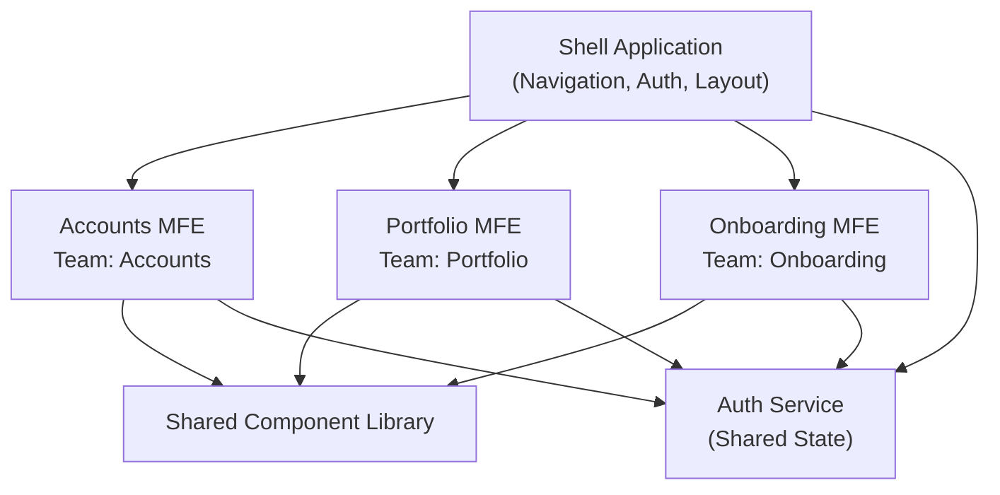

# Micro Frontends: Scaling Across Multiple Teams

As applications grow and organizations scale, a single Angular monolith can become a bottleneck -- not because of technical limitations, but because of coordination overhead. When three teams need to ship features to the same application on different cadences, merge conflicts become the norm, and deployment risk compounds with every release. Micro frontends address this by applying the same decomposition principles that microservices brought to the backend: independent development, independent deployment, and team autonomy.

This chapter explores when micro frontends make sense, how to implement them in Angular using Native Federation, and how web components can bridge version and framework boundaries. Throughout, we will use a **FinancialApp** as our running example -- a platform where an accounts team, a portfolio team, and an onboarding team each own distinct parts of the user experience.

## What are Micro Frontends?

A micro frontend is an architectural pattern where a web application is composed of semi-independent fragments, each owned by a different team. Rather than a single team building and deploying the entire frontend, each team delivers a self-contained vertical slice of the UI -- from the route down to the data-fetching logic.

In our FinancialApp, this looks like three separately built and deployed Angular applications:

- **Accounts MFE** -- account balances, transaction history, statements
- **Portfolio MFE** -- investment holdings, performance charts, asset allocation
- **Onboarding MFE** -- KYC flows, identity verification, account creation wizards

A **shell** application stitches these together into a unified experience. The user sees one application; under the hood, each section is loaded from a different deployment artifact.



This diagram illustrates the core topology: a shell that owns global concerns (navigation, authentication, layout) and delegates feature areas to independently deployed micro frontends. Shared libraries and services provide consistency without coupling.

### Motivation Behind Micro Frontends

The case for micro frontends is almost always organizational rather than technical. Consider these scenarios:

**Independent release cadences.** The onboarding team ships weekly to iterate on conversion funnels. The accounts team deploys bi-weekly after compliance reviews. In a monolith, these cadences collide. With micro frontends, each team deploys on its own schedule without coordinating with others.

**Team autonomy.** Each team owns its CI/CD pipeline, its test suite, and its build configuration. The portfolio team can adopt a new charting library without waiting for the other teams to evaluate it. The accounts team can refactor its state management without risking regressions elsewhere.

**Scaling development.** As organizations grow past 8-10 frontend developers working on a single codebase, coordination overhead grows super-linearly. Micro frontends create natural team boundaries that reduce the blast radius of changes.

**Incremental modernization.** When migrating from AngularJS or an older Angular version, micro frontends allow you to replace one section at a time rather than rewriting the entire application.

### Challenges to Keep in Mind

Micro frontends are not without cost, and adopting them prematurely is a common mistake.

**Increased complexity.** You now have multiple build pipelines, multiple deployment targets, and a shell that must orchestrate loading. What was a single `ng build` is now a distributed system.

**UX consistency.** Without discipline, each team drifts toward its own design patterns. A shared component library -- like the one discussed in [Chapter 11](ch09-architecture.md) -- becomes essential rather than optional.

**Payload duplication.** If micro frontends are not configured to share dependencies, the user downloads Angular's runtime multiple times. Federation mitigates this, but it requires deliberate configuration.

**Cross-cutting concerns.** Authentication, error handling, theming, and analytics must be coordinated across teams. These shared concerns need clear ownership, typically by the shell team or a platform team.

**Testing the integrated experience.** Unit testing individual micro frontends is straightforward. Testing the composed application -- navigation flows that cross MFE boundaries, shared state consistency -- requires dedicated integration infrastructure.

### Micro Frontends and Self-Contained Systems

Micro frontends are most effective when combined with the vertical slicing architecture from [Chapter 11](ch09-architecture.md). Each micro frontend should be a self-contained system (SCS): it owns its routes, its state, its API interactions, and its UI components. Cross-MFE communication is minimal and explicit.

In the FinancialApp, the accounts MFE does not reach into the portfolio MFE's state to display an account summary. Instead, if the portfolio view needs account balance data, it fetches it from the same API the accounts MFE uses -- or the shell provides it through a shared context.

This constraint -- minimal coupling between micro frontends -- is what makes independent deployment possible. If MFEs are tightly coupled, you have a distributed monolith: the worst of both worlds.

## Native Federation

Angular's ecosystem has converged on **Native Federation** as the standard approach for building micro frontends. Native Federation builds on the ideas of Webpack Module Federation but uses browser-native `import()` instead of a bundler-specific runtime. This means it works with any build tool -- esbuild, Vite, Webpack -- making it a natural fit for Angular's modern build pipeline.

The core concept: each micro frontend exposes specific modules (components, routes, services) in a `remoteEntry.json` manifest. The shell reads these manifests at runtime and dynamically loads the exposed modules on demand.

### Using Native Federation

To add Native Federation to an Angular workspace, install the `@angular-architects/native-federation` package:

```bash
ng add @angular-architects/native-federation --project accounts-mfe --type remote --port 4201
ng add @angular-architects/native-federation --project portfolio-mfe --type remote --port 4202
ng add @angular-architects/native-federation --project shell --type dynamic-host
```

This scaffolds the federation configuration for each project. The `--type remote` flag marks a project as a micro frontend that exposes modules. The `--type dynamic-host` flag marks the shell as a consumer that loads remotes at runtime, reading their locations from a configuration file rather than hardcoding them at build time.

### Native Federation: Setting up a Micro Frontend

Each micro frontend declares what it exposes in a `federation.config.js` file. For the accounts MFE:

```javascript
// apps/accounts-mfe/federation.config.js
const { withNativeFederation, shareAll } = require('@angular-architects/native-federation/config');

module.exports = withNativeFederation({
  name: 'accounts-mfe',
  exposes: {
    './routes': './src/app/accounts.routes.ts',
  },
  shared: shareAll({
    singleton: true,
    strictVersion: true,
    requiredVersion: 'auto',
  }),
});
```

The `exposes` map defines the public contract. Here, the accounts MFE exposes its route configuration -- everything the shell needs to integrate the accounts section. The `shareAll` helper tells Federation to share all dependencies listed in `package.json`, ensuring that Angular's core packages (`@angular/core`, `@angular/router`, etc.) are loaded only once when the shell and remote run the same version.

The corresponding route file is a standard Angular route array:

```typescript
// apps/accounts-mfe/src/app/accounts.routes.ts
import { Routes } from '@angular/router';

export const ACCOUNTS_ROUTES: Routes = [
  {
    path: '',
    loadComponent: () =>
      import('./features/dashboard/dashboard.component').then(m => m.DashboardComponent),
  },
  {
    path: 'transactions',
    loadComponent: () =>
      import('./features/transactions/transactions.component').then(m => m.TransactionsComponent),
  },
  {
    path: 'statements',
    loadComponent: () =>
      import('./features/statements/statements.component').then(m => m.StatementsComponent),
  },
];
```

Nothing about this route configuration is micro-frontend-specific. It uses the same lazy loading patterns covered in [Chapter 4](ch04-router.md). This is one of Native Federation's strengths: the micro frontend is just a normal Angular application that happens to expose some of its internals.

### Native Federation: Setting up a Shell

The shell application acts as the orchestrator. It defines where each micro frontend lives and maps URL paths to remote modules. A `federation.manifest.json` file provides the runtime mapping:

```json
{
  "accounts-mfe": "https://accounts.financialapp.com/remoteEntry.json",
  "portfolio-mfe": "https://portfolio.financialapp.com/remoteEntry.json",
  "onboarding-mfe": "https://onboarding.financialapp.com/remoteEntry.json"
}
```

During development, these URLs point to local dev servers (`http://localhost:4201/remoteEntry.json`). In production, they point to the deployed micro frontends. The shell loads this manifest at startup:

```typescript
// apps/shell/src/main.ts
import { initFederation } from '@angular-architects/native-federation';

initFederation('federation.manifest.json')
  .then(() => import('./bootstrap'))
  .catch(err => console.error(err));
```

The shell's route configuration uses `loadRemoteModule` to wire each path to the corresponding micro frontend:

```typescript
// apps/shell/src/app/app.routes.ts
import { Routes } from '@angular/router';
import { loadRemoteModule } from '@angular-architects/native-federation';

export const APP_ROUTES: Routes = [
  {
    path: 'accounts',
    loadChildren: () =>
      loadRemoteModule('accounts-mfe', './routes').then(m => m.ACCOUNTS_ROUTES),
  },
  {
    path: 'portfolio',
    loadChildren: () =>
      loadRemoteModule('portfolio-mfe', './routes').then(m => m.PORTFOLIO_ROUTES),
  },
  {
    path: 'onboarding',
    loadChildren: () =>
      loadRemoteModule('onboarding-mfe', './routes').then(m => m.ONBOARDING_ROUTES),
  },
  {
    path: '',
    redirectTo: 'accounts',
    pathMatch: 'full',
  },
];
```

From the router's perspective, these look like any other lazy-loaded routes. The only difference is that `loadRemoteModule` fetches the code from a separately deployed bundle rather than from the shell's own build output.

### Exposing a Router Config

Exposing route arrays rather than individual components is a deliberate architectural choice. When a micro frontend exposes `./routes`, the shell integrates an entire feature area with a single `loadChildren` call. The micro frontend team retains full control over the internal navigation structure -- they can add, remove, or reorganize routes without coordinating with the shell team.

This approach aligns with the self-contained systems principle. The shell knows that `/accounts` maps to the accounts MFE. Everything under `/accounts/**` is the accounts team's domain.

The alternative -- exposing individual components and assembling routes in the shell -- creates coupling. The shell team must update its route configuration every time a micro frontend adds a new view. This defeats the purpose of independent deployment.

### Communication between Micro Frontends

Micro frontends should communicate sparingly, but some cross-cutting state is unavoidable. The authenticated user's identity, the selected locale, and feature flags are examples of state that every MFE needs.

**Shared services via dependency injection.** When micro frontends share the same Angular version (the common case with Native Federation), they share the same dependency injection tree. A service provided in the shell's root injector is available to all loaded micro frontends:

```typescript
// libs/shared/auth/src/auth.context.ts
import { Injectable, signal, computed } from '@angular/core';

@Injectable({ providedIn: 'root' })
export class AuthContext {
  private readonly currentUser = signal<User | null>(null);
  
  readonly user = this.currentUser.asReadonly();
  readonly isAuthenticated = computed(() => this.currentUser() !== null);

  setUser(user: User | null): void {
    this.currentUser.set(user);
  }
}
```

Each micro frontend injects `AuthContext` and reads the reactive signals. Because the service is a singleton shared through Federation, all MFEs see the same state.

**Custom events for loose coupling.** When micro frontends need to notify each other without sharing a service -- especially across framework boundaries -- browser `CustomEvent` provides a framework-agnostic channel:

```typescript
// Portfolio MFE dispatches an event
window.dispatchEvent(
  new CustomEvent('portfolio:asset-selected', {
    detail: { assetId: 'AAPL', type: 'equity' },
  })
);

// Accounts MFE listens
window.addEventListener('portfolio:asset-selected', (event: CustomEvent) => {
  const { assetId } = event.detail;
  // Navigate to related transactions
});
```

Custom events are inherently loosely coupled -- the sender does not know or care who listens. This makes them appropriate for optional integrations but unsuitable for critical data flow.

**General guideline:** If two micro frontends communicate frequently or share significant state, they may belong in the same MFE. Excessive cross-MFE communication is a design smell that suggests the boundaries are drawn in the wrong place.

## Multi-Version and Multi-Framework Solutions

Native Federation works well when all micro frontends share the same Angular version. But what happens when the accounts team is on Angular v21 and the onboarding team is still on Angular v17? Or when a team wants to use React for a specific micro frontend?

In these scenarios, each micro frontend runs its own framework runtime. Sharing dependencies through Federation is no longer possible -- two versions of `@angular/core` cannot coexist as singletons. The micro frontends must be fully isolated.

**Web components** provide this isolation boundary. Each micro frontend is packaged as a custom element, with its own framework runtime bootstrapped inside the shadow DOM (or a regular DOM subtree). The shell loads these custom elements without knowing or caring what framework powers them.

### Abstracting Micro Frontends with Web Components

Angular's `@angular/elements` package converts Angular components into standard web components. The micro frontend team creates a wrapper that bootstraps their application inside a custom element:

```typescript
// apps/onboarding-mfe/src/main.ts
import { createApplication } from '@angular/platform-browser';
import { createCustomElement } from '@angular/elements';
import { OnboardingRootComponent } from './app/onboarding-root.component';
import { appConfig } from './app/app.config';

(async () => {
  const app = await createApplication(appConfig);
  
  const OnboardingElement = createCustomElement(OnboardingRootComponent, {
    injector: app.injector,
  });
  
  customElements.define('onboarding-mfe', OnboardingElement);
})();
```

The `OnboardingRootComponent` is a standard Angular component that contains the MFE's router outlet and top-level layout. Once registered as `<onboarding-mfe>`, it can be loaded into any HTML page regardless of the host framework.

### Loading Web Components in a Shell

The shell loads web component micro frontends by dynamically adding `<script>` tags and then rendering the custom element:

```typescript
// apps/shell/src/app/mfe-loader.component.ts
import { Component, input, effect, ElementRef, inject, Renderer2 } from '@angular/core';

@Component({
  selector: 'app-mfe-loader',
  standalone: true,
  template: `<div #container></div>`,
})
export class MfeLoaderComponent {
  readonly bundleUrl = input.required<string>();
  readonly elementTag = input.required<string>();

  private readonly elRef = inject(ElementRef);
  private readonly renderer = inject(Renderer2);

  constructor() {
    effect(() => {
      const url = this.bundleUrl();
      const tag = this.elementTag();
      this.loadMfe(url, tag);
    });
  }

  private loadMfe(url: string, tag: string): void {
    const script = this.renderer.createElement('script');
    script.src = url;
    script.onload = () => {
      const mfeElement = this.renderer.createElement(tag);
      const container = this.elRef.nativeElement.querySelector('div');
      this.renderer.appendChild(container, mfeElement);
    };
    this.renderer.appendChild(document.head, script);
  }
}
```

The shell's route configuration uses this loader:

```typescript
{
  path: 'onboarding',
  component: MfeLoaderComponent,
  data: {
    bundleUrl: 'https://onboarding.financialapp.com/main.js',
    elementTag: 'onboarding-mfe',
  },
}
```

This approach is framework-agnostic. The shell does not import anything from the micro frontend -- it loads a script and renders a custom element. The micro frontend could be Angular, React, Vue, or vanilla JavaScript.

### Sharing Zone.js

In earlier versions of Angular, Zone.js was a mandatory runtime dependency that monkey-patched browser APIs to enable automatic change detection. When multiple Angular micro frontends ran on the same page, they shared a single Zone.js instance -- and conflicts were common.

The typical workaround was to load Zone.js exactly once in the shell and configure each micro frontend to skip its own Zone.js bundle:

```javascript
// In the micro frontend's build config (legacy approach)
module.exports = {
  // ...
  shared: share({
    'zone.js': { singleton: true, strictVersion: false },
  }),
};
```

**In Angular v21, this concern is largely moot.** With the `provideZonelessChangeDetection()` API now stable, new applications run without Zone.js entirely. Signal-based reactivity drives change detection, and there is no global monkey-patching to conflict between micro frontends.

However, if you are building a shell that hosts legacy micro frontends -- say, an Angular v15 MFE alongside an Angular v21 MFE -- Zone.js sharing remains relevant for the older MFE. The recommended approach is:

1. The shell loads Zone.js once if any legacy MFE requires it.
2. Modern (zoneless) MFEs ignore Zone.js entirely.
3. Legacy MFEs are configured to use the shell's Zone.js instance rather than bundling their own.

As you migrate micro frontends to Angular v21+ and adopt signals, Zone.js conflicts will disappear naturally. This is one of many reasons to standardize on zoneless change detection across your micro frontend ecosystem.

### Web Components with own Routes

A web component micro frontend often needs internal routing. The onboarding MFE, for example, has a multi-step wizard: `/onboarding/identity`, `/onboarding/documents`, `/onboarding/review`. These routes must work within the custom element while the shell's router manages the top-level navigation.

The micro frontend configures its own `Router` with a base path that matches where the shell mounts it:

```typescript
// apps/onboarding-mfe/src/app/app.config.ts
import { ApplicationConfig } from '@angular/core';
import { provideRouter } from '@angular/router';
import { ONBOARDING_ROUTES } from './onboarding.routes';

export const appConfig: ApplicationConfig = {
  providers: [
    provideRouter(ONBOARDING_ROUTES),
  ],
};
```

The key challenge is that the browser has a single URL bar, but two routers (shell and MFE) want to control it. The shell's router handles `/onboarding/**`, and the MFE's router must interpret the sub-path (`/identity`, `/documents`) without conflicting with the shell.

### Workaround for Routers in Web Component

The most robust solution is to use a **custom URL handling strategy** that limits each router's scope. The shell's router owns the top-level segments and delegates everything under a micro frontend's prefix. The MFE's router uses a `PathLocationStrategy` (or a custom one) scoped to its prefix.

A practical approach is to have the MFE router use hash-based routing or a custom location strategy that reads from a sub-path:

```typescript
// apps/onboarding-mfe/src/app/custom-location-strategy.ts
import { PathLocationStrategy, APP_BASE_HREF } from '@angular/common';

export function provideMfeRouting(basePath: string) {
  return [
    { provide: APP_BASE_HREF, useValue: basePath },
    provideRouter(ONBOARDING_ROUTES),
  ];
}
```

Alternatively, some teams avoid the dual-router problem entirely by not using Angular's router inside web component MFEs. Instead, they manage internal navigation with a signal-driven state machine:

```typescript
@Component({
  selector: 'app-onboarding-root',
  standalone: true,
  template: `
    @switch (currentStep()) {
      @case ('identity') { <app-identity-step (next)="goTo('documents')" /> }
      @case ('documents') { <app-document-step (next)="goTo('review')" /> }
      @case ('review') { <app-review-step (complete)="finish()" /> }
    }
  `,
})
export class OnboardingRootComponent {
  readonly currentStep = signal<'identity' | 'documents' | 'review'>('identity');

  goTo(step: typeof this.currentStep extends Signal<infer T> ? T : never): void {
    this.currentStep.set(step);
  }

  finish(): void {
    window.dispatchEvent(new CustomEvent('onboarding:complete'));
  }
}
```

This sidesteps the routing conflict entirely. The trade-off is that internal MFE navigation is not reflected in the browser's URL, which affects deep-linking and browser history. Whether this matters depends on the feature -- a multi-step wizard may not need deep-linkable URLs, while a browsable content area likely does.

There is no universal answer. Choose based on your requirements:

| Approach | URL Reflects State | Complexity | Deep-Linking |
|---|---|---|---|
| Scoped `APP_BASE_HREF` | Yes | Medium | Full support |
| Hash-based MFE routing | Partial | Low | Hash-only |
| Signal-driven state | No | Low | Not supported |
| Shell-managed routes (Native Federation) | Yes | Lowest | Full support |

When possible, prefer the Native Federation approach from the earlier sections -- it avoids the dual-router problem by sharing a single router instance. Reserve the web component approaches for multi-version or multi-framework scenarios where sharing a router is not feasible.

## The Cost of Micro Frontends

Micro frontends solve organizational problems, but they introduce technical ones. Before adopting this architecture, consider whether the organizational pain justifies the engineering overhead.

**Build and deployment infrastructure.** Each micro frontend needs its own CI/CD pipeline, its own hosting, and its own versioning strategy. For the FinancialApp, that means three pipelines instead of one, three deployment targets, and a process for coordinating breaking changes to shared contracts.

**Performance overhead.** Even with dependency sharing, micro frontends add network requests (manifest files, remote entry points) and JavaScript parsing cost. A well-optimized monolith will always load faster than a well-optimized micro frontend architecture, because the monolith can tree-shake and bundle more aggressively.

**Developer experience.** Running the full FinancialApp locally means starting four dev servers (shell + three MFEs). Hot module replacement works within a single MFE but not across boundaries. Debugging navigation issues that span MFEs requires understanding the federation loading mechanism.

**Shared library versioning.** The shared component library that all three teams use must be versioned carefully. A breaking change in the library requires coordinated upgrades across all micro frontends -- the same coordination problem that micro frontends were supposed to eliminate.

**When micro frontends are the right choice:**
- Multiple teams (3+) with distinct business domains and different release cadences
- The application is large enough that a monolith creates genuine coordination bottlenecks
- Teams need technology autonomy (different Angular versions, or mixing frameworks)
- Incremental migration from a legacy frontend

**When a monolith is better:**
- A single team or two teams that release together
- The application fits comfortably in one build pipeline
- Teams share most of their components and state
- You value simplicity, performance, and developer experience over team isolation

Many applications that adopt micro frontends would be better served by a well-structured Nx monorepo with library boundaries, as described in [Chapter 11](ch09-architecture.md). Nx's `enforce-module-boundaries` lint rule provides team autonomy at the code level without the runtime complexity of federation. Consider micro frontends only when the monorepo approach is no longer sufficient -- typically when teams need independent deployment, not just independent development.

## Summary

Micro frontends decompose a frontend application into independently developed and deployed units, each owned by a separate team. They are an organizational scaling pattern, not a technical optimization.

**Native Federation** is the recommended approach when all micro frontends share the same Angular version. It uses browser-native `import()` to load remote modules at runtime, sharing dependencies through a configured manifest. Micro frontends expose route configurations, and the shell integrates them with standard `loadChildren` calls -- keeping the router patterns from [Chapter 4](ch04-router.md) intact.

**Web components** provide isolation when micro frontends run different Angular versions or different frameworks. Each MFE bundles its own runtime and registers as a custom element. This approach trades shared dependency benefits for full decoupling, which is appropriate for incremental migrations or polyglot frontend architectures.

**Zone.js sharing**, once a significant pain point in multi-Angular micro frontend setups, is fading in relevance as Angular v21's zoneless change detection becomes the default. New micro frontends should adopt `provideZonelessChangeDetection()` and avoid Zone.js entirely.

The recurring theme is that **micro frontends add complexity that must be justified by organizational need**. A three-person team building a dashboard does not need federation. A 40-person organization with four autonomous product teams and different compliance requirements might. The architecture should follow the team structure, not the other way around.
