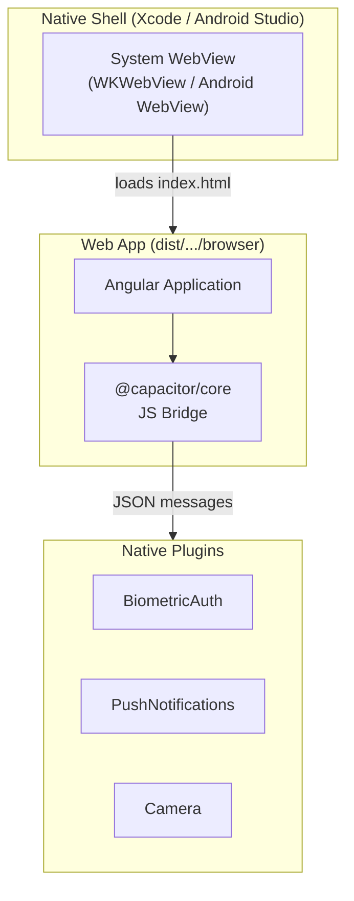

# Chapter 44: Capacitor & Mobile

A FinancialApp customer opens the App Store, downloads *FinancialApp*, taps the icon on their home screen, and authenticates with Face ID. Seconds later they are looking at their portfolio -- the same portfolio they checked from Chrome on their laptop an hour earlier. The iPhone build and the web build share a codebase, a design system, a data-access layer, and a team. The only code that differs is the thin shell that hosts the Angular app inside a native container and the handful of platform-specific integrations that unlock biometrics, native push, camera access, and the App Store listing.

This is what Capacitor delivers. It is not a cross-platform framework that rewrites your UI into native widgets -- it is a native runtime that hosts your existing Angular application inside a system WebView, exposing device APIs through a JavaScript bridge. The Angular code you already have is the mobile application, with a few extra services injected when `Capacitor.getPlatform()` returns `'ios'` or `'android'`.

For FinancialApp, Capacitor is the path from a single-team web product to a multi-channel product -- web, iOS, Android -- without a second team, a second codebase, or the compromises of a rewrite. This chapter covers how to add it, how to integrate native plugins with the existing services from [Chapter 27](ch17-auth-patterns.md), how to extend the offline and push patterns from [Chapter 26](ch33-pwa-service-workers.md) onto native, and how to ship through the App Store and Play Console.

> **Prerequisites:** [Chapter 27](ch17-auth-patterns.md) (the `AuthService` and BFF pattern we extend with biometrics) and [Chapter 26](ch33-pwa-service-workers.md) (`SwPush` and offline patterns we complement with native equivalents).

> **Companion code:** `financial-app/apps/financial-app-mobile/` Capacitor shell with biometric login wiring into the existing AuthService.

---

## Why Capacitor over Ionic, NativeScript, or Flutter

Four serious options compete for the "ship Angular on mobile" slot:

- **Ionic** -- a UI component library that runs on top of Capacitor. It gives you iOS-styled and Material-styled components that adapt to the host platform. FinancialApp already uses Angular Material and a bespoke component library in `libs/shared/ui/`, so Ionic's widgets would compete with what we have. We keep Capacitor and drop Ionic's UI layer.
- **NativeScript** -- renders native widgets directly. No WebView, no HTML. Genuinely native performance, but every template must be rewritten in NativeScript's XML dialect. The web build becomes a second codebase, doubling the cost of every feature forever.
- **Flutter** -- Google's cross-platform UI toolkit. Excellent native output, but an entire parallel technology stack: new language (Dart), new framework, new tooling, new team skill set. A year-long rewrite that produces two codebases the moment it ships.
- **Capacitor** -- the minimum viable path from web to mobile. The Angular app runs unchanged in a system WebView (WKWebView on iOS, Android WebView on Android). Native capabilities appear as injected services. One codebase, one test suite, one CI pipeline, one team.

Capacitor's trade-off is performance: complex animations and scroll-heavy lists perform worse in a WebView than in a native view. For FinancialApp -- forms, tables, charts, moderate interactivity -- the gap is not user-visible on 2022-and-later hardware. For a gaming app or a 3D-heavy experience, Flutter or native would be the right call.

---

## Capacitor Architecture

A Capacitor application has three layers:



**Native shell.** A minimal Xcode project (Swift) and Android Studio project (Kotlin) generated by the Capacitor CLI. You rarely edit this code -- it hosts the WebView, registers plugins, and satisfies App Store / Play Store requirements (entitlements, `Info.plist`, `AndroidManifest.xml`).

**System WebView.** iOS uses WKWebView; Android uses the Chromium-based Android System WebView. Both implement a modern subset of web standards. The Angular bundle loads from the app's bundle resources, not over HTTP, so the first paint happens without a network round-trip.

**Plugin bridge.** Capacitor's JS bridge serializes method calls to JSON, crosses into native code via `WKScriptMessageHandler` (iOS) or `addJavascriptInterface` (Android), executes native logic, and returns the result. A plugin call looks like a plain `Promise`:

```typescript
import { Camera, CameraResultType } from '@capacitor/camera';

const photo = await Camera.getPhoto({ resultType: CameraResultType.Uri, quality: 80 });
```

At runtime, Capacitor dispatches that call to `AVFoundation` on iOS or `CameraX` on Android. The Angular code has no awareness of the underlying platform.

---

## Adding Capacitor to the FinancialApp Nx Workspace

FinancialApp is an Nx monorepo with `apps/financial-app` (web), `apps/financial-app-bff` (the auth proxy from Chapter 27), and `libs/shared/*`. The mobile app is a new application that reuses everything in `libs/` and points Capacitor at the web build output.

```bash
npm install @capacitor/core @capacitor/cli
npm install @capacitor/ios @capacitor/android

nx g @nx/angular:app financial-app-mobile --directory=apps/financial-app-mobile
cd apps/financial-app-mobile
npx cap init FinancialApp com.example.financialapp \
  --web-dir=../../dist/apps/financial-app-mobile/browser

npx cap add ios
npx cap add android
```

The two arguments to `cap init` are the display name (shown under the app icon) and the bundle identifier -- a reverse-DNS name that must be unique across Apple's and Google's ecosystems. Changing it later means a new app listing, not an update, so choose carefully. `cap add` creates full Xcode and Android Studio projects under `ios/` and `android/`, checked into source control but rarely edited directly; `npx cap sync` regenerates the parts that depend on `capacitor.config.ts` and installed plugins.

The configuration file sits alongside the native projects:

```typescript
// apps/financial-app-mobile/capacitor.config.ts
import type { CapacitorConfig } from '@capacitor/cli';

const config: CapacitorConfig = {
  appId: 'com.example.financialapp',
  appName: 'FinancialApp',
  webDir: '../../dist/apps/financial-app-mobile/browser',
  server: { iosScheme: 'capacitor', hostname: 'app.financialapp.com' },
  plugins: {
    SplashScreen: { launchShowDuration: 2000, backgroundColor: '#1a237e' },
    PushNotifications: { presentationOptions: ['badge', 'sound', 'alert'] },
  },
};
export default config;
```

The `webDir` is what Capacitor copies into the native bundle on every sync. The `server.hostname` is what the WebView reports as the origin. This matters for cookies and CORS: the BFF must accept this origin, and the session cookie from Chapter 27 needs `SameSite=None; Secure` to cross from `app.financialapp.com` to `api.financialapp.com`.

---

## Platform Detection

The same Angular service runs in three environments: web, iOS, Android. A thin `PlatformService` wraps Capacitor's platform check so feature code stays testable:

```typescript
// libs/shared/platform/src/platform.service.ts
import { Injectable } from '@angular/core';
import { Capacitor } from '@capacitor/core';

@Injectable({ providedIn: 'root' })
export class PlatformService {
  readonly platform = Capacitor.getPlatform() as 'web' | 'ios' | 'android';
  readonly isNative = this.platform !== 'web';
  readonly isIOS = this.platform === 'ios';
  readonly isAndroid = this.platform === 'android';
}
```

Feature code branches on this flag:

```typescript
async login(credentials: Credentials): Promise<void> {
  await firstValueFrom(this.http.post('/bff/login', credentials));
  if (this.platform.isNative) await this.biometric.enrollForQuickLogin();
}
```

On web, the injected biometric service is a stub. On native, it prompts the user to enable Face ID or fingerprint login. The `AuthService` itself does not know which environment it is in -- it consumes an injected abstraction. This is the pattern we repeat for every platform-specific integration.

---

## Biometric Authentication

The auth flow from [Chapter 27](ch17-auth-patterns.md) ends with an `HttpOnly` session cookie set by the BFF. On web, that cookie travels with every request until the session expires. On mobile, users expect a faster return: open the app, glance at the Face ID prompt, and the portfolio is there -- no password, no re-authentication.

The `@capacitor-community/biometric-auth` plugin wraps `LocalAuthentication` (iOS) and `BiometricPrompt` (Android). A `BiometricAuthService` exposes it to the rest of the app as three methods -- an availability check, an enrollment step that stores a refresh token in the Keychain, and an authentication step that returns that token on success:

```typescript
// libs/shared/auth/src/biometric-auth.service.ts
const REFRESH_TOKEN_KEY = 'fa.refresh_token';

@Injectable({ providedIn: 'root' })
export class BiometricAuthService {
  private readonly platform = inject(PlatformService);

  async isAvailable(): Promise<boolean> {
    if (!this.platform.isNative) return false;
    return (await BiometricAuth.checkBiometry()).isAvailable;
  }

  async enrollForQuickLogin(refreshToken: string): Promise<void> {
    if (await this.isAvailable()) {
      await Preferences.set({ key: REFRESH_TOKEN_KEY, value: refreshToken });
    }
  }

  async authenticate(): Promise<string | null> {
    if (!(await this.isAvailable())) return null;
    try {
      await BiometricAuth.authenticate({ reason: 'Log in to FinancialApp' });
    } catch { return null; }
    return (await Preferences.get({ key: REFRESH_TOKEN_KEY })).value;
  }
}
```

The native prompt appears, the user scans their face or fingerprint, and the service reads the stored refresh token. The token travels to the BFF, which exchanges it for a new access token and sets a fresh session cookie -- identical to the web flow, just triggered by biometry instead of a password. The `AuthService` from Chapter 27 grows one method:

```typescript
async tryBiometricLogin(): Promise<boolean> {
  const refreshToken = await this.biometric.authenticate();
  if (!refreshToken) return false;
  const { ok } = await firstValueFrom(
    this.http.post<{ ok: boolean }>('/bff/login/refresh', { refreshToken }),
  );
  return ok;
}
```

The login component calls it on startup before rendering the password form. If biometric login succeeds, the user never sees the form; if it fails or is cancelled, the normal form renders as a fallback.

---

## Secure Token Storage with Preferences

The `@capacitor/preferences` plugin stores small values in the platform's secure key-value store: the iOS Keychain and Android EncryptedSharedPreferences. This is the native counterpart to the `HttpOnly` cookie from Chapter 27 -- on web, the browser manages the cookie; on native, the Keychain manages the refresh token.

Values set via `Preferences.set` survive app restarts, are encrypted at rest, and are wiped when the user uninstalls the app. Unlike `localStorage`, they are not accessible to arbitrary JavaScript running in the WebView -- the plugin bridge is the only access path. For a financial application, this is the difference between a compliant architecture and a security finding.

> **Do not** use `localStorage` for refresh tokens on native. Even though it works, it places the token in WebView storage readable by any script, including scripts injected via XSS. The Preferences plugin crosses the native boundary and stores the value outside the WebView's reach.

---

## Push Notifications

Chapter 26 introduced `SwPush` for web push using VAPID keys. On native, push works through platform-specific channels: Apple uses APNs, Google uses FCM, each with its own server-side certificate or API key. The `@capacitor/push-notifications` plugin wraps both, and a `PushService` unifies them so the rest of the app does not care which one is active:

```typescript
// libs/shared/notifications/src/push.service.ts
async register(): Promise<void> {
  if (this.platform.isNative) return this.registerNative();
  return this.registerWeb();
}

private async registerNative(): Promise<void> {
  const { receive } = await PushNotifications.requestPermissions();
  if (receive !== 'granted') return;
  await PushNotifications.register();
  PushNotifications.addListener('registration', (token) => {
    this.http.post('/api/notifications/subscribe-native', {
      platform: this.platform.platform, token: token.value,
    }).subscribe();
  });
  PushNotifications.addListener('pushNotificationActionPerformed', (action) => {
    const url = action.notification.data?.['url'];
    if (url) this.router.navigateByUrl(url);
  });
}

private async registerWeb(): Promise<void> {
  if (!this.swPush.isEnabled) return;
  const sub = await this.swPush.requestSubscription({
    serverPublicKey: environment.vapidPublicKey,
  });
  await firstValueFrom(this.http.post('/api/notifications/subscribe-web', sub));
}
```

The server stores the subscription tagged as `web`, `ios`, or `android`, and when a transaction alert fires dispatches it through the matching channel: `web-push` (Node) for web subscriptions, APNs HTTP/2 for iOS, FCM HTTP v1 for Android. From Angular's perspective, the same `pushService.register()` call does the right thing on every platform.

On iOS, enable the **Push Notifications** capability in Xcode (Signing & Capabilities) and upload an APNs authentication key to your server. On Android, place `google-services.json` from Firebase in `apps/financial-app-mobile/android/app/` and enable FCM in the Firebase console.

---

## Camera for Receipt Capture

FinancialApp already supports attaching receipts on web via a file input. On mobile, users expect to tap a button and snap a photo. The `@capacitor/camera` plugin opens the native camera:

```typescript
// apps/financial-app-mobile/src/app/transactions/receipt-capture.component.ts
import { Camera, CameraResultType, CameraSource } from '@capacitor/camera';

async capture(): Promise<void> {
  const photo = await Camera.getPhoto({
    resultType: CameraResultType.Base64,
    source: CameraSource.Camera,
    quality: 80,
  });
  this.preview.set(`data:image/jpeg;base64,${photo.base64String}`);
  await this.transactions.attachReceipt(photo.base64String!);
}
```

On first use, iOS displays the permission dialog you declared in `Info.plist` via `NSCameraUsageDescription`. Android triggers the runtime permission dialog for `CAMERA`. Both platforms remember the user's answer.

The same component works on web, where Capacitor's web implementation falls back to `<input type="file" accept="image/*" capture="environment">` -- mobile web browsers open the camera directly, desktop browsers open a file picker. One component, three behaviors, zero conditionals in the feature code.

---

## Filesystem for Document Storage

When a user downloads a statement PDF or exports their portfolio to CSV, the web app triggers a browser download. On mobile, apps write to a sandboxed filesystem and let the user share the file via the native share sheet. The `@capacitor/filesystem` and `@capacitor/share` plugins combine for this:

```typescript
async exportStatement(pdfBase64: string, filename: string): Promise<void> {
  if (this.platform.isNative) {
    const { uri } = await Filesystem.writeFile({
      path: filename, data: pdfBase64, directory: Directory.Documents,
    });
    await Share.share({ title: 'FinancialApp Statement', url: uri });
  } else {
    const link = document.createElement('a');
    link.href = `data:application/pdf;base64,${pdfBase64}`;
    link.download = filename;
    link.click();
  }
}
```

`Directory.Documents` on iOS exposes the file through the Files app and iCloud Drive. On Android, it writes to the app's external documents directory, accessible through the Files app.

---

## Splash Screen and App Icons

Capacitor ships `@capacitor/splash-screen` for the launch-time splash and `@capacitor/assets` to generate every required icon and splash image from a single source file. Place source assets in `apps/financial-app-mobile/resources/`: `icon-only.png` (1024x1024, no rounded corners), `icon-foreground.png` and `icon-background.png` (Android adaptive icon layers), and `splash.png` (2732x2732, centered logo on a branded background). Then run:

```bash
npx @capacitor/assets generate --ios --android
```

It writes every icon size Apple and Google expect into `ios/App/App/Assets.xcassets/` and `android/app/src/main/res/mipmap-*/`, and the splash images into the corresponding Storyboard and drawable resources. Re-run whenever the brand changes.

The `SplashScreen` plugin controls timing from Angular:

```typescript
async ngOnInit(): Promise<void> {
  if (this.platform.isNative) {
    await this.auth.restoreSession();
    await SplashScreen.hide({ fadeOutDuration: 250 });
  }
}
```

Delaying `SplashScreen.hide()` until after session restore avoids a flicker between the splash and an empty login screen.

---

## Deep Linking

A deep link opens the app directly to a specific screen. The `@capacitor/app` plugin exposes the launch URL and URL-open events:

```typescript
import { App } from '@capacitor/app';

async ngOnInit(): Promise<void> {
  const launch = await App.getLaunchUrl();
  if (launch?.url) this.handleDeepLink(launch.url);
  App.addListener('appUrlOpen', (event) => this.handleDeepLink(event.url));
}

private handleDeepLink(url: string): void {
  this.router.navigateByUrl(new URL(url).pathname);
}
```

For production deep links, use **Universal Links** on iOS and **App Links** on Android so that tapping `https://app.financialapp.com/transactions/42` in Mail or Slack opens the app directly. Both require serving a well-known file from your domain:

- iOS: `https://app.financialapp.com/.well-known/apple-app-site-association`
- Android: `https://app.financialapp.com/.well-known/assetlinks.json`

Each file lists the bundle ID (iOS) or package name and SHA-256 signing fingerprint (Android) allowed to handle the domain. The BFF serves them with `Content-Type: application/json`. In Xcode, enable **Associated Domains** and add `applinks:app.financialapp.com`. In Android Studio, add an intent filter to `AndroidManifest.xml`:

```xml
<intent-filter android:autoVerify="true">
  <action android:name="android.intent.action.VIEW" />
  <category android:name="android.intent.category.DEFAULT" />
  <category android:name="android.intent.category.BROWSABLE" />
  <data android:scheme="https" android:host="app.financialapp.com" />
</intent-filter>
```

Once the platform verifies the domain association, the app becomes the default handler for matching URLs -- no prompt, no browser interstitial.

---

## Platform-Specific UI

Angular templates render correctly inside a WebView, but "correctly" is not the same as "natively". Two adjustments lift the mobile experience from "web in a window" to "feels like an app".

**Safe-area insets.** iOS devices with notches and home indicators report safe-area insets that the app must respect. CSS `env()` variables expose them:

```scss
.app-shell {
  padding-top: env(safe-area-inset-top);
  padding-bottom: env(safe-area-inset-bottom);
}
.bottom-tabs {
  padding-bottom: calc(env(safe-area-inset-bottom) + 8px);
}
```

Declare `viewport-fit=cover` in `index.html` so the WebView extends under the notch and the insets take effect:

```html
<meta name="viewport" content="width=device-width, initial-scale=1, viewport-fit=cover" />
```

**Pull-to-refresh.** Native apps refresh lists by pulling down from the top. Angular CDK's `ScrollingModule` does not handle this gesture directly, but the `@capacitor-community/pull-to-refresh` plugin hooks the native scroll view's refresh control and calls an Angular callback. Scope the gesture to containers that genuinely benefit from it (transaction lists, portfolio holdings) rather than every route.

---

## Building and Running

The development loop is: build the Angular app, sync the output into the native projects, then build the native project for the simulator or a connected device.

```bash
nx build financial-app-mobile --configuration=production
npx cap sync
npx cap open ios       # opens Xcode
npx cap open android   # opens Android Studio
```

`cap sync` copies `webDir` into the native bundle and updates native plugin registrations when dependencies change. Run it after every Angular build or plugin install.

For a tight inner loop, skip the full rebuild and use **live reload**:

```bash
nx serve financial-app-mobile --host=0.0.0.0
npx cap run ios --livereload --external
```

This starts the Angular dev server on the local network and points the WebView at it. Saving a `.ts` or `.html` file triggers HMR on the phone in your hand. Native code and plugin changes still require a full rebuild, but day-to-day UI work runs at web-dev speed.

---

## App Store Deployment

Shipping to the App Store and Play Store requires, in brief: a developer account, code signing, a compliant binary, metadata (screenshots, description, privacy labels), and a review.

**iOS -- App Store Connect.** Pay the $99/year Apple Developer Program fee. In Xcode, configure the signing team under Signing & Capabilities; Xcode provisions a development certificate automatically. For release, archive the build (`Product > Archive`) and upload to App Store Connect. TestFlight distributes pre-release builds to internal testers (instantly) and external testers (after a quick Apple review). When ready, submit for App Review -- typical turnaround is 24-48 hours. Financial apps must comply with App Store Review Guidelines on financial information and in-app purchases. Document your architecture and credential handling in the App Review Notes field.

**Android -- Google Play Console.** Pay the one-time $25 developer fee. Generate a release signing key and store it in a secrets vault -- losing it means you cannot ship updates. Configure signing in `android/app/build.gradle` or use **Play App Signing**, which has Google manage the signing key while you sign with an upload key. Build an Android App Bundle (`./gradlew bundleRelease`), upload to the Play Console, complete the content rating, data safety, and target audience questionnaires, and submit. Google's review is usually same-day.

**Phased rollout.** Both stores support gradual rollout: 5% of users on day one, 20% on day two, 100% by day five. Combine it with crash reporting (Firebase Crashlytics, Sentry) and halt the rollout if the crash-free rate drops below your threshold.

---

## Testing on Real Devices

Simulators and emulators cover most testing, but some behaviors only show up on real hardware: biometric prompts, push notifications (APNs does not deliver to simulators reliably), camera quality, network conditions, and battery impact.

**iOS remote debugging.** Connect the iPhone via USB, enable Web Inspector in iOS Settings (Safari > Advanced), open Safari on the Mac, and choose the phone's WebView from the Develop menu. The full Safari DevTools attach to the WebView.

**Android remote debugging.** Enable Developer Options and USB Debugging on the phone. Connect via USB and visit `chrome://inspect` in Chrome. Click Inspect next to the WebView to open Chrome DevTools pointed at it.

With DevTools attached and `npx cap run ... --livereload --external` running, you have IDE-like iteration on a real device.

---

## CI/CD for Mobile

Mobile CI is harder than web CI because iOS builds require Apple-signed infrastructure and fail fast on any signing misconfiguration. Three options cover most teams:

- **Xcode Cloud.** Apple's first-party CI, integrated into Xcode and App Store Connect. Workflows run on Apple-managed Macs, handle signing automatically, and produce TestFlight builds on every merge to `main`. The simplest path for an iOS-primary team; costs scale with compute hours.
- **Bitrise.** A dedicated mobile CI platform with pre-built steps for Capacitor, `cap sync`, Android signing, iOS code signing, TestFlight upload, and Play Console upload. Handles the macOS-runner headache and maintains up-to-date Xcode versions.
- **GitHub Actions with macOS runners.** The most flexible option if you already have GitHub Actions for the web build. A workflow on push to `main` runs `npm ci`, `nx build financial-app-mobile --configuration=production`, `npx cap sync`, then `xcodebuild archive` on `macos-14` for iOS and `./gradlew bundleRelease` on `ubuntu-latest` for Android. Credentials come from encrypted secrets (`IOS_CERTIFICATE_P12`, `APP_STORE_CONNECT_API_KEY`, `PLAY_CONSOLE_SERVICE_ACCOUNT`), and actions like `apple-actions/upload-testflight-build` and `r0adkll/upload-google-play` push the artifacts to internal testing tracks.

Promotion to TestFlight external testers or Play Console production is always a manual action in the respective console. This gates every release on a human acknowledging the build, which is exactly what App Review also enforces.

---

## Summary

Capacitor lets FinancialApp ship on iOS and Android without a second codebase, a second team, or a second design system. The Angular application that runs in Chrome is the same application that runs on an iPhone -- the differences are isolated to a handful of platform-specific services and a thin native shell.

- **Architecture and setup.** Capacitor is a system WebView, a native shell, and a JS bridge. Adding it to the Nx workspace is three commands: `npm install @capacitor/core @capacitor/cli`, `npx cap init`, and `npx cap add ios/android`. `capacitor.config.ts` points `webDir` at the Nx build output; everything else is platform defaults.
- **Platform detection** happens through a thin `PlatformService` wrapping `Capacitor.getPlatform()`. Feature code branches on `platform.isNative`, and injected abstractions keep services testable.
- **Biometric authentication** extends the `AuthService` from [Chapter 27](ch17-auth-patterns.md) with a Face ID / fingerprint fast-path, backed by a refresh token stored in the secure Preferences API (iOS Keychain / Android EncryptedSharedPreferences). `localStorage` is not a substitute.
- **Push notifications** unify `SwPush` (web, from [Chapter 26](ch33-pwa-service-workers.md)) and `PushNotifications` (native, APNs/FCM) behind a single `PushService` that routes registrations by platform.
- **Camera, Filesystem, Share, Splash Screen, and App plugins** upgrade receipt capture, document export, launch flow, and deep linking to native experiences with no changes to feature-level code beyond a platform check. `@capacitor/assets` generates every required icon and splash image from a single source.
- **Platform-specific UI** comes from `env(safe-area-inset-*)` for notches and home indicators and from the pull-to-refresh community plugin. The goal is not to rebuild native widgets but to respect native platform conventions.
- **Building, running, and debugging** flows through `nx build`, `npx cap sync`, and `npx cap open`. `npx cap run ios --livereload` gives web-dev iteration speed on real devices, with Safari Web Inspector and Chrome DevTools attaching to the WebView.
- **Deployment** requires Apple and Google developer accounts, code signing, and store metadata. Phased rollout combined with crash reporting limits blast radius. **CI/CD** runs on Xcode Cloud, Bitrise, or GitHub Actions with macOS runners.

The deeper lesson is that a well-structured web application -- the Nx library boundaries from [Chapter 14](ch14-monorepos-libraries.md), the BFF auth from [Chapter 27](ch17-auth-patterns.md), the offline support from [Chapter 26](ch33-pwa-service-workers.md) -- is already most of a mobile application. Capacitor is the last-mile wiring. The team that ships web well ships mobile well, because they are the same team shipping the same codebase.
